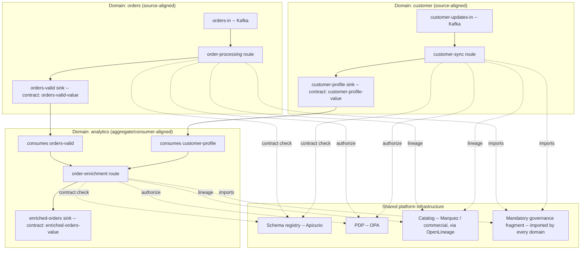

# Data Mesh Reference Architecture for the Declarative Integration Middleware

**Type:** Supporting document — companion to the core design, not part of it
**Builds on:** Declarative Integration Middleware — Design Document, v8
**Date:** 2026-09-01

## 1. Purpose and how this relates to the core design

The earlier `data-mesh-feasibility-analysis.md` evaluated the design (as of v6/v7) against the four data mesh principles and found three things: a strong operational fit overall, one real technical gap (no first-class data contract distinct from `route_version`), and one organizational gap (no domain/namespace concept, no described config-ownership workflow). The technical gap has since been closed — v8 added data contracts and schema conformance (§11 of the core design). This document does two things with what's left:

1. **Proposes** a domain/namespace model that closes the organizational gap. This is a proposal, not a ratified addition to the core spec — it's presented here, separately, so it can be reviewed and iterated on its own terms before (if ever) being folded into the numbered design document the way every other feature in this project has been.
2. **Formalizes the data mesh use case** — a worked reference architecture showing how a real organization would actually run a data mesh on top of this middleware, using the mechanisms (contracts, lineage, PBAC, retention policies) that already exist in the core spec plus the domain model proposed here.

Nothing in this document changes `eip-middleware-design.md`. Where it references a mechanism from the core design, it cites the section (e.g., §11 for contracts). Where it proposes something new, that's flagged explicitly as **PROPOSED**.

## 2. Where things stand, updated

| Principle | v6/v7 finding | Status after v8 |
|---|---|---|
| Domain-oriented decentralized ownership | Partial — routes are independently deployable, but no namespace/ownership concept | Unchanged by v8. Addressed here (§3, proposal only). |
| Data as a product | Weak-to-partial — no data contract | **Substantially closed.** v8 §11 gives every source/sink a versioned, enforced contract, inline or registry-backed, with its own `contract_version` axis and OpenLineage schema-facet publication. |
| Self-serve infrastructure as a platform | Strong | Unchanged, still strong. The domain proposal in §3 extends it rather than compensating for a weakness. |
| Federated computational governance | Strong foundation, narrow scope (auth + retention only) | **Meaningfully widened.** Contract enforcement (v8 §11) is structurally the same computational-governance pattern as `authorize` — a fourth automatically-enforced, non-retryable classification alongside retry/dead-letter/denial. Interoperability conformance is no longer entirely unaddressed; it's now partially covered by schema enforcement specifically (naming/vocabulary conventions beyond schema shape are still open, see §5). |
| Data contracts / output ports (cross-cutting) | Weak | **Closed for the schema half.** The "these sinks are the same product" grouping question is still open; §4 below proposes a lightweight answer via the domain/product model. |

## 3. PROPOSED: a domain/namespace model

### 3.1 What's missing today

In the core design (§6), `sources`, `sinks`, `functions`, and `fragments` all live in one flat global namespace. That's fine for a single team; it doesn't give a multi-domain organization a way to express "this route belongs to the payments domain," which matters for three separate reasons: **ownership** (who reviews/approves a change), **discoverability** (which domain does this data product come from), and **governance** (which centrally-mandated policies must this domain's routes include).

### 3.2 The proposal

Add an optional `domain:` field, consistently available wherever a name is declared — routes, sources, sinks, and fragments:

```yaml
# domains/payments/orders.yaml
domain: payments

sources:
  orders-in: { type: kafka, connection: kafka-prod, topic: orders.raw }

sinks:
  orders-valid:
    domain: payments
    type: kafka
    connection: kafka-prod
    topic: orders.valid
    product: orders                 # groups this sink with others under one data product, §4.1
    contract: { registry: schema-registry-prod, subject: orders-valid-value, enforce: true }

routes:
  order-processing:
    domain: payments
    from: orders-in
    ...
```

This is deliberately **a labeling and file-organization convention first**, not a runtime multi-tenancy mechanism — it doesn't require the harder problem (resource quotas, isolated failure blast radius between domains sharing one instance, which the core design's roadmap already defers to Phase 3) to be solved before it's useful. Three things become possible immediately just from the label existing and being validated:

- **Config ownership**, via the filesystem: a domain's routes live under `domains/<name>/`, and a CODEOWNERS-style convention (or the engine's own `midctl validate` refusing a file whose `domain:` doesn't match its directory) gives every domain team a config-ownership boundary enforced in CI, without needing a control-plane API or a new deployment model.
- **Discoverability**, via lineage and OpenLineage export (core design §10.5): `domain` becomes another dataset/job facet, so a catalog entry says which domain a data product belongs to — something the current design's OpenLineage export doesn't yet carry, since the concept doesn't exist upstream of it.
- **Federated governance, made computational rather than aspirational**, via a **mandatory fragment convention** (§5 below): a domain's `imports` are checked, at validation time, for a required central-governance fragment — closing the feasibility analysis's specific complaint that `imports`/`fragments` *could* carry mandatory policy but nothing today verifies a domain actually included it.

### 3.3 What this proposal deliberately does not solve

- **Runtime isolation between domains sharing one instance** — still a Phase 3 concern in the core design (multi-tenant policy isolation). This proposal's answer for now is the same as the core design's existing answer: run separate instances per domain if isolation matters more than shared infrastructure efficiency. `domain:` labeling doesn't require solving multi-tenancy first, but it doesn't solve it either.
- **A provisioning workflow or scaffold** ("create a new data product" wizard, a template generator). Genuinely useful, out of scope here — this is a data-model proposal, not a developer-experience one.
- **Cross-domain naming/vocabulary standards** (shared ID formats, shared timestamp conventions) — schema conformance (core design §11) checks a contract's *shape*, not whether two domains independently chose incompatible conventions for "the same" concept. That's a harder, more organizational problem; §5 notes it as still open.

## 4. Reference architecture: a worked example

Three domains, a common governance layer, and a downstream analytics consumer — small enough to read in one sitting, large enough to show every mechanism actually interacting.



The **orders** and **customer** domains each own their own source-aligned data product — one route, ingesting from their own operational system, publishing a contract-conformant sink. Neither domain knows or cares who consumes its data product; that's the point. The **analytics** domain owns an aggregate/consumer-aligned data product: it *consumes* the other two domains' published sinks as its own sources (the sink of one domain literally is the source of another — no special mechanism needed, this already falls out of the core design's `sources`/`sinks` being ordinary named, addressable endpoints), joins/enriches them in its own `translate` step, and publishes its own contract-conformant output. All three domains share the same registry, PDP, and catalog — shared platform infrastructure, not shared config or shared deployment.

### 4.1 Config: the orders domain publishing a source-aligned product

```yaml
# domains/orders/orders.yaml
domain: orders

imports:
  - ../governance/mandatory.yaml   # §5 -- every domain imports this

resources:
  connections:
    kafka-prod: { type: kafka, brokers: ["broker1:9092"] }
    schema-registry-prod:
      type: schema-registry
      engine: apicurio
      url: https://registry.example.org/apis/registry/v3

sources:
  orders-in: { type: kafka, connection: kafka-prod, topic: orders.raw, group: orders-router, format: json }

sinks:
  orders-valid:
    domain: orders
    product: orders                # PROPOSED grouping key, §3.2
    type: kafka
    connection: kafka-prod
    topic: orders.valid
    contract:
      registry: schema-registry-prod
      subject: orders-valid-value
      version: latest
      enforce: true
  orders-dlq: { type: kafka, connection: kafka-prod, topic: orders.dlq }

routes:
  order-processing:
    domain: orders
    from: orders-in
    lineage: { retention_policy: default }
    error_path: { target: orders-dlq, retry: { max_attempts: 5, backoff: { type: exponential, initial: 1s, max: 30s } } }
    steps:
      - fragment: org-mandatory-checks   # from the imported governance fragment, §5
      - translate:
          expr: '{ "order_id": body.id, "total": body.amount / 100, "currency": body.currency ? body.currency : "USD" }'
      - route:
          cases: [{ when: 'body.total > 10000', to: [orders-valid, high-value-review] }]
          default: { to: [orders-valid] }
```

### 4.2 Config: the analytics domain consuming two domains' products

```yaml
# domains/analytics/order-enrichment.yaml
domain: analytics

imports:
  - ../governance/mandatory.yaml

resources:
  connections:
    kafka-prod: { type: kafka, brokers: ["broker1:9092"] }
    schema-registry-prod: { type: schema-registry, engine: apicurio, url: https://registry.example.org/apis/registry/v3 }

sources:
  orders-valid-in:    { type: kafka, connection: kafka-prod, topic: orders.valid,          format: json }
  customer-profile-in: { type: kafka, connection: kafka-prod, topic: customer.profile,      format: json }

sinks:
  enriched-orders:
    domain: analytics
    product: enriched-orders
    type: kafka
    connection: kafka-prod
    topic: analytics.enriched_orders
    contract:
      registry: schema-registry-prod
      subject: enriched-orders-value
      enforce: true

routes:
  order-enrichment:
    domain: analytics
    from: orders-valid-in
    auth: none
    error_path: { target: enriched-orders-dlq, retry: { max_attempts: 3 } }
    steps:
      - fragment: org-mandatory-checks
      - translate:
          expr: '{ "order_id": body.order_id, "total": body.total, "enriched_at": $now() }'
      - route:
          default: { to: [enriched-orders] }
```

(A real version of this route would join against `customer-profile-in` — the core design's `aggregate` step, which correlates messages from more than one stream, is exactly the mechanism for that and is deferred past the first delivery phase per the core design's §4/§19; this example keeps to what's already specified rather than assuming a step that doesn't exist yet.)

## 5. Federated governance in this reference architecture

The core design's feasibility-analysis gap was specific: `imports`/`fragments` *could* carry centrally-mandated policy, but nothing verified a domain actually included it. This reference architecture closes that with a convention, not a new engine mechanism:

```yaml
# governance/mandatory.yaml -- owned by the platform/governance team, not any domain
fragments:
  org-mandatory-checks:
    - authorize: { mode: pbac, engine: opa, connection: opa-prod, action: 'route:{{route}}', on_deny: { to: unauthorized-dlq } }
```

Every domain's routes `import` this file (§4.1, §4.2). What makes the mandate *computational* rather than a code-review convention:

- `midctl validate` (core design §6.3) can be extended, at the org's discretion, with a lint rule checking that every route's compiled step list includes the fragment named in an org-level policy config (e.g., `validation.required_fragments: [org-mandatory-checks]`) — this is a natural extension of the existing validation mechanism, not a new one.
- Because `imports` resolution happens before compilation (core design §6.2), a domain team cannot silently omit the fragment and still pass validation once that lint rule exists — the same load-time-error behavior that already applies to naming collisions applies here to absence.
- The governance fragment's *content* can itself reference the domain's own PDP action namespace (`route:{{route}}` above is illustrative — the exact templating mechanism, if any, is out of scope for both this document and the core design, since fragments are explicitly unparameterized as of core design §6.2), meaning the platform team owns *that a check happens*, while the specific allow/deny decision still comes from OPA policy the platform team also owns — genuinely federated, not just centrally imposed.

What this does **not** yet give the organization: enforcement of shared *vocabulary* (two domains independently deciding an order's currency field is called `currency` vs `ccy`) — schema conformance (core design §11) validates a contract's shape once declared, but doesn't harmonize two domains' independently-designed contracts with each other. That remains a real, unaddressed gap, more organizational than technical, and is called out here rather than glossed over.

## 6. What's still open or deferred

Carried forward from the feasibility analysis, and not addressed by either v8 or this document:

- **Multi-tenant runtime isolation** for domains sharing one instance (resource quotas, blast-radius containment) — still Phase 3 in the core design.
- **Self-service provisioning workflow** — a scaffold/template for "stand up a new domain's first data product," beyond "copy an existing domain's directory."
- **Cross-domain vocabulary/naming standardization** — schema conformance checks shape, not semantic agreement between independently designed contracts (§5).
- **Whether `domain:`/`product:` should be schema-validated, required fields** (this document treats them as optional/proposed) **or become mandatory the same way `auth:` is** (core design §13.5) — not decided here; raised as the natural next question if this proposal is adopted.

## 7. If this is adopted

Not a commitment, since nothing here has been folded into the core spec — but for context: `domain:`/`product:` fields and the required-fragment lint rule are additive to the core design's config schema (core design §6.3) and wouldn't require revisiting any decision already made through v8. They'd fit naturally alongside the core design's own Phase 0/Phase 1 work (§19) if and when this proposal itself goes through the same review process every other feature in this project has.
