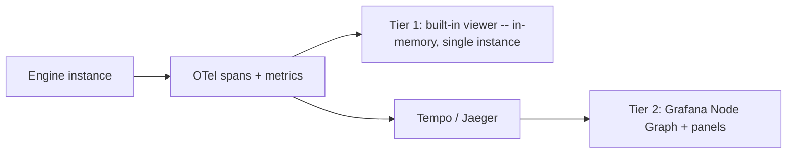
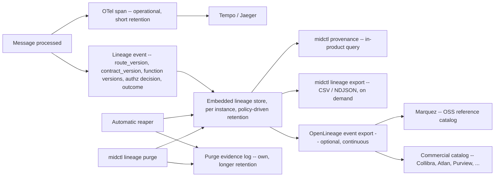
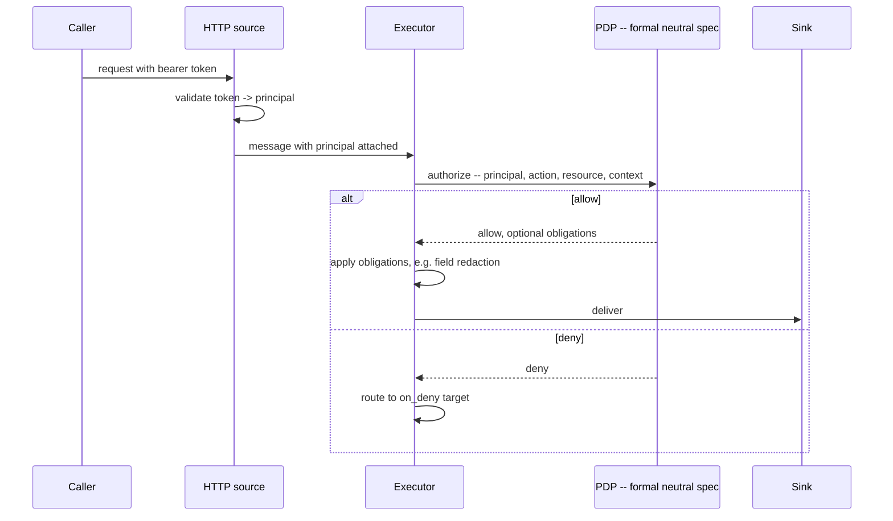
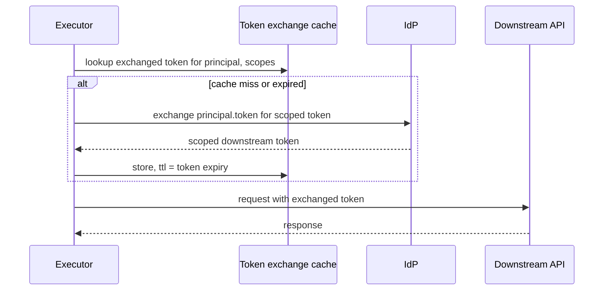
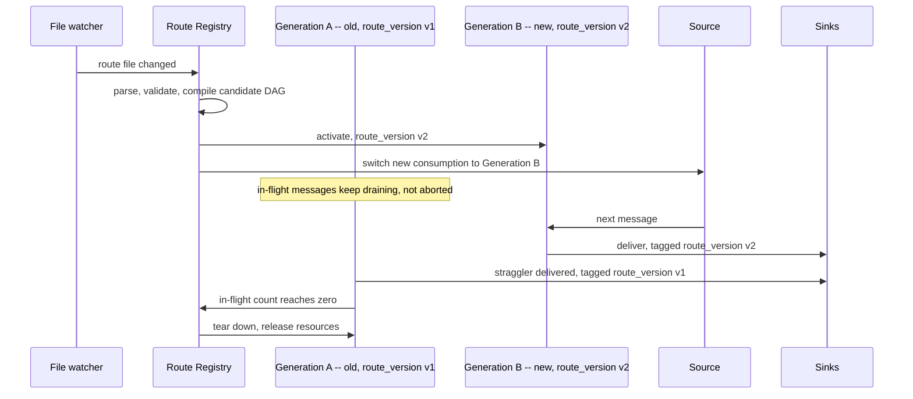
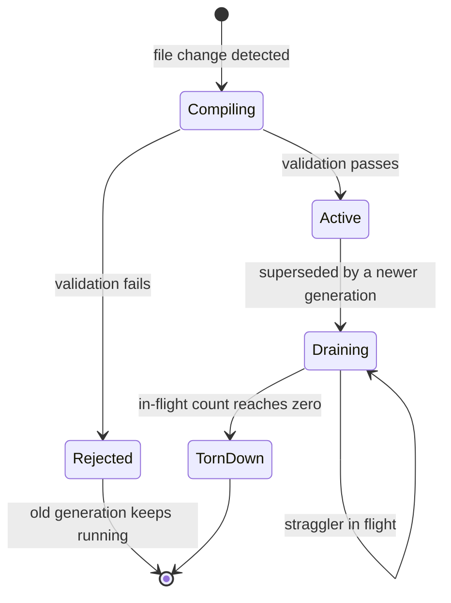
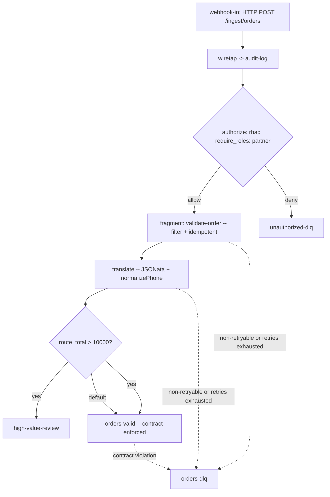
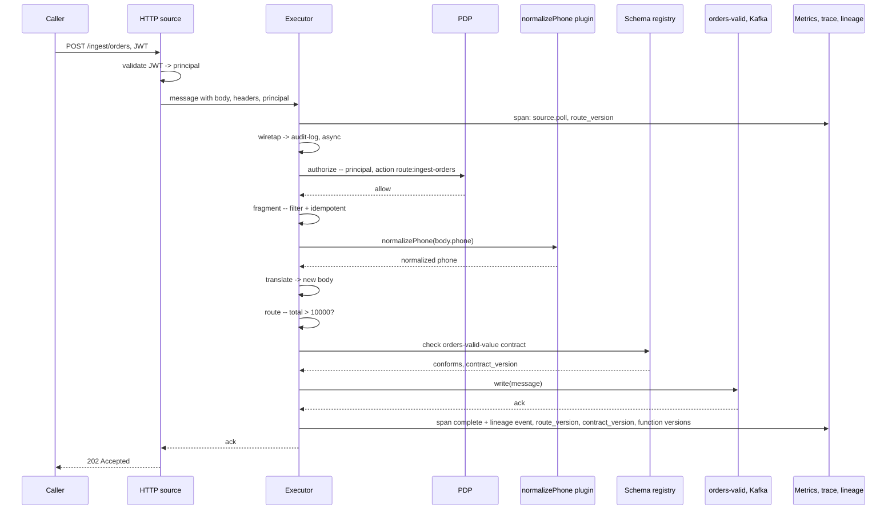

# Declarative Integration Middleware — Design Document

**Status:** Draft v10 — open for review
**Date:** 2026-09-05

## Revision history

- **v1 (2026-08-27):** Initial draft. Core EIP mapping, config model, reliability model, adapter contract, deployment model. Six open questions posed.
- **v2 (2026-09-01):** Resolved v1's six open questions (JSONata + registered-function escape hatch, at-least-once-only reliability scope, aggregator/splitter/claim-check deferred, `imports`/`fragments` config composition, drain-based hot reload, JSON Schema validation). Added a full Observability & Debuggability section. Four new open questions posed.
- **v3 (2026-09-01):** Resolved v2's four open questions (built-in OTEL viewer, both plugin and WASM function runtimes, fragment parameterization deferred, background-draining hot reload). Added Data lineage & DAG versioning (§10) and Authorization, plus two new tenets. Four new open questions posed.
- **v4 (2026-09-01):** Resolved v3's four open questions (single-instance built-in viewer confirmed sufficient; lineage gets a durable embedded store with OpenLineage-based export; OPA confirmed as reference PDP with BYO explicitly supported; `auth:` declaration enforced as a warning during migration). Added Mermaid system, DAG, sequence, and state diagrams throughout. Four new open questions posed.
- **v5 (2026-09-01):** Resolved v4's four open questions. Lineage storage stays per-instance-local, with an on-demand CSV/NDJSON export command covering cross-instance aggregation. Retention became a named, configurable policy system. The PDP contract specified as neutral and engine-agnostic, with OPA fronted by its own adapter. The `auth:` enforcement flip is purely an explicit, per-team opt-in flag. Four new open questions posed.
- **v6 (2026-09-01):** Resolved v5's four open questions. The CSV/NDJSON export pairing confirmed as-is. Retention-policy assignment supports both static and dynamic (per-message) selection. Purge gets both an automatic background reaper and a manual `midctl lineage purge` trigger, both writing to an append-only purge evidence log. The neutral PDP contract committed to a formal, independently versioned spec, moved up to Phase 1. Four new open questions posed.
- **v7 (2026-09-01):** Resolved v6's four open questions. An unresolved dynamic retention policy fails open. The purge log stays a bounded long window, paired with a new expiry-warning mechanism. Subject-targeted purge confirmed, introducing `subject_id_expr` and a store-level subject index. Reaper cadence configurable per retention policy. Two new, narrower open questions posed. A standalone data mesh feasibility analysis was produced separately (not folded in), evaluating this design against the four data mesh principles — headline finding: strong operational fit, but no first-class **data contract** distinct from `route_version`, and no domain/namespace concept.
- **v8 (2026-09-01):** Added **§11, Data contracts & schema conformance** — directly closing the feasibility analysis's largest gap. Contracts are provided inline (alongside config, no infrastructure required) or via a pluggable schema-registry contract, with **Apicurio Registry** (Apache 2.0) as the reference implementation and Confluent Schema Registry / commercial registries (AWS Glue, Azure, ...) supported as bring-your-own. Enforcement happens at source/sink boundaries with a new `contract_violation` failure classification. `contract_version` is tracked as an axis independent of `route_version` throughout lineage and dead-letter records. A new tenet 12 was added. Sections §11 onward renumbered accordingly. Four new open questions posed. The feasibility analysis's other two findings — the organizational/domain-namespace gap, and formalizing a data mesh reference use case — are addressed separately in a new companion document, `data-mesh-reference-architecture.md`, deliberately kept out of this core spec per how the request was scoped.
- **v9 (2026-09-05):** Housekeeping fix, no open questions involved. §4's EIP mapping table still grouped Claim Check as "same phase as Splitter/Aggregator," left over from v2 when all three were deferred together as one undifferentiated bucket. §19's roadmap has since split them — Splitter and Aggregator went to Phase 2, Claim Check stayed in Phase 3 — and the table was never updated to match, an inconsistency the Phase 2→3 implementation review surfaced. The three rows now name their actual phase instead of cross-referencing each other's, matching §19 exactly.
- **v10 (2026-09-05):** Added a **Phase 4 — self-service and visual tooling** entry to §19, folding in the not-yet-adopted proposals from `self-service-feasibility-study.md` (its GitOps pipeline, `midctl scaffold`, the pre-deployment discovery surface, domain-scoped secrets) alongside a local, file-based visual route-authoring interface per `visual-route-builder-feasibility-analysis.md`'s recommended scope — confirmed after review, not added speculatively. §1.1's non-goals bullet on UI-first authoring was clarified alongside it: the non-goal was always about config staying the source of truth and not becoming a separate system of record, not a blanket ban on any authoring tool whatsoever, and the original wording ("not a drag-and-drop route designer") read as the latter, which would have contradicted the new Phase 4 entry outright. No open questions posed; Phase 4 itself is not yet scoped to subtask grain — that's for whenever a round actually plans it, the same way Phase 0 through 3 each got their own implementation-plan document only once their turn came.

## 1. Purpose and scope

This document proposes the architecture for a declarative, configuration-driven integration middleware built on Enterprise Integration Patterns (EIP). The system routes and transforms messages between heterogeneous systems — queues, topics, HTTP endpoints, files, databases — using YAML-defined routes rather than hand-written glue code.

It sits in the same conceptual space as Apache Camel, Apache NiFi, Benthos/Redpanda Connect, and Kafka Connect, but is not a clone of any of them:

- From Camel: the EIP vocabulary itself, and the idea of named routes with explicit error handling.
- From NiFi: first-class provenance/observability and back-pressure-aware flow, without requiring a cluster and a UI to get started — the live visual flow view (§9) and the data lineage/provenance model (§10) are both direct answers to what NiFi does well, aimed at the same guarantee (reconstruct exactly what happened to any given record) without NiFi's always-on content repository.
- From Benthos/Redpanda Connect: single-binary deployment, YAML-first config, and a small expressive transformation language rather than a component-per-format explosion.
- From Kafka Connect: the clean separation between a stable connector SPI and the runtime, and treating retry/dead-letter/offset management as core runtime responsibilities rather than something every connector reimplements — and, per §11, its strong (if Kafka-centric) tradition of schema-registry-backed conformance, generalized here across any source/sink type.

### 1.1 Non-goals

- Not a general-purpose workflow orchestrator (Airflow/Temporal territory).
- Not a BPM/ESB suite with a process modeler.
- Not UI-first for *authoring* — config stays the source of truth (§2), and any authoring tool must operate on that same config rather than become a separate system of record. The visualization surfaces in §9 are read-only observability tools. A local, file-based visual route-authoring tool — generating and re-parsing the same route YAML `midctl validate`/`midctl test` already operate on, not a parallel format — is Phase 4 scope (§19); a hosted, multi-user design surface that becomes its own system of record is not, since that would undermine tenet 1 rather than serve it.
- No transactional/exactly-once delivery mode. At-least-once delivery plus optional idempotent-consumer dedup is the whole reliability promise (§7.4).
- Not an identity provider, policy engine, data-catalog product, or schema registry. Authorization (§13), lineage (§10), and contract conformance (§11) are enforced/recorded by the middleware at defined points, but authentication, policy decisions, long-term cataloging, and schema storage/compatibility rules are delegated to external systems the middleware integrates with via standard, formally specified contracts (OIDC/OAuth for identity, a versioned neutral PDP spec, OpenLineage for catalogs, a neutral registry contract with Apicurio as the reference) — consistent with the "compose, don't build" approach already taken for observability.

## 2. Design tenets

1. **Config is the source of truth.** A route is data (YAML), not code. It is diffable, versionable, testable, and reviewable in a PR.
2. **Everything is a pipeline.** A route is `source → [ordered steps] → sink(s)`, connected by named channels.
3. **Reliability is structural, not bolted on.** Every route declares its error path.
4. **Small orthogonal primitives.** Each EIP maps to one step type that does one thing.
5. **Streaming by default, batch as a special case of scheduling.**
6. **The core stays small; adapters are plugins.**
7. **Expressions stay pure; anything stateful or complex is a named function, not an expression.**
8. **Observability is derived, not hand-built.** The engine emits standard telemetry; visualization is composed from existing OSS tools, with one deliberate built-in exception where zero-dependency access mattered enough to justify it (§9.3).
9. **Authorization is structural too.** Every route declares its authorization stance explicitly. Enforcement severity is opt-in and team-controlled — a warning by default, escalated to a hard failure only when a team explicitly flips that flag for itself, never automatically (§13.5).
10. **A message's journey is always reconstructable, from the same signals that already exist.** Route/DAG version, function versions, and authorization decisions are stamped into the telemetry and lineage records the engine already produces (§10).
11. **A policy stated is a policy provably enforced.** A retention policy (§10.2) is paired with an actual deletion mechanism and evidence that deletion happened (§10.4).
12. **A data product's contract is versioned independently of the logic that produces it, and conformance is checked automatically at the boundary, not assumed.** `route_version` tells you what logic ran; `contract_version` tells you what shape the data was supposed to have. Neither substitutes for the other (§11).

## 3. Comparative landscape

| Dimension | Apache Camel | Apache NiFi | Benthos / Redpanda Connect | Kafka Connect | Proposed system |
|---|---|---|---|---|---|
| Config style | Java DSL / XML / YAML (hybrid) | Visual flow graph (flow.json under the hood) | YAML + Bloblang expressions | JSON connector configs | YAML routes + JSONata expressions |
| Deployment unit | Embedded library or standalone app (JVM) | Clustered NiFi node (JVM, heavier) | Single static binary | Kafka Connect worker (JVM), needs a Kafka cluster | Single binary, no mandatory cluster |
| Flow model | Named routes, DSL-defined | Free-form processor graph | Linear pipeline with branching | Source/sink connector pairs, no in-flight routing | Named routes = DAG of typed steps |
| State / persistence | Minimal built-in; relies on components | Heavy: FlowFile repository, provenance, content repo | Minimal; relies on the message bus for durability | Kafka offsets; connector-managed state | Source-managed offsets/cursors + optional durable channel |
| Expression language | Simple/JSONPath/many others (fragmented) | NiFi Expression Language (limited) | Bloblang (purpose-built, powerful) | None (JSON config only) | JSONata, with a registered-function escape hatch (native plugin or WASM), §6.1 |
| Live flow visualization | None built-in | Native — the whole product is the visual flow graph | None | None | Built-in zero-dependency viewer plus a composed OTel→Tempo/Jaeger→Grafana view (§9.3) |
| Data lineage / provenance | None built-in | Native, comprehensive — always-on FlowFile provenance repository | None | Kafka offsets only | Route/DAG-version-stamped lineage in a per-instance embedded store, with policy-driven retention, an enforced purge-with-evidence lifecycle, on-demand export, and optional OpenLineage push to OSS or commercial catalogs (§10) |
| Schema / data-contract conformance | No first-class registry integration; format-specific components only | Solid — Record Reader/Writer controller services back onto Confluent/Hortonworks-style schema registries | JSON Schema processor plus some Avro/registry support; not a first-class contract concept | Strong but Kafka/Confluent-centric — Avro/Protobuf/JSON Schema converters tied to Confluent's registry, doesn't generalize past Kafka | Pluggable across any source/sink type, inline or registry-backed, neutral registry contract with Apicurio as the OSS reference, versioned independently of `route_version`, enforced at the boundary with its own failure classification (§11) |
| Identity / authorization propagation | Component-level auth only; no generic OBO | Its own RBAC for the NiFi UI/API; not deep per-record identity propagation | None | Connector-level auth only | Principal-aware messages, opt-in OBO token exchange, pluggable RBAC/PBAC/ABAC over a formally specified, engine-agnostic policy contract (§13) |
| Connector ecosystem | Huge (300+ components) | Large, UI-curated | Growing, curated | Kafka-centric, large via Confluent Hub | Small at v1; SPI designed for third-party growth |
| Best fit | Enterprise Java shops needing broad protocol coverage | Dataflow with strong lineage/audit needs, ops-managed via UI | Cloud-native stream processing, ops-light | Kafka-centric CDC/ingest at the edges of a Kafka deployment | Config-first teams wanting Camel's vocabulary and NiFi's visibility/lineage without the JVM/cluster weight |
| What we want to avoid | XML/DSL sprawl, JVM startup cost | Requires a cluster + UI to be usable at all | No standard error-path vocabulary | Not a router | — |

## 4. Core concepts: EIP mapping

| EIP | Role in this system |
|---|---|
| **Message** | `{ headers, body, metadata }`. Metadata always includes a correlation ID, ingest timestamp, route/stage provenance, the `route_version` processing it (§10), the `contract_version` it was checked against where a contract applies (§11), and — when authenticated — a `principal` (§13). |
| **Message Channel** | A named, bounded, backpressure-aware conduit between stages. |
| **Message Endpoint** | A `source` (consumer) or `sink` (producer). |
| **Polling Consumer** | A source with a `schedule` (cron or interval). |
| **Event-Driven Consumer** | A source that is pushed to (webhook, Kafka consumer, AMQP subscriber). |
| **Content-Based Router** | A `route` step: JSONata `when` expressions branch to targets, falling through to `default`. |
| **Message Translator** | A `translate` step: JSONata reshapes body/headers and/or converts format. |
| **Message Filter** | A `filter` step: drops messages that don't satisfy a JSONata predicate. |
| **Message Filter (authorization variant)** | An `authorize` step (§13): predicate is a policy decision (RBAC/PBAC/ABAC); denial routes to `on_deny`, a distinct auditable outcome, not a silent discard. |
| **Message Filter (contract-conformance variant)** | An implicit boundary check on a `source`/`sink` with `contract.enforce: true` (§11): the predicate is schema conformance rather than a JSONata predicate or a policy decision; a violation is its own failure classification (`contract_violation`), routed to `on_violation` or the route's normal dead-letter target. |
| **Wire Tap** | A `wiretap` step: non-blocking copy to a secondary channel (audit, monitoring, or local debug, §9.4). |
| **Recipient List / Fan-out** | A `route` case (or `fanout` step) listing more than one target. |
| **Splitter** | A `split` step, one message → N. Deferred to Phase 2 (§19). |
| **Aggregator** | An `aggregate` step, N messages → one. Deferred to Phase 2 (§19), alongside Splitter. |
| **Idempotent Consumer** | An `idempotent` step: dedups by key against a pluggable store. The entire reliability story for exactly-once-like behavior (§7.4). |
| **Dead Letter Channel** | The `error_path.target` sink after retries are exhausted or on a non-retryable error. |
| **Claim Check** | Deferred to Phase 3 (§19). |
| **Adapter (with retry/replay)** | The concrete Source/Sink implementation, responsible for connection-level retry and offset/position exposure for replay. |

## 5. Runtime architecture

```mermaid
flowchart LR
    subgraph SRC["Sources"]
        direction TB
        HTTP["HTTP webhook"]
        KAFKAIN["Kafka"]
        FILE["File / SFTP, polling"]
    end

    subgraph CORE["Engine core"]
        direction TB
        REG["Route Registry -- compiles DAG, stamps route_version"]
        SCHED["Scheduler"]
        EXEC["Processor graph executor -- steps, channels, backpressure"]
        ERR["Error router -- retry, dead-letter, denial, contract violation"]
        TEL["Metrics + trace collector"]
    end

    subgraph SNK["Sinks"]
        direction TB
        OK["Business sinks"]
        DLQ["Dead-letter sink"]
        DENY["Unauthorized sink"]
    end

    subgraph OBS["Observability, composed"]
        direction TB
        PROM["Prometheus"]
        TRC["Tempo or Jaeger"]
        GRAF["Grafana"]
        VIEWER["Built-in viewer, Tier 1"]
    end

    subgraph GOV["Governance"]
        direction TB
        PDP["PDP -- formal neutral spec, OPA or BYO"]
        SCHEMA["Schema registry -- Apicurio or BYO"]
        IDP["Identity provider"]
        SECRETS["Secret provider"]
    end

    subgraph LIN["Lineage, per instance"]
        direction TB
        LDB["Embedded lineage store"]
        REAPER["Automatic reaper"]
        PLOG["Purge evidence log"]
        EXP["On-demand CSV / NDJSON export"]
        OLEXP["OpenLineage export, optional"]
        CATALOG["External catalog"]
    end

    HTTP --> REG
    KAFKAIN --> REG
    FILE --> SCHED --> REG
    REG --> EXEC
    EXEC -->|success| OK
    EXEC -->|retries exhausted| ERR --> DLQ
    EXEC -->|authorize deny| DENY
    EXEC -->|contract violation| ERR
    EXEC --> TEL
    EXEC <-->|policy decision| PDP
    EXEC <-->|contract check| SCHEMA
    HTTP -.->|validate token| IDP
    EXEC -.->|secret resolution| SECRETS

    TEL --> PROM --> GRAF
    TEL --> TRC --> GRAF
    TEL --> VIEWER
    TEL --> LDB
    LDB --> EXP
    LDB --> OLEXP --> CATALOG
    REAPER --> LDB
    REAPER --> PLOG
```



**Engine core responsibilities:**
- **Route Registry** — loads and validates route YAML (resolving `imports`, §6.2), compiles each route into a step DAG, computes that DAG's `route_version` (§10.1). A route can have more than one active DAG generation during a hot reload (§14.1).
- **Scheduler** — drives polling sources on their configured schedule.
- **Channel implementation** — bounded queues between stages; applies the configured overflow policy when a downstream stage is slower than upstream.
- **Processor Graph Executor** — runs each stage with a configurable worker pool; propagates backpressure; tracks per-stage, per-generation in-flight counts; checks source/sink contracts when configured (§11).
- **Error Router** — applies the route's retry policy, forwards to dead-letter on exhaustion, and routes authorization denials (§13) and contract violations (§11) to their own classifications and targets.
- **Metrics/Trace Collector** — per-route, per-stage counters and OTel spans (§9), stamped with `route_version`, `contract_version`, and `principal`/authorization attributes (§10, §11, §13), and the source of lineage events (§10.2).
- **Plugin Registry** — resolves `type:` references for sources/sinks/steps and `functions` (§6.1) to registered implementations, native or WASM.

**Delivery semantics:** at-least-once. A message is acknowledged back to the source only after it has been durably handed to every configured sink (or to the dead-letter sink).

## 6. Configuration model

Top-level YAML structure: `resources`, `functions`, `sources`, `sinks`, `routes`, `fragments`, `lineage` (§10.2), with optional `defaults` and `imports`.

```yaml
version: 1
schema: "https://schemas.example.org/mid/v1/route.json"

defaults:
  error_path:
    retry:
      max_attempts: 3
      backoff: { type: exponential, initial: 1s, max: 30s, jitter: true }

resources:
  connections:
    kafka-prod:
      type: kafka
      brokers: ["broker1:9092", "broker2:9092"]
      auth: { type: sasl_scram, username: "${SECRET:kafka_user}", password: "${SECRET:kafka_pass}" }

sources:
  orders-in:
    type: kafka
    connection: kafka-prod
    topic: orders.raw
    group: orders-router
    format: json

sinks:
  orders-valid: { type: kafka, connection: kafka-prod, topic: orders.valid }
  orders-dlq:   { type: kafka, connection: kafka-prod, topic: orders.dlq }

routes:
  order-processing:
    from: orders-in
    auth: none    # explicit opt-out, §13
    error_path:
      target: orders-dlq
      retry: { max_attempts: 5, backoff: { type: exponential, initial: 1s, max: 30s, jitter: true } }
    steps:
      - filter: { expr: 'body.status != "test"' }
      - translate:
          expr: |
            { "order_id": body.id, "total": body.amount / 100, "currency": body.currency ? body.currency : "USD" }
      - idempotent:
          key: 'body.order_id'
          store: { type: redis, connection: redis-cache, ttl: 24h }
      - route:
          cases:
            - when: 'body.total > 10000'
              to: [orders-valid, high-value-review]
          default:
            to: [orders-valid]
```

- `resources.connections` centralizes connection/auth config so multiple sources/sinks can share a pool.
- `${SECRET:name}` is resolved by a pluggable secret provider at load time — never inlined.
- `sources`/`sinks` are named endpoints reused across routes via `from` and step `to` targets.
- A polling source is just a source with a `schedule`.
- A route-level `auth:` key is mandatory in the schema (tenet 9) — `none` or one or more `authorize` steps (§13.5 on enforcement severity).

### 6.1 Expression language: JSONata, with a registered-function escape hatch

Every `expr`/predicate field (`filter`, `translate`, `route.cases[].when`, `idempotent.key`, `authorize` ABAC predicates, `lineage.retention_policy_expr`/`subject_id_expr`, §10.2) is a **JSONata** expression over `{ body, headers, metadata, principal }`.

```yaml
functions:
  normalizePhone: { type: plugin, runtime: go, ref: plugins/normalize_phone }
  scoreRisk:       { type: wasm,   ref: plugins/risk_score.wasm }
```

**Both `type: plugin` and `type: wasm` are first-class from the start**, no forced default runtime — a plugin for performance-sensitive trusted logic, WASM for anything that should be sandboxed or written in another language. Called from expressions exactly like a JSONata built-in: `$normalizePhone(body.phone)`.

### 6.2 Config composition: imports and fragments

```yaml
# shared/common-steps.yaml
fragments:
  validate-order:
    - filter: { expr: 'body.id != null and body.amount != null' }
    - idempotent: { key: 'body.order_id', store: { type: memory, ttl: 24h } }
```

```yaml
# order-processing.yaml
imports:
  - ./shared/common-steps.yaml
routes:
  order-processing:
    from: orders-in
    auth: none
    steps:
      - fragment: validate-order
      - translate: { expr: '{ "order_id": body.id, "total": body.amount / 100 }' }
```

Fragments are literal, unparameterized reuse in this phase (confirmed deferred, §17).

### 6.3 Validation

The route config format is a versioned JSON Schema, validated post-`imports`-resolution. `midctl validate <file>` runs it in CI; a `$schema` reference gives IDEs inline validation. The schema requires an `error_path` (inherited or explicit, §7.1). It also checks for the `auth:` declaration (§13.5), but a missing one is a **warning**, not a hard failure, by default:

```
$ midctl validate order-processing.yaml
WARN  route "ingest-orders": no `auth:` declaration (warning-level under the
      current validation.auth_declaration setting; set it to `enforce` when
      your team is ready — see §13.5)
```

`midctl validate --strict`, or setting `validation.auth_declaration: enforce` in the engine's own config, opts a team into the hard-failure behavior on their own schedule (§13.5) — there is no engine-driven default change over time.

## 7. Reliability model

### 7.1 Error path and retry

Every route has an `error_path`: a dead-letter `target` sink plus a `retry` policy. Retryable failures (timeouts, connection resets, 5xx) are retried; non-retryable ones (schema violation on the *config* side, 4xx, filter/validation failure) go straight to dead-letter. Two further classifications never retry and route to their own distinct targets rather than the general dead-letter: an **authorization denial** (§13) via `on_deny`, and a **contract violation** (§11) — a message or an outbound write that doesn't conform to a declared data contract — via `on_violation`, defaulting to `error_path.target` when no dedicated target is configured.

### 7.2 Dead-letter envelope

`error_reason`, `error_type`, `attempt_count`, `first_failed_at`, `last_failed_at`, `route`, `stage`, `route_version` (§10.1), and `contract_version` where a contract applied (§11.4) — `route_version` matters because a retry can span a hot-reload boundary; `contract_version` matters because it tells you whether a failure was a logic bug or a data-shape mismatch against a specific schema version.

### 7.3 Replay

```
midctl replay --from dlq:orders-dlq --to orders-in --filter 'error_type == "timeout"'
```

For durable sources exposing offsets, replay can also mean rewinding the source's committed position.

### 7.4 Exactly-once is explicitly out of scope

At-least-once delivery plus optional `idempotent`-step dedup, full stop. No transactional read-process-write mode.

### 7.5 Idempotency and circuit breaking

The `idempotent` step dedups using a pluggable store — in-memory LRU by default (zero extra infrastructure), Redis/DB-backed for multi-instance deployments. Each adapter separately maintains its own circuit breaker for its external connection.

## 8. Adapter (Source/Sink) contract

```
Source:  poll() -> []Message | subscribe(handler)
         Message.ack() / Message.nack(reason)
         healthCheck() -> status
         checkpoint() -> offset-like cursor

Sink:    write([]Message) -> []Result
         healthCheck() -> status
```

First-phase built-in adapters: HTTP(S) (webhook source / REST sink, including JWT/OAuth validation for `principal`, §13), File and SFTP (polling), a generic exec/stdio adapter. Kafka and AMQP follow next; database (JDBC, then CDC) later (§19).

## 9. Observability & debuggability

### 9.1 Metrics

Prometheus-format metrics per route/stage: throughput, latency, error rate, queue depth, dead-letter rate, retry count, authorization denial rate, contract violation rate.

### 9.2 Distributed tracing

Every message gets a correlation ID at ingest, carried as OTel trace context; each stage emits a span carrying `route.version`, `contract.version` where applicable, `function.<name>.version`, and `principal.subject`/`principal.roles` when present. This is also the source of lineage events (§10.2).

### 9.3 Live pipeline visualization — two tiers

**Tier 1 — built-in, zero-dependency viewer.** Bundled and opt-in (`midctl serve viewer`). Taps the engine's own span/metric stream into a bounded in-memory ring buffer; serves a small web UI with a live-updating node graph of the route topology and a per-message lookup by correlation ID. Single-instance scope, confirmed sufficient.



**Tier 2 — composed, production-grade.** Tempo (or Jaeger) derives a live service graph from span parent/child relationships, rendered through Grafana's Node Graph panel — auto-refreshing, colored/sized by real traffic. Queue depth sits as adjacent Prometheus-fed panels since traces don't capture backlog.

### 9.4 Local dev debugging

- `midctl explain <route>` — static compiled DAG as Graphviz DOT / ASCII.
- `midctl trace tail <route> [--stage <name>]` — live sampled message metadata to the terminal.
- `wiretap` pointed at a local file sink for ad hoc inspection.

### 9.5 Logs

Structured (JSON), per-route verbosity, automatic redaction of `${SECRET:...}`-sourced values and anything an authorization obligation marks sensitive (§13.3). Loki-friendly format for the same Grafana instance as Tier 2.

## 10. Data lineage & DAG versioning

### 10.1 Route/DAG versioning

Every compiled DAG has a **`route_version`** — a content hash of the fully resolved (post-`imports`) route config; a no-op reload doesn't churn the version. Function implementations version independently — `function.<name>.version` identifies the specific plugin/WASM artifact that ran. `route_version` describes *logic*; §11.4 introduces `contract_version`, a separate axis describing *data shape*.

### 10.2 Lineage storage: per-instance, with static or dynamic retention-policy assignment

Lineage events (a lighter, purpose-built record — `route_version`, `contract_version` where applicable, `function.*.version`s, authorization decision, outcome, timestamps) are written to a **per-instance embedded store** (a single-file, e.g. SQLite-class store, no extra infrastructure). Every instance is fully self-sufficient for its own provenance queries (§10.7); cross-instance aggregation is handled on demand (§10.3).

**Retention is a named, configurable policy**, since different payload types and regulatory regimes need different rules on the same engine:

```yaml
lineage:
  store: { type: embedded }
  retention_policies:
    default: { retention: 90d,  include_body_sample: false }
    pci:     { retention: 7y,   include_body_sample: false }
    phi:     { retention: 6y,   include_body_sample: false }
    public:  { retention: 30d,  include_body_sample: true }

routes:
  card-payments:
    lineage: { retention_policy: pci }         # static -- the common, preferred case
  order-processing:
    lineage: { retention_policy: default }
  generic-intake:
    lineage:
      retention_policy: default                                     # static fallback
      retention_policy_expr: 'body.card_number ? "pci" : "default"'  # dynamic, per message
      subject_id_expr: 'principal.subject ? principal.subject : body.customer_id'
```

Both **static** and **dynamic** assignment are supported, with static preferred as the default path. `retention_policy_expr` exists for the minority of routes that genuinely mix payload sensitivities: evaluated per message, its result selects that message's policy, overriding the static fallback. An expression that resolves to an undeclared policy name **fails open** — falls back to `default`, logs a warning, increments `lineage_retention_policy_fallback_total` — rather than rejecting the message.

`subject_id_expr` is a related, optional per-route expression tagging each lineage event with the data subject it concerns. The store indexes on this field when present, making subject-targeted purge (§10.4) an indexed lookup rather than a full scan. Whether it should be inferred automatically from `principal` when present, versus always requiring an explicit expression, is an open question (§18.1) — note that the schema-registry "subject" in §11.3 is an unrelated, pre-existing term from a different ecosystem; see the terminology note in §17 to avoid confusing the two.

### 10.3 On-demand export (CSV / NDJSON)

```
midctl lineage export --route card-payments --since 2026-08-01 --format csv    > card-payments-lineage.csv
midctl lineage export --route card-payments --since 2026-08-01 --format ndjson > card-payments-lineage.ndjson
```

CSV and NDJSON side by side: CSV for the direct "hand this to an auditor" case, NDJSON for records whose nested structure doesn't flatten cleanly into columns. Aggregating exports across a fleet of instances is an external concern, consistent with the store staying per-instance by design.

### 10.4 Purge: automatic reaper, manual trigger, subject targeting, and an evidence log with its own expiry warning

A retention policy is only real if something actually deletes data at the end of its window and can prove it did (tenet 11). Two required, complementary mechanisms:

- **Automatic reaper.** Each instance runs a background job that scans its local store for lineage records past their assigned policy's `retention` window and deletes them. Cadence is configurable per retention policy, not just globally.
- **Manual/triggered purge.** `midctl lineage purge`, including subject targeting for right-to-erasure requests:

```
midctl lineage purge --route card-payments --before 2020-01-01
midctl lineage purge --route card-payments --policy pci --reason "right-to-erasure request #4821"
midctl lineage purge --subject cust-48213 --reason "right-to-erasure request #4821"
```

Every purge writes to an **append-only purge evidence log**, distinct from the lineage data being deleted, recording only what's needed to prove the deletion happened (route, policy, subject when subject-scoped, record count, criteria, timestamp, trigger) — never the deleted content itself.

```yaml
lineage:
  reaper:
    enabled: true
    default_interval: 6h
  purge_log:
    retention: 10y
    expiry_warning_lead: 90d
  retention_policies:
    default: { retention: 90d, include_body_sample: false, reaper_interval: 6h }
    pci:     { retention: 7y,  include_body_sample: false, reaper_interval: 24h }
```

The purge log's own retention is a bounded long window, not "indefinite," paired with an expiry warning (metric, log, `midctl lineage purge-log status`) as entries approach their own retention boundary, so evidence is never lost silently.

### 10.5 Long-term integration: OpenLineage export

Rather than integrating with one specific catalog product, the engine can optionally emit **OpenLineage**-spec events to any OpenLineage-compatible consumer:

- A **route** maps to an OpenLineage **job**.
- Each **DAG generation**/execution window maps to a **run**, carrying `route_version` as a run facet.
- **Sources and sinks** map to **datasets**, with facets for connection/topic/path — and, where a data contract exists (§11), the dataset's actual declared schema is published as OpenLineage's standard `SchemaDatasetFacet` (§11.6), rather than relying solely on best-effort inferred column lineage from a `translate` step's JSONata.

**Marquez** is the natural first integration to validate against; commercial catalogs that speak OpenLineage natively are reachable through the same export path with no engine-side changes.

### 10.6 Delivery tagging

Sink adapters can optionally stamp outgoing headers (`x-mid-route`, `x-mid-route-version`, `x-mid-correlation-id`), so a receiving system can trace back which route/DAG version delivered a record without querying the lineage store or trace backend directly.

### 10.7 Provenance query

`midctl provenance <correlation-id>` reconstructs a message's full lineage — source, `route_version`, `contract_version` where applicable, each step and `function.*.version` invoked, any `authorize` decision and policy version, final sink(s) or dead-letter/denial/violation outcome — reading from the local embedded store, with a fall-through to the trace backend for full per-hop span detail while it's still within its own retention window.



### 10.8 Interaction with hot reload

Because hot reload (§14.1) lets old-DAG stragglers finish in the background rather than force-aborting them, two DAG generations of the same route can be processing messages concurrently for a short window. `route_version` is exactly what disambiguates, after the fact, which generation actually handled a given message.

## 11. Data contracts & schema conformance

### 11.1 Contract model: what a contract is, and how it's provided

A **data contract** is a versioned schema (JSON Schema, Avro, or Protobuf — pluggable, same adapter philosophy as elsewhere in the design, §8) describing the shape of what a `source` emits or a `sink` expects. It is versioned independently of `route_version` (§10.1): a route's internal transformation logic and the shape of the data flowing through its boundaries are related but distinct, and conflating them — which is what `route_version` alone would do — was the single largest gap surfaced when this design was evaluated against data mesh's "data as a product" principle. A consumer needs to know when *the data's shape* changed, not merely when *the pipeline's logic* changed.

Two ways to provide one, matching the "zero extra infrastructure by default, registry as the upgrade path" pattern already used for the `idempotent` step's store (§7.5) and the lineage store (§10.2):

```yaml
sources:
  vendor-drop:
    type: sftp
    connection: sftp-vendor
    path: /outbound
    contract:
      inline: ./contracts/vendor-order.schema.json   # alongside config, no registry required
      format: json-schema
      enforce: true

sinks:
  orders-valid:
    type: kafka
    connection: kafka-prod
    topic: orders.valid
    format: json
    contract:
      registry: schema-registry-prod   # resolved from a registry, §11.3
      subject: orders-valid-value
      version: latest                  # or pin an exact version
      enforce: true
      on_violation: { to: orders-dlq }
```

**Inline** contracts are the simpler, no-infrastructure default — a schema file sits beside the route YAML, versioned in the same repo, the same way a fragment (§6.2) does. **Registry-backed** contracts are the upgrade path for teams that already run, or want to run, a schema registry as shared infrastructure across many domains — appropriate once contract reuse and cross-domain discovery matter more than "get started with nothing running."

### 11.2 Enforcement and failure classification

`enforce: true` on a source validates the inbound message body against its contract before the message enters the pipeline; on a sink it validates the outbound message (post-`translate`) before the write. A violation is a **fourth, distinct failure classification** alongside retryable, non-retryable, and authorization-denied (§7.1) — `error_type: contract_violation` — because a schema mismatch, like an authorization denial, is never fixed by retrying, and because a team building a data-quality view over dead-letter traffic needs to tell "this is a shape problem" apart from "this is a downstream outage" at a glance. `on_violation` follows the same shape as `authorize`'s `on_deny` (§13.2) — an optional distinct target, defaulting to the route's own `error_path.target` when not set, so a team doesn't have to stand up a dedicated queue on day one but can add one once contract violations are common enough to warrant it.

### 11.3 Schema registry integration: a neutral contract, Apicurio as the reference

Following the same pattern already used for the policy decision point (§13.3): the engine talks to a schema registry through a **neutral, engine-agnostic contract** (register/fetch/list schema versions by subject, check compatibility), not one vendor's native API.

**Apicurio Registry** (Apache 2.0) ships as the tested, documented reference implementation — genuinely open source, and it natively speaks a Confluent-API-compatible mode, so many existing Confluent Schema Registry clients and conventions carry over with minimal friction. **Confluent Schema Registry** itself, and commercial equivalents (AWS Glue Schema Registry, Azure Schema Registry, and others), are reachable as **bring-your-own** registries through the same contract — consistent with how OPA is the reference PDP without being the shape the PDP contract is modeled on (§13.3), and with how Marquez is the reference lineage catalog without OpenLineage being Marquez-specific (§10.5).

```yaml
resources:
  connections:
    schema-registry-prod:
      type: schema-registry
      engine: apicurio        # or: confluent, aws-glue, azure-schema-registry, ...
      url: https://registry.example.com/apis/registry/v3
      auth: { type: bearer, token: "${SECRET:registry_token}" }
```

Compatibility rules (backward/forward/full evolution) are deliberately **not reimplemented** by the engine — that's exactly the kind of check a registry already does well, and delegating it is the same "compose, don't build" instinct behind Tempo-derived service graphs (§9.3) and OPA-based PBAC (§13.3): the registry rejects an incompatible schema registration per its subject's configured compatibility mode, and the engine simply respects whatever version resolution (`latest` or pinned) a source or sink asks for.

### 11.4 Two independent version axes

A message's lineage event and dead-letter envelope (§7.2, §10.2) now carry **both** `route_version` (which compiled DAG, and therefore which transformation logic, processed the message) **and** `contract_version` (which version of the source's or sink's declared schema the message was checked against) as separate fields. They change independently: a `translate` step can be edited (new `route_version`) without the sink's published contract changing at all, and a sink's contract can gain a new optional field (new `contract_version`, registry-permitting under its compatibility mode) without anyone touching the route's steps. `midctl provenance` (§10.7) surfaces both, so "what logic touched this" and "what shape was this data supposed to be" are always answerable separately.

### 11.5 Static conformance checking: real, but limited

Where a `translate` step's JSONata is a simple, statically analyzable object construction — the same subset already identified as capable of producing column-lineage facets automatically (§10.5) — `midctl validate` can opportunistically check the constructed shape against the target sink's declared contract at config-validation time, catching some mistakes before deployment rather than only at runtime. This is explicitly a best-effort, partial check: JSONata can be arbitrarily dynamic, and most real transformations will fall outside what can be checked without executing them. The runtime `enforce: true` check (§11.2) is the actual guarantee; the static check is a convenience on top of it, not a substitute — whether it's worth shipping given the false-confidence risk of a partial check is an open question (§18.3).

### 11.6 Reinforcing OpenLineage discoverability

A declared contract is exactly what OpenLineage's standard `SchemaDatasetFacet` is for (§10.5) — where a contract exists, the engine publishes it as that facet on the corresponding dataset, rather than relying solely on the best-effort inferred column lineage already described there. A catalog consumer then sees the *actual*, engine-enforced schema, not just what static analysis of a `translate` step could infer.

## 12. Security

- Secrets are never inline in YAML — always `${SECRET:name}`, resolved via a pluggable provider (env, file, Vault-style secret manager).
- TLS is the default for network adapters; plaintext requires an explicit opt-out.
- Per-connection auth lives in `resources.connections`.

This section covers *transport and secrets*. Who is allowed to do what — including on whose behalf — is §13.

## 13. Authorization

### 13.1 Principal propagation

A source adapter that can authenticate its caller attaches a **`principal`** to the message's metadata (e.g., the HTTP adapter validates a bearer JWT against an identity provider and populates `principal: { subject, roles, claims, token }`). It travels with the message like the correlation ID and is available to JSONata expressions and the `authorize` step.

### 13.2 The `authorize` step

```yaml
- authorize:
    mode: rbac
    require_roles: [operator, admin]
    on_deny: { to: unauthorized-dlq }

- authorize:
    mode: abac
    expr: 'principal.roles[0] = "partner" and body.amount < 50000'
    on_deny: { to: unauthorized-dlq }

- authorize:
    mode: pbac
    engine: opa
    connection: opa-prod
    action: "route:partner-payout"
    on_deny: { to: unauthorized-dlq }
```

`on_deny` is distinct from the route's normal dead-letter sink (§7.1) — a denial is an auditable outcome, not a processing failure.

### 13.3 A formally specified, neutral policy decision point contract

RBAC and simple ABAC need no external system. Anything more nuanced routes through a **PDP** — and the contract that PDP is called through is **neutral and engine-agnostic**, not modeled on any single policy engine's native API:

```
POST <pdp connection endpoint>
{
  "principal": { "subject": "...", "roles": [...], "claims": {...} },
  "action":    "route:partner-payout",
  "resource":  { "route": "partner-payout", "sink": "orders-valid" },
  "context":   { "...body/metadata attributes referenced by the policy..." }
}
->
{
  "allow": true,
  "obligations": [ { "type": "redact", "fields": ["ssn"] } ]
}
```

This contract is published as a formal, independently versioned spec (JSON Schema and an OpenAPI description) rather than left as prose, brought forward into Phase 1 alongside the OPA reference adapter and PBAC mode (§19).

**Open Policy Agent ships as the tested, documented reference integration**, fronted by a thin adapter that translates this spec into OPA's own Rego input/output shape — exactly what any bring-your-own engine (Cedar, Casbin, an in-house policy service) would need its own adapter to do. OPA is the first engine with a shipped, spec-conformant adapter, not the shape the spec is modeled on.



A decision can carry **obligations** beyond allow/deny — e.g., "allow, but redact field X" — composing with the existing `translate` step.

### 13.4 On-behalf-of (OBO) delivery

```yaml
resources:
  connections:
    downstream-api:
      type: http
      base_url: https://partner.example.com
      auth:
        type: obo
        token_source: metadata.principal.token
        exchange_endpoint: https://idp.example.com/oauth2/token
        scopes: ["payouts.write"]
```



Token exchange happens per send, not once at ingest, with a short-lived cache keyed by `(principal, scopes)` and a TTL tied to the exchanged token's own expiry. Opt-in per connection; without `auth.type: obo` a sink authenticates as its own static service identity as usual.

### 13.5 Declaration is mandatory; enforcement is an explicit, per-team opt-in

Per tenet 9, a route must declare either `auth: none` or carry at least one `authorize` step — there is no silent default. The declaration is validated at the **warning** level by default, and the *only* way it becomes a hard failure is a team explicitly setting `validation.auth_declaration: enforce` (or `midctl validate --strict`) for itself — no engine-driven timeline, version bump, or coverage threshold flips it automatically.

## 14. Deployment and scaling model

A single binary/daemon loads a directory of route YAML files. Horizontal scaling relies on the source's own partitioning (e.g., a Kafka consumer group), so multiple instances running the identical route config split the work without a coordination layer of our own. A distributed control plane is deferred to a later phase, deliberately, to avoid NiFi's "you need a cluster to get started" friction. Consistent with that, the lineage store (§10.2) is also per-instance rather than assuming a shared backend.

### 14.1 Hot reload: new traffic switches immediately, stragglers finish in the background





1. New DAG takes over **all new traffic immediately** on validation success — no pause in accepting messages.
2. Messages already in flight on the old DAG are **not aborted**; they run to completion on the old DAG's pipeline as a background draining generation.
3. Old-generation resources are released incrementally as each straggler completes.
4. Every message a draining generation processes is stamped with that generation's `route_version` (§10.1).
5. **Safety valve:** the number of concurrent draining generations per route is capped (default 3); a reload beyond that cap is queued rather than applied immediately, surfaced as a metric/log warning.
6. External state (Redis/DB-backed `idempotent` store) lives outside any generation's lifecycle and is unaffected.

## 15. Testing story

```yaml
# order-processing.route_test.yaml
route: order-processing
cases:
  - name: high value USD order routes to review
    input: { body: { id: "o1", amount: 1500000, status: "ok" } }
    expect:
      orders-valid: [{ order_id: "o1", total: 15000 }]
      high-value-review: [{ order_id: "o1", total: 15000 }]

  - name: malformed order goes to dead-letter, not retried
    input: { body: { id: "o2" } }
    expect:
      orders-dlq: [{ error_type: "non_retryable" }]

  - name: unauthenticated caller is denied, not dead-lettered
    input: { body: { id: "o3", amount: 100 }, principal: null }
    expect:
      unauthorized-dlq: [{ error_type: "authorization_denied" }]

  - name: output not matching the sink contract is a contract violation, not retried
    input: { body: { id: "o4", amount: "not-a-number" } }
    expect:
      orders-dlq: [{ error_type: "contract_violation" }]
```

Run via `midctl test`; adapters, the PDP (for `pbac` steps), and the schema registry (for registry-backed contracts) are mocked/stubbed.

## 16. Full example: imports, functions, authorization, contracts, wire tap, dead-letter

```yaml
# shared/common-steps.yaml
functions:
  normalizePhone: { type: plugin, runtime: go, ref: plugins/normalize_phone }

fragments:
  validate-order:
    - filter: { expr: 'body.id != null and body.amount != null' }
    - idempotent: { key: 'body.order_id', store: { type: memory, ttl: 24h } }
```

```yaml
# order-processing.yaml
version: 1
imports:
  - ./shared/common-steps.yaml

sources:
  webhook-in: { type: http, path: /ingest/orders, method: POST }

sinks:
  orders-valid:
    type: kafka
    connection: kafka-prod
    topic: orders.valid
    contract:
      registry: schema-registry-prod
      subject: orders-valid-value
      version: latest
      enforce: true
  orders-dlq:      { type: kafka, connection: kafka-prod, topic: orders.dlq }
  unauthorized-dlq: { type: kafka, connection: kafka-prod, topic: orders.unauthorized }
  audit-log:       { type: file, path: /var/log/audit/orders.log, format: jsonl }

routes:
  ingest-orders:
    from: webhook-in
    lineage: { retention_policy: default }
    error_path:
      target: orders-dlq
      retry: { max_attempts: 3, backoff: { type: exponential, initial: 500ms, max: 10s } }
    steps:
      - wiretap: { to: audit-log }
      - authorize: { mode: rbac, require_roles: [partner], on_deny: { to: unauthorized-dlq } }
      - fragment: validate-order
      - translate:
          expr: |
            { "order_id": body.id, "total": body.amount / 100, "phone": $normalizePhone(body.phone) }
      - route:
          cases:
            - when: 'body.total > 10000'
              to: [orders-valid, high-value-review]
          default:
            to: [orders-valid]
```

As a DAG:



And the same route end to end as a sequence:



## 17. Terminology decisions made so far (for consistency going forward)

- **route**, not "pipeline" or "flow."
- **source** / **sink**, not "endpoint" for both.
- **step**, not "processor."
- **fragment** — a named, reusable, unparameterized list of steps, spliced inline via `imports` (§6.2).
- **function** — a named, host-implemented callable (native plugin or WASM, §6.1) invoked from JSONata as `$name(...)`.
- **route_version** — a content hash of a route's fully resolved config; describes *logic* (§10.1).
- **contract_version** — the version of a source's or sink's declared data contract a message was checked against; describes *data shape*, independent of `route_version` (§11.4).
- **DAG generation** — one compiled, running instance of a route's DAG at a given `route_version`; more than one can be active per route briefly during a hot reload (§14.1).
- **principal** — the authenticated caller identity attached to a message's metadata (§13.1).
- **PDP (policy decision point)** — the pluggable system an `authorize: { mode: pbac }` step delegates to, over a formally specified, engine-agnostic contract; OPA is the reference-integrated engine (§13.3).
- **lineage store** — the per-instance, durable, purpose-built store for lineage events, with retention governed by named **retention policies** (§10.2).
- **subject_id** (§10.2) — a data-subject identifier tagged onto a lineage event for privacy/erasure purposes. **Note the naming collision:** a schema registry's **subject** (§11.3) is an unrelated, pre-existing term meaning a named schema family (e.g. `orders-valid-value`) — same word, two different established meanings borrowed from two different ecosystems. Context (nested under `lineage:` vs. `contract:`) disambiguates today; whether the config key itself should be renamed to avoid the collision entirely is an open question (§18.4).
- **purge evidence log** — the append-only record of every deletion the reaper or a manual purge performed, retained independently of (and longer than) the data it attests to, with its own expiry-warning mechanism (§10.4).
- **data contract (contract)** — a versioned schema for what a source emits or a sink expects, provided inline or via a schema registry (§11.1).

## 18. Open questions for this review round

1. **`subject_id` derivation: automatic vs. always-explicit.** Should the engine infer a sensible default automatically (`principal.subject` when present), with an explicit expression only needed when the subject differs from the caller, or should every route with a retention policy be required to set `subject_id_expr` explicitly?
2. **Purge-log expiry warning: alert-only vs. auto-export.** Is alerting sufficient, leaving an operator to decide whether and how to archive, or should the engine automatically export expiring entries ahead of deletion?
3. **Static contract conformance checking.** §11.5's `midctl validate`-time check is real but necessarily partial (only statically-analyzable `translate` expressions can be checked at all). Is a best-effort partial check worth shipping, or does its false-confidence risk (it can say nothing about most real transformations) outweigh the value of catching the easy cases?
4. **The `subject` naming collision.** §11.3's schema-registry `subject` and §10.2's privacy-oriented `subject_id` are unrelated concepts sharing a word. Rename the schema-registry key (e.g. to `schema_subject`) to remove the ambiguity outright, or is the fact that they live under different config blocks (`contract:` vs. `lineage:`) sufficient disambiguation in practice?

## 19. Proposed phased roadmap (post-design-freeze)

- **Phase 0 — core engine, v1 reliability, observability, lineage, contracts, and authorization baseline.** In-memory channels; HTTP + file/SFTP adapters; `filter` / `translate` / `route` / `wiretap` / `idempotent` / `authorize` (RBAC + ABAC) steps on JSONata plus the `functions` registry (plugin and WASM); dead-letter + retry; principal propagation from the HTTP adapter; mandatory `auth:`/`error_path` schema validation (warning-level for `auth:`, opt-in `enforce`, §13.5); `imports`/`fragments`; drain-with-background-stragglers hot reload (§14.1); `route_version` stamping; **inline data contracts with `enforce`/`on_violation` and the `contract_violation` failure classification, plus `contract_version` tagging on lineage and dead-letter records (§11.1, §11.2, §11.4)**; the per-instance embedded lineage store with static and dynamic retention-policy assignment and `subject_id` indexing (§10.2); the automatic reaper with per-policy cadence, manual `midctl lineage purge` including subject targeting, and the purge evidence log with its expiry-warning mechanism (§10.4); `midctl lineage export` (§10.3); CLI runner + route tests; Prometheus metrics, OTel tracing, the built-in Tier 1 viewer, a shipped example Grafana Tier 2 dashboard; `midctl explain` / `midctl trace tail` / `midctl provenance`.
- **Phase 1 — ecosystem breadth.** Kafka and AMQP adapters, replay tooling, additional secret providers, additional idempotent-store backends, PBAC mode with the OPA reference adapter, the formally versioned PDP contract spec published alongside it (§13.3), OBO token exchange, OpenLineage export with Marquez as the validated first target including `SchemaDatasetFacet` publication (§10.5, §11.6), **and schema-registry-backed contracts with the Apicurio reference adapter, plus BYO support for Confluent/commercial registries (§11.3)**.
- **Phase 2 — advanced EIPs and lineage refinement.** `aggregate` / `split`, database (JDBC, then CDC) adapters, fragment parameterization, auto-export-on-expiry-warning if §18.2 confirms it's needed, static contract conformance checking if §18.3 confirms it's worth shipping, authorization obligations/redaction.
- **Phase 3 — scale-out.** Distributed/clustered mode, claim check, formal third-party plugin SDK, multi-tenant policy isolation.
- **Phase 4 — self-service and visual tooling.** A GitOps deployment pipeline wiring the guardrails that already exist rather than building new ones (`self-service-feasibility-study.md`'s §4, that document's own highest-leverage recommendation); a `midctl scaffold` command for a starter data-product layout (`self-service-feasibility-study.md`'s §5.1); a pre-deployment discovery surface over the existing registry/catalog (`self-service-feasibility-study.md`'s §5.2); domain-scoped secrets (`self-service-feasibility-study.md`'s §5.3); and a local, file-based visual route-authoring interface that generates and re-parses the same route YAML, reusing `midctl validate`/`midctl test` rather than becoming a hosted or multi-user design surface (`visual-route-builder-feasibility-analysis.md`, confirmed after review — see §1.1). A control-plane API and multi-tenant runtime isolation remain explicitly out of this phase too: the former stays deferred past any named phase per `self-service-feasibility-study.md`'s own §6, and the latter is already Phase 3's to solve, not duplicated here.

Language/runtime selection remains deferred until this design is settled.

---

*This is v8. The organizational/domain-namespace gap and a formalized data mesh reference use case are addressed separately in `data-mesh-reference-architecture.md`, which builds on this version's contract support but is deliberately not folded into this core spec.*
