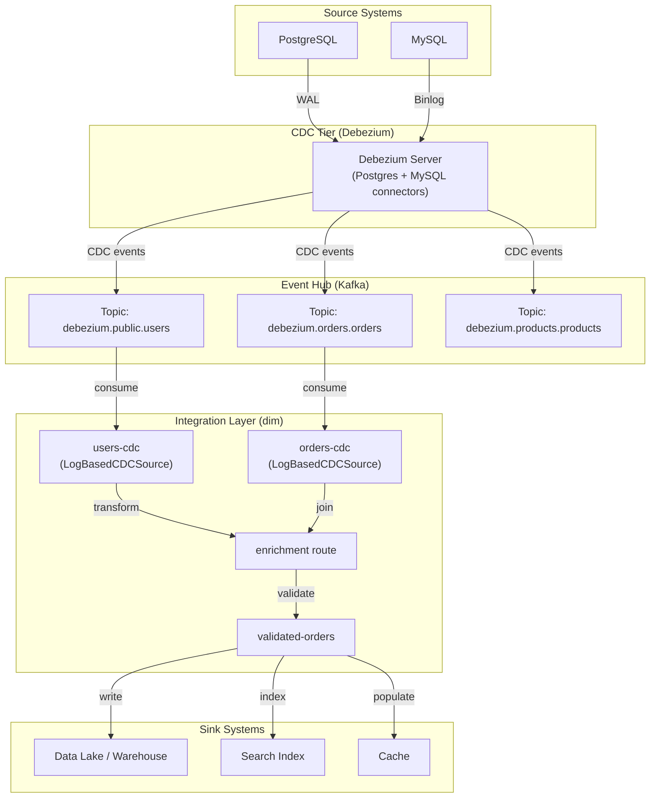
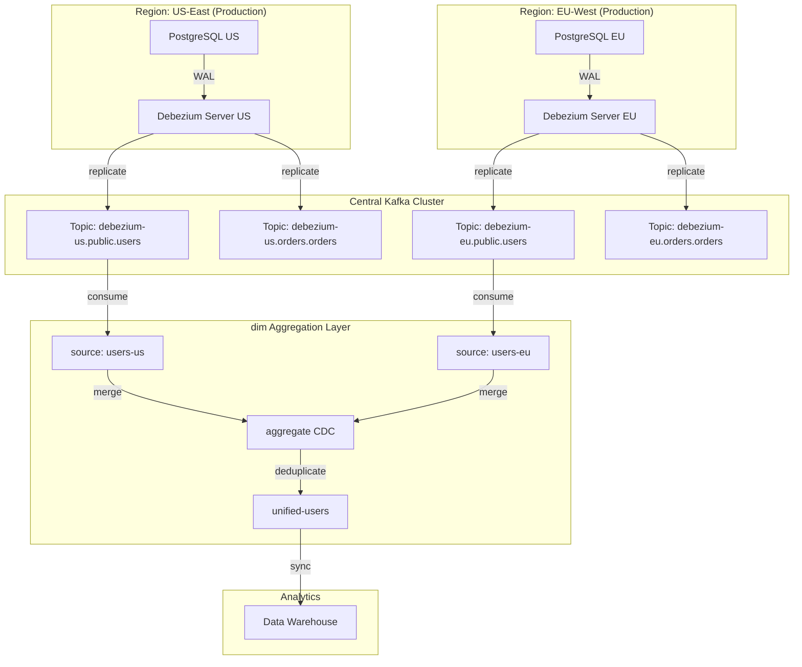
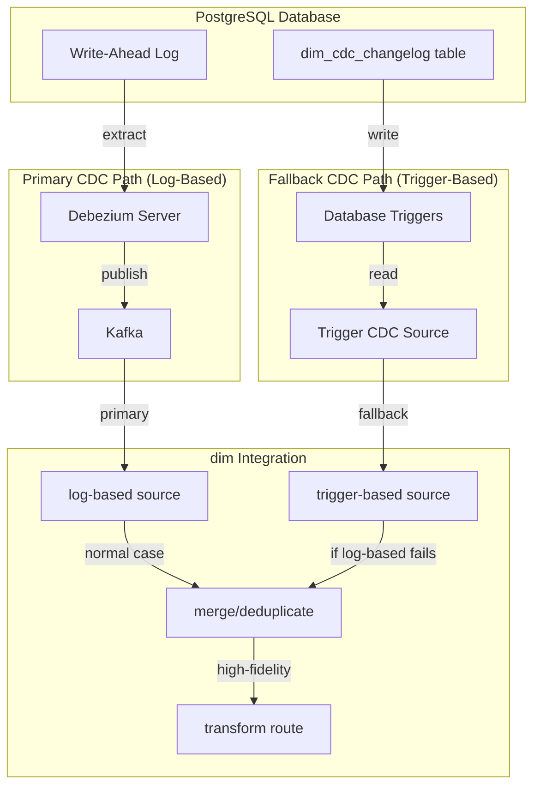
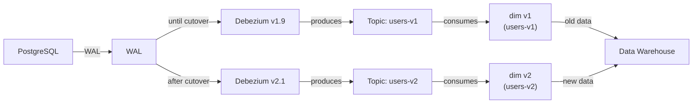

# Log-Based CDC Reference Architecture for the Declarative Integration Middleware

**Type:** Supporting document — companion to M2.3.4 CDC implementation design  
**Builds on:** M2.3.4 Database Adapters — CDC Design Document  
**Date:** 2026-09-05

## 1. Purpose

M2.3.4 introduced two CDC approaches: **trigger-based** (recommended for simplicity) and **log-based via Kafka** (optional for high-volume scenarios). This reference architecture formalizes how organizations deploying Debezium, Kafka, or alternative log-based CDC systems should structure their data-capture topology using dim.

This document assumes:
- Kafka cluster is already operational (Kafka < 3.0, 3.0+, or Confluent Cloud)
- Debezium Server or similar CDC middleware is already deployed
- Organizations want centralized event capture without database-level complexity
- Schema evolution and versioning matter

## 2. CDC Comparison Matrix

| Aspect | Polling (M2.3.1) | Trigger-Based (M2.3.4a) | Log-Based (M2.3.4b) |
|--------|-----------------|------------------------|----------------------|
| **Latency** | Minutes | Seconds | Milliseconds |
| **DB Load** | Medium (queries) | High (triggers + changelog) | Low (replication log read-only) |
| **External Infra** | None | None | Debezium, Kafka |
| **Scalability** | 100s of tables | 10s-100s of tables | 1000s of tables |
| **When to Use** | Starting out, low volume | Medium volume, simpler ops | High volume, Kafka exists |
| **Setup Complexity** | 1/5 | 2/5 | 4/5 |
| **Operations Complexity** | 1/5 | 3/5 (trigger management) | 3/5 (Debezium management) |
| **Data Guarantees** | Eventually consistent | Near real-time | Real-time (at-least-once) |

## 3. Reference Architectures

### 3.1 Simple Debezium + Kafka + dim topology



**Key characteristics:**
- Debezium extracts from PostgreSQL WAL and MySQL binlog
- CDC events published to Kafka topics (one topic per table)
- dim consumes from Kafka topics as sources
- Watermark-free; offset tracking via Kafka consumer group
- At-least-once delivery semantics

### 3.2 Multi-region Debezium with central aggregation



**Key characteristics:**
- Multiple Debezium instances per region
- Kafka topics in central cluster replicate CDC across regions
- dim aggregates CDC from multiple regions
- Deduplication and conflict resolution at integration layer

### 3.3 Hybrid: Log-Based Primary with Trigger-Based Fallback



**Key characteristics:**
- Debezium provides primary CDC path (low database overhead)
- Trigger-based fallback if Debezium unavailable
- Deduplication ensures no double-capture
- SLA improvement: combines best of both approaches

## 4. Debezium Deployment Patterns

### 4.1 Standalone Debezium Server (simplest)

```yaml
# debezium-server-config/application.properties
quarkus.log.level=INFO

# Storage: use file-based offset storage for simplicity
debezium.source.database.server.id=1
debezium.source.database.server.name=production

# Postgres connector
debezium.source.connector.class=io.debezium.connector.postgresql.PostgresConnector
debezium.source.database.hostname=postgres-prod.example.org
debezium.source.database.port=5432
debezium.source.database.user=replication_user
debezium.source.database.password=${DB_PASSWORD}
debezium.source.database.dbname=production
debezium.source.plugin.name=pgoutput
debezium.source.publication.name=cdc_publication
debezium.source.schema.include.list=public,payments

# Sink: Kafka
debezium.sink.type=kafka
debezium.sink.kafka.topic.prefix=debezium
debezium.sink.kafka.bootstrap.servers=kafka-broker-1:9092,kafka-broker-2:9092,kafka-broker-3:9092
debezium.sink.kafka.compression.type=snappy

# Transforms: add envelope with before/after
debezium.transforms=route
debezium.transforms.route.type=org.apache.kafka.connect.transforms.RegexRouter
debezium.transforms.route.regex=([^.]+)\\.([^.]+)\\.([^.]+)
debezium.transforms.route.replacement=$3
```

**dim integration:**
```yaml
sources:
  users-cdc:
    type: database-cdc
    mode: log-based
    config:
      kafka:
        brokers:
          - kafka-broker-1:9092
          - kafka-broker-2:9092
          - kafka-broker-3:9092
        topic: users
        consumer_group: dim-users-cdc
        start_offset: latest
      cdc_format: debezium
      batch_size: 100
```

### 4.2 Kafka Connect Distributed (production-grade)

```yaml
# docker-compose.yml - Kafka Connect cluster with Debezium
version: '3.8'
services:
  kafka-connect-1:
    image: confluentinc/cp-kafka-connect:7.5.0
    environment:
      CONNECT_BOOTSTRAP_SERVERS: kafka:9092
      CONNECT_GROUP_ID: debezium-cdc
      CONNECT_CONFIG_STORAGE_TOPIC: _connect_configs
      CONNECT_OFFSET_STORAGE_TOPIC: _connect_offsets
      CONNECT_STATUS_STORAGE_TOPIC: _connect_status
      CONNECT_CONFIG_STORAGE_REPLICATION_FACTOR: 3
      CONNECT_OFFSET_STORAGE_REPLICATION_FACTOR: 3
      CONNECT_STATUS_STORAGE_REPLICATION_FACTOR: 3
      CONNECT_PLUGIN_PATH: /usr/local/share/kafka/plugins
    volumes:
      - ./debezium-plugins:/usr/local/share/kafka/plugins
    ports:
      - "8083:8083"

  postgres-source:
    image: debezium/connect:latest
    environment:
      CONNECT_CONNECTOR_CLASS: io.debezium.connector.postgresql.PostgresConnector
      CONNECT_DATABASE_HOSTNAME: postgres-prod
      CONNECT_DATABASE_PORT: 5432
      CONNECT_DATABASE_USER: replication_user
      CONNECT_DATABASE_PASSWORD: ${DB_PASSWORD}
      CONNECT_DATABASE_DBNAME: production
      CONNECT_DATABASE_SERVER_NAME: prod-postgres
      CONNECT_PLUGIN_NAME: pgoutput
      CONNECT_PUBLICATION_NAME: cdc_publication
      CONNECT_SCHEMA_INCLUDE_LIST: public,payments
      CONNECT_TASKS_MAX: 4
      CONNECT_SNAPSHOT_MODE: initial
```

**REST API to register connector:**
```bash
curl -X POST http://kafka-connect:8083/connectors \
  -H "Content-Type: application/json" \
  -d '{
    "name": "postgres-cdc",
    "config": {
      "connector.class": "io.debezium.connector.postgresql.PostgresConnector",
      "database.hostname": "postgres-prod.example.org",
      "database.port": "5432",
      "database.user": "replication_user",
      "database.password": "***",
      "database.dbname": "production",
      "database.server.name": "prod-postgres",
      "plugin.name": "pgoutput",
      "publication.name": "cdc_publication",
      "table.include.list": "public.users,public.orders,payments.transactions",
      "tasks.max": "4"
    }
  }'
```

**Key differences:**
- Distributed cluster: scales horizontally, fault-tolerant
- REST API for connector management
- Centralized offset/config storage in Kafka
- Better for 1000s+ of tables

### 4.3 Confluent Cloud (managed Debezium)

```yaml
# No infrastructure to manage; Confluent Cloud handles Debezium
confluent_cloud:
  organization_id: "org-xyz"
  environment_id: "env-abc"
  cluster_id: "lkc-123"

# Create source connector via Confluent Cloud UI or API
connector:
  name: postgres-prod-cdc
  type: PostgresDebezium
  source_database: production
  source_hostname: postgres-prod.example.org
  replication_user: debezium_user
  publication_name: cdc_publication
  output_topic_format: "debezium_{table_name}"
  connector_scaling:
    tasks: 8  # Auto-scales based on partition count
```

**dim integration (no change):**
```yaml
sources:
  orders-cdc:
    type: database-cdc
    mode: log-based
    config:
      kafka:
        brokers:
          - pkc-xxx.us-east-1.provider.confluent.cloud:9092
        topic: debezium_orders
        consumer_group: dim-orders-cdc
        security:
          mechanism: SASL_SSL
          protocol: SASL_SSL
          username: "${CONFLUENT_API_KEY}"
          password: "${CONFLUENT_API_SECRET}"
      cdc_format: debezium
```

## 5. Alternative CDC Systems

### 5.1 PostgreSQL pgoutput (built-in, free)

**Pros:**
- No external tool needed; uses PostgreSQL's native streaming replication protocol
- Works with existing Kafka consumers (need bridge tool)
- Low overhead; designed for replication

**Cons:**
- Requires bridge to Kafka (e.g., pgcopydb, pgreplicationslots2kafka)
- Less operational tooling than Debezium
- Schema evolution handling manual

**dim integration:**
```yaml
sources:
  users-pgoutput:
    type: database-cdc
    mode: log-based
    config:
      kafka:
        brokers: [kafka:9092]
        topic: pgoutput.public.users
        consumer_group: dim-pgoutput-users
      cdc_format: debezium  # pgoutput converts to Debezium format via bridge
```

### 5.2 MySQL Binlog (via Maxwell or Databus)

**Maxwell approach:**
```yaml
maxwell:
  jdbc_url: "jdbc:mysql://mysql-prod:3306/production"
  jdbc_user: "maxwell_user"
  kafka:
    bootstrap_servers: "kafka:9092"
    topic_template: "maxwell.{{ database }}.{{ table }}"
```

**dim integration:**
```yaml
sources:
  orders-maxwell:
    type: database-cdc
    mode: log-based
    config:
      kafka:
        brokers: [kafka:9092]
        topic: maxwell.orders.orders
        consumer_group: dim-maxwell-orders
      cdc_format: maxwell
```

### 5.3 DMS (AWS Database Migration Service)

```yaml
aws_dms:
  source_database: "production-postgres"
  target_kafka_cluster: "kafka-prod"
  cdc_start_position: "now"  # or point-in-time recovery
  parallelism: 4
  batch_size: 100
  changelog_retention_hours: 24
```

**dim integration:**
```yaml
sources:
  orders-dms:
    type: database-cdc
    mode: log-based
    config:
      kafka:
        brokers: [kafka:9092]
        topic: dms.orders.orders
        consumer_group: dim-dms-orders
      cdc_format: debezium  # DMS outputs Debezium-compatible format
```

## 6. Consumer Group Strategy for dim

### 6.1 Single consumer group per route

```yaml
routes:
  - name: orders-ingestion
    version: v1
    sources:
      - name: orders-cdc
        type: database-cdc
        mode: log-based
        config:
          kafka:
            brokers: [kafka:9092]
            topic: debezium.orders.orders
            consumer_group: dim-orders-ingestion-v1  # Unique per route
            start_offset: latest
          cdc_format: debezium
          batch_size: 1000
```

**Characteristics:**
- Each route has dedicated consumer group
- Allows independent scaling and failure modes
- Consumer group offset persisted in Kafka
- Resumption after restart: continues from last committed offset

### 6.2 Shared consumer group with offset management

```yaml
sources:
  orders-cdc:
    type: database-cdc
    mode: log-based
    config:
      kafka:
        brokers: [kafka:9092]
        topic: debezium.orders.orders
        consumer_group: dim-all-cdc  # Shared across multiple routes
        start_offset: earliest  # Reprocess from start on first run
      cdc_format: debezium
      batch_size: 100

routes:
  - name: orders-to-warehouse
    sources: [orders-cdc]
    steps:
      - name: validate
        type: validate-contract
        config:
          schema_registry: apicurio
          subject: orders-value

  - name: orders-to-cache
    sources: [orders-cdc]
    steps:
      - name: enrich
        type: translate
        config:
          expr: "{ id: $.id, customer: $.customer_id, total: $.amount }"
```

**Characteristics:**
- One consumer group shared by multiple routes
- All routes see same events in same order
- Simpler offset management but less flexibility

## 7. Schema Evolution Patterns

### 7.1 Forward-compatible schema with registry

```yaml
routes:
  - name: users-forward-compat
    version: v2
    sources:
      - name: users-cdc
        type: database-cdc
        mode: log-based
        config:
          kafka:
            brokers: [kafka:9092]
            topic: debezium.public.users
            consumer_group: dim-users-v2
          cdc_format: debezium
    steps:
      - name: validate-schema
        type: validate-contract
        config:
          schema_registry: apicurio
          subject: debezium.public.users-value
          enforce: true
          compatibility: FORWARD  # New fields OK; missing old fields break
    sinks:
      - name: users-warehouse
        type: database
        config:
          driver: postgres
          table: users_raw
```

**Debezium + Schema Registry setup:**
```yaml
debezium:
  source:
    schema.registry.url: http://apicurio:8080
    value.converter: io.confluent.connect.avro.AvroConverter
    value.converter.schema.registry.url: http://apicurio:8080
```

### 7.2 Migration strategy: versioned topics



**Cutover process:**
1. Deploy Debezium v2.1 in parallel, produce to new topic
2. Deploy dim v2 consuming from new topic
3. Validate data consistency
4. Decommission old topic and Debezium v1.9
5. Update downstream consumers to use new topic

## 8. Failure Modes and Recovery

### 8.1 Debezium connector crashes

**Automatic recovery (Kafka Connect):**
```
[NORMAL] Connector polls Postgres WAL → produces to Kafka
[FAILURE] Postgres connection lost or connector error
         → Kafka Connect triggers restart policy (default: 30s backoff, infinite retries)
         → dim keeps consuming from Kafka; offset frozen until new records arrive
[RECOVERY] Debezium comes back, resumes from Postgres replication slot
          → New CDC events resume on Kafka topic
          → dim continues from last committed offset
```

**Manual intervention:**
```bash
# Check connector status
curl http://kafka-connect:8083/connectors/postgres-cdc/status

# Reset connector (loses state; must restart from snapshot)
curl -X POST http://kafka-connect:8083/connectors/postgres-cdc/restart

# Pause connector (graceful stop)
curl -X PUT http://kafka-connect:8083/connectors/postgres-cdc/pause
```

### 8.2 Kafka broker failure (multi-node cluster)

**Automatic recovery:**
```
[FAILURE] Broker 1 crashes; topic replicas on brokers 2,3
         → Kafka controller elects new leader for partitions
         → Producer/consumer auto-reconnect within ~30s
         → No message loss if replication factor ≥ 3
```

**dim behavior:**
```yaml
kafka:
  brokers: [broker-1:9092, broker-2:9092, broker-3:9092]  # All brokers in config
  # Consumer auto-discovers leader via metadata
  # Briefly pauses during broker failure (~30s)
  # Resumes automatically
```

### 8.3 dim consumer fails

**Recovery:**
```
[FAILURE] dim process crashes while processing events
         → Kafka consumer group rebalances
         → Consumer offset NOT committed (lost N seconds of data)
         → On restart, dim resumes from last committed offset
         → Reprocesses messages since last commit
[RESULT] At-least-once delivery; deduplication needed in sinks
```

**To improve RTO:**

```yaml
routes:
  - name: orders-cdc
    sources:
      - name: orders-cdc-kafka
        type: database-cdc
        mode: log-based
        config:
          kafka:
            brokers: [kafka:9092]
            topic: debezium.orders.orders
            consumer_group: dim-orders
            commit_interval_ms: 5000  # Commit offset every 5s
            fetch_timeout_ms: 30000
          cdc_format: debezium
          batch_size: 100
    steps:
      - name: deduplicate
        type: deduplicate  # Built-in dedup step
        config:
          key_expr: "$.id"
          time_window_sec: 60
    sinks:
      - name: orders-warehouse
        type: database
        config:
          table: orders
          upsert:
            enabled: true
            key_columns: [id]  # Idempotent sink
```

## 9. Sizing Guidance

### 9.1 Kafka broker sizing for CDC

For 100 tables, each with 1000 writes/sec, producing 1KB events:

```
Total throughput = 100 tables × 1000 writes/sec × 1KB = 100 MB/sec
Retention: 24 hours (default) = 100 MB/sec × 86400 = 8.6 TB per day

Broker config:
- Replication factor: 3
- Partition count: 3 × 100 = 300 partitions
- Broker disk: 10 TB per broker (accounting for compaction, 3x replication)
- Network: 100 MB/sec per broker = ~800 Mbps (need 10G NIC minimum)
- Memory per broker: 8 GB (standard; more for faster catch-up)
```

### 9.2 Debezium resource requirements

```
Per 100 tables:
- Memory: 2-4 GB (baseline 512MB + 20-30MB per table)
- CPU: 2-4 cores
- Disk: 100 MB (for replication slots, offset storage)

Scaling:
- 1K tables: Use Kafka Connect distributed (4-8 worker nodes)
- 10K+ tables: Multi-cluster Debezium + dedicated Kafka topics per domain
```

### 9.3 dim consumer sizing

```
Per consumer thread (single route):
- Memory: 256 MB base + batch_size × message_size
- CPU: 0.1-0.5 cores (mostly I/O bound)
- Throughput: 10K-100K messages/sec per thread

Example: 1M msgs/sec across all routes
- 10 consumer threads (100K msgs/sec each)
- 1-2 CPU cores total
- 2-4 GB memory
```

## 10. Operational Checklist

**Pre-deployment:**
- [ ] Kafka cluster operational (min 3 brokers for production)
- [ ] Schema registry (Apicurio or Confluent) deployed
- [ ] Debezium server/Kafka Connect cluster deployed
- [ ] Database replication user created with appropriate grants
- [ ] Replication slot created (PostgreSQL) or binlog enabled (MySQL)
- [ ] Network connectivity verified: Debezium → PostgreSQL, Debezium → Kafka

**Deployment:**
- [ ] Create Debezium connector via REST API or UI
- [ ] Verify topics created in Kafka (e.g., `debezium.public.users`)
- [ ] Validate initial snapshot is processing (check Debezium connector metrics)
- [ ] Deploy dim routes consuming CDC topics
- [ ] Verify messages flowing through topics
- [ ] Validate schema registry has entries for all tables

**Post-deployment monitoring:**
- [ ] Kafka topic lag: `kafka-consumer-groups.sh --group dim-cdc --describe`
- [ ] Debezium connector health: REST API status endpoint
- [ ] Message count and byte rate: Kafka metrics
- [ ] End-to-end latency: measure from database write to sink receipt
- [ ] Error rates in dim routes

**Ongoing maintenance:**
- [ ] Monthly: Review Debezium task distribution (rebalancing)
- [ ] Quarterly: Analyze Kafka topic sizes; adjust retention if needed
- [ ] As-needed: Handle schema evolution via versioned topics or connector updates

## 11. Cost Comparison

| Aspect | Trigger-Based | Log-Based (Debezium + Kafka) |
|--------|---------------|------------------------------|
| **Infrastructure** | DB only (triggers) | Debezium cluster + Kafka cluster |
| **Monthly (AWS)** | $0 (on-premise DB) | $500-2000 (depending on Kafka size) |
| **Human effort** | Low (SQL triggers) | Medium-High (Debezium ops) |
| **Scalability cost** | Medium (DB load) | Linear (add Kafka brokers) |
| **Break-even point** | N/A (lower fixed cost) | 1000+ tables or >100MB/sec throughput |

**Recommendation:** Start with trigger-based, migrate to log-based when:
- Table count > 500 and growing
- CDC throughput > 50 MB/sec
- Operational team familiar with Kafka/Debezium
- Cost justifies investment in CDC infrastructure

## 12. Real-World Example: Multi-Domain CDC

Three business domains (Orders, Customers, Inventory) with centralized CDC:

```yaml
# domains/orders/routes.yaml
domain: orders
sources:
  orders-db-cdc:
    type: database-cdc
    mode: log-based
    config:
      kafka:
        brokers: [kafka-1:9092, kafka-2:9092, kafka-3:9092]
        topic: debezium.orders.orders
        consumer_group: dim-orders-cdc
      cdc_format: debezium
      batch_size: 500

routes:
  orders-sync:
    domain: orders
    from: orders-db-cdc
    steps:
      - name: validate
        type: validate-contract
        config:
          schema_registry: apicurio-prod
          subject: orders-value
      - name: enrich-customer
        type: translate
        config:
          expr: "$ | { customer_name: $.customer_id, status: $.status }"
    sinks:
      - name: orders-warehouse
        type: database
        config:
          driver: postgres
          dsn: "postgres://warehouse-prod/analytics"
          table: orders
          insert_columns: [id, customer_id, customer_name, amount, status, changed_at]
          upsert:
            enabled: true
            key_columns: [id]
```

```yaml
# domains/inventory/routes.yaml
domain: inventory
sources:
  inventory-db-cdc:
    type: database-cdc
    mode: log-based
    config:
      kafka:
        brokers: [kafka-1:9092, kafka-2:9092, kafka-3:9092]
        topic: debezium.products.inventory
        consumer_group: dim-inventory-cdc
      cdc_format: debezium
      batch_size: 1000

routes:
  inventory-sync:
    domain: inventory
    from: inventory-db-cdc
    steps:
      - name: validate
        type: validate-contract
        config:
          schema_registry: apicurio-prod
          subject: inventory-value
      - name: calculate-reorder
        type: translate
        config:
          expr: "$ | { reorder_qty: $.reorder_point - $.on_hand }"
    sinks:
      - name: inventory-warehouse
        type: database
        config:
          driver: postgres
          dsn: "postgres://warehouse-prod/analytics"
          table: inventory
          insert_columns: [sku, product_id, on_hand, reorder_qty, warehouse_id, updated_at]
          upsert:
            enabled: true
            key_columns: [sku, warehouse_id]

  inventory-search:
    domain: inventory
    from: inventory-db-cdc
    sinks:
      - name: opensearch-inventory
        type: search
        config:
          host: opensearch-prod:9200
          index: inventory
          key_field: sku
```

**Debezium connectors:**
```bash
# PostgreSQL orders connector
curl -X POST http://kafka-connect:8083/connectors \
  -H "Content-Type: application/json" \
  -d '{
    "name": "postgres-orders",
    "config": {
      "connector.class": "io.debezium.connector.postgresql.PostgresConnector",
      "database.hostname": "postgres-orders-prod",
      "database.dbname": "orders",
      "database.user": "debezium",
      "table.include.list": "orders.orders",
      "publication.name": "cdc_orders",
      "topic.prefix": "debezium.orders"
    }
  }'

# PostgreSQL inventory connector
curl -X POST http://kafka-connect:8083/connectors \
  -H "Content-Type: application/json" \
  -d '{
    "name": "postgres-inventory",
    "config": {
      "connector.class": "io.debezium.connector.postgresql.PostgresConnector",
      "database.hostname": "postgres-inventory-prod",
      "database.dbname": "products",
      "database.user": "debezium",
      "table.include.list": "products.inventory",
      "publication.name": "cdc_products",
      "topic.prefix": "debezium.products"
    }
  }'
```

---

## Summary

Log-based CDC via Debezium and Kafka provides:

✅ **Real-time CDC** for 1000s of tables without database overhead  
✅ **Multiple CDC sources** (PostgreSQL, MySQL, Oracle, etc.) unified in Kafka  
✅ **Scalable integration** via dim consuming from Kafka topics  
✅ **Schema evolution** via schema registry integration  
✅ **Multi-region/multi-source** aggregation patterns  
✅ **Operational tooling** (Kafka metrics, Debezium dashboards)  

Use this reference architecture to:
- Design CDC topology for your organization
- Choose between trigger-based, log-based, or hybrid approaches
- Implement multi-domain data products with decentralized ownership
- Integrate existing Debezium/Kafka infrastructure with dim
