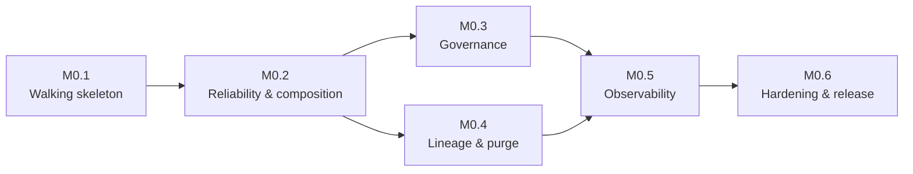
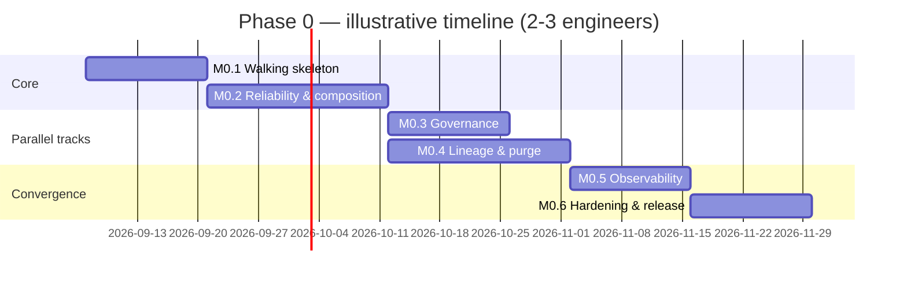

# Phase 0 Implementation Plan — Declarative Integration Middleware

**Type:** Engineering plan — how to build, not what to build. Scope is fixed by the core design; nothing here changes it.
**Builds on:** `eip-middleware-design.md`, v8 (§19, Phase 0)
**Language:** Go (selected over Rust and TypeScript/Node.js — rationale in §3)
**Status:** Draft v5 — no open questions remain; ready for execution
**Date:** 2026-09-01

## Revision history

| Version | Date | Summary |
|---|---|---|
| v1 | 2026-09-01 | Initial Phase 0 implementation plan: stack decisions, repo layout, six milestones, risk register, testing/CI strategy, acceptance criteria. |
| v2 | 2026-09-01 | Resolved round-1 open questions: JS shell-out accepted as a JSONata fallback if the spike finds the Go-native libraries insufficient (with a single-binary-preserving mitigation added to the risk register); added §7, Execution model, making the coding-agent-implementation assumption and its testing/spec guardrails explicit; PBAC dropped entirely from the Phase 0 `authorize` step schema rather than stubbed, deferred to Phase 1 as a schema-plus-implementation unit. Definition of done and risk register renumbered to §8/§9 accordingly. Three new open questions posed. |
| v3 | 2026-09-01 | Resolved round-2 open questions: required human PR review added alongside the CI gate (§6, §7); schema versioning confirmed as a Phase 1 concern, not added to Phase 0's route schema; every milestone in §5 broken down into agent-sized subtasks (50 total, M0.x.y), each with its own exit criterion, with the milestone-level exit criteria retained as the aggregate gate. Three new open questions posed on schema-compatibility testing, review tiering by risk, and explicit subtask dependency graphs. |
| v4 | 2026-09-01 | Resolved round-3 open questions: accepted relying on discipline plus a Phase-1-time backward-compatibility test for the `pbac` schema addition, with no compatibility-check subtask added to Phase 0's CI (noted in M0.3.4); adopted risk-tiered human review by name (M0.2.10, M0.3.1–M0.3.4, M0.4.5–M0.4.7 require specialist review, §6); added an explicit per-milestone subtask dependency-graph table to §5 for each of the six milestones, customized for coding-agent hand-off, superseding list-order as the sequencing signal (§7). Three new open questions posed on mechanical enforcement of the review tiers and dependency graphs, and whether to snapshot the Phase 0 schema for Phase 1's compatibility baseline. |
| v5 | 2026-09-01 | Resolved round-4 open questions, all toward the lighter-weight option: review-tier enforcement is by reviewer self-selection, not `CODEOWNERS` (§6); the `v0.1.0` git tag itself is the compatibility baseline for Phase 1's `pbac` addition, no separate schema snapshot file (M0.3.4); the subtask dependency graphs stay advisory, not CI-enforced (§5, §7 dependency-graph notes). No new open questions — the plan is considered ready for execution. |

## 1. Purpose and how to read this

This document does not add or change anything in `eip-middleware-design.md`. It answers a different question than that document: given the Phase 0 scope the design's roadmap already committed to (§19), how do we actually build it — in what order, with what libraries, against what exit criteria, and with what known risks. Every milestone below cites the design section(s) it implements, so scope drift is checkable by cross-reference, not by memory.

Two companion documents — `data-mesh-reference-architecture.md` and `self-service-feasibility-study.md` — describe capabilities that are explicitly **not** in Phase 0 (domain/namespace labeling, GitOps scaffolding, `midctl scaffold`, discovery surfaces). Nothing in this plan builds toward those; they stay proposals until a future design round pulls them into the roadmap.

## 2. Phase 0 scope recap and explicit exclusions

Restating design §19's Phase 0 scope in engineering terms, this plan covers:

- Core engine: message envelope, channels, executor, DAG generations.
- Route steps: `filter`, `translate`, `route` (content-based router), `wiretap`, `idempotent`, `authorize` (RBAC + ABAC only), plus contract conformance checks on source/sink boundaries.
- Expression/function layer: JSONata plus the `functions` registry, both `plugin` and `wasm` function types.
- Adapters: HTTP (source and sink) and file/SFTP (source and sink). In-memory channels for intra-engine wiring.
- Reliability: error path, retry with backoff, dead-letter envelope, idempotent-consumer dedup (§7).
- Config: `imports`/`fragments` composition (§6.2), JSON Schema validation of route config including mandatory `auth:`/`error_path` declarations (§6.3, §13.5).
- Data contracts: inline (file-beside-route) JSON Schema contracts only, with `enforce`/`on_violation`, `contract_violation` classification, and `contract_version` stamping (§11.1, §11.2, §11.4).
- Authorization: principal propagation from the HTTP adapter, `authorize` step in RBAC/ABAC modes (§13.1, §13.2, §13.5).
- Lineage: per-instance embedded store, static and dynamic retention-policy assignment, `subject_id_expr` indexing, automatic reaper with per-policy cadence, manual `midctl lineage purge` (including `--subject`), purge evidence log with `expiry_warning_lead`, on-demand `midctl lineage export` (§10.1–§10.4, §10.6–§10.8).
- Hot reload: drain-with-background-stragglers, concurrent-generation cap (§14.1).
- Observability: Prometheus metrics, OTel tracing, built-in Tier 1 viewer, a shipped example Tier 2 Grafana dashboard (§9).
- Tooling: `midctl run`, `validate`, `explain`, `trace tail`, `provenance`, `lineage export`/`purge`, plus a route test runner against `route_test.yaml` fixtures (§15).

**Explicitly out of scope for Phase 0** (all deferred to the design's Phase 1/2/3, §19 — listed here only so nothing below is mistaken for building toward them):

- Kafka/AMQP adapters.
- PBAC via the neutral PDP contract and the OPA reference adapter — Phase 0 ships RBAC and ABAC only; `mode: pbac` is absent from the Phase 0 `authorize` step schema entirely, not stubbed. It arrives as a schema change and its implementation together, as one Phase 1 unit of work.
- The formally published, versioned PDP OpenAPI/JSON Schema spec itself.
- OBO (on-behalf-of) token exchange.
- Schema-registry-backed contracts and the Apicurio reference integration — Phase 0 contracts are inline JSON Schema only.
- OpenLineage export and Marquez integration.
- Replay tooling beyond what the dead-letter envelope already enables manually.
- Aggregator/splitter/claim-check steps.
- Distributed control plane, plugin SDK publication, multi-tenant isolation.
- Everything in the data-mesh reference architecture and self-service feasibility study (domain namespacing, `midctl scaffold`, discovery surface, domain-scoped secrets) — those remain proposals, not roadmap items, until a future round adopts them.

## 3. Stack decision record

### 3.1 Language: Go

Selected over Rust and TypeScript/Node.js. Rationale, weighed against the design's tenets:

- Single static binary distribution matches the deployment model implied by §14 (no runtime dependency install step for `dimd`/`midctl`).
- Goroutines and channels map directly onto the channel-plus-worker-pool executor model in §5 — the concurrency primitives the design already assumes are native to the language, not a library bolted on.
- A pure-Go WASM runtime (`wazero`) exists and needs no cgo, which matters for the plugin/WASM functions registry (§6.1) staying in a single static binary.
- A pure-Go embedded SQLite driver (`modernc.org/sqlite`) exists and avoids cgo, which matters for the same reason for the lineage store (§10.2).
- The OTel, Prometheus, and Kafka (Phase 1) client ecosystems in Go are mature and first-party-maintained.
- OPA (the Phase 1 PDP reference adapter, §13.3) is itself written in Go and embeddable as a library, which keeps that Phase 1 integration a dependency add rather than a cross-language bridge.

Rust was competitive on raw performance and WASM tooling but loses on ecosystem maturity for OTel/Prometheus/Kafka and imposes a steeper contribution barrier. TypeScript/Node.js was ruled out primarily on the single-binary-distribution and concurrency-model fit.

### 3.2 Libraries

| Concern | Library | Notes |
|---|---|---|
| JSONata evaluation | `blues/jsonata-go` (spike to confirm; `xiatechs/jsonata-go` as fallback) | See risk register §9 — early spike required to check spec-fidelity gaps against the canonical `jsonata-js` reference implementation before this is load-bearing. |
| WASM function runtime | `tetratelabs/wazero` | Pure Go, no cgo. |
| Native plugin runtime | `hashicorp/go-plugin` | Subprocess + RPC. See §3.3 for why this is preferred over Go's built-in `plugin` package. |
| Embedded lineage store | `modernc.org/sqlite` | Pure Go, no cgo. WAL mode plus a single-writer goroutine to serialize concurrent writes (see risk register). |
| Tracing | `go.opentelemetry.io/otel` | OTLP exporter for Tier 2 (§9.2, §9.3). |
| Metrics | `github.com/prometheus/client_golang` | §9.1. |
| JSON Schema validation | `santhosh-tekuri/jsonschema/v5` | Used for both route-config validation (§6.3) and inline data-contract conformance checks (§11.1, §11.5). |
| Cron parsing (schedules) | `robfig/cron` | Polling-source schedules. |
| SFTP | `github.com/pkg/sftp` + `golang.org/x/crypto/ssh` | File/SFTP adapter. |
| CLI framework | `spf13/cobra` | `midctl`. |

### 3.3 One implementation-level decision worth flagging explicitly

The design's plugin/WASM split (§6.1) says native compiled functions and WASM functions are both first-class, but doesn't specify a native-plugin transport. This plan uses `hashicorp/go-plugin` (subprocess plus RPC) rather than Go's built-in `plugin` package. The built-in package requires the plugin `.so` and the host binary to be built with the exact same Go toolchain version and dependency versions, which is fragile for anything distributed independently of `dimd` itself — effectively it would force every native-function plugin to be rebuilt in lockstep with every `dimd` release. `hashicorp/go-plugin` avoids that at the cost of a subprocess boundary (higher per-call latency than an in-process `.so` call, though still far below WASM's own boundary cost). This doesn't change anything the design commits to — native functions remain "first-class, no forced default" exactly as §6.1 states — but it's a concrete transport choice worth surfacing rather than leaving implicit, since it affects what a native-function plugin author has to ship (a standalone executable, not a `.so`).

## 4. Repository layout

```
dim/
├── cmd/
│   ├── dimd/                  # engine daemon entrypoint
│   └── midctl/                # CLI entrypoint
├── internal/
│   ├── config/                # YAML loading, imports/fragments resolution, JSON Schema validation
│   ├── route/                 # route model, route_version hashing
│   ├── engine/
│   │   ├── channel.go
│   │   ├── executor.go
│   │   └── generation.go      # DAG generation lifecycle, hot reload, drain
│   ├── steps/
│   │   ├── filter.go
│   │   ├── translate.go
│   │   ├── route_step.go      # content-based router
│   │   ├── wiretap.go
│   │   ├── idempotent.go
│   │   ├── authorize.go
│   │   └── contract.go        # inline contract conformance checks
│   ├── expr/
│   │   ├── jsonata.go
│   │   ├── functions.go       # functions registry
│   │   ├── wasm_runtime.go
│   │   └── plugin_runtime.go
│   ├── adapters/
│   │   ├── source.go          # Source interface
│   │   ├── sink.go            # Sink interface
│   │   ├── http/
│   │   └── file/               # local file + SFTP
│   ├── errorpath/              # retry, backoff, dead-letter envelope
│   ├── lineage/
│   │   ├── store.go
│   │   ├── retention.go
│   │   ├── reaper.go
│   │   ├── purge.go
│   │   ├── purgelog.go
│   │   └── export.go
│   ├── authz/
│   │   ├── principal.go
│   │   └── pdp.go               # RBAC/ABAC evaluation only; PBAC (schema + impl) ships in Phase 1
│   ├── observability/
│   │   ├── metrics.go
│   │   ├── tracing.go
│   │   └── viewer/              # Tier 1 built-in viewer
│   └── secrets/                 # ${SECRET:name} resolution: env, file, Vault-style providers
├── pkg/
│   └── sdk/                     # public SPI for plugin/WASM function authors
├── schemas/
│   └── route.schema.json        # route config JSON Schema (§6.3)
├── examples/
│   └── order-processing/        # Phase-0-adapted version of design §16's worked example
├── test/
│   ├── fixtures/                # route_test.yaml fixtures (§15)
│   └── integration/             # -race-enabled end-to-end tests
└── deploy/
    └── grafana/                  # example Tier 2 dashboard-as-code (§9.3)
```

## 5. Milestones



### M0.1 — Walking skeleton

**Scope:** the smallest end-to-end path a message can take, with nothing structural missing that later milestones would need to retrofit.

**Subtasks:**
- **M0.1.1 — JSONata library spike.** Compare `blues/jsonata-go` and `xiatechs/jsonata-go` against a shared suite of JSONata spec test cases (risk register, §9). Exit: findings written down, one library selected and pinned in `go.mod`.
- **M0.1.2 — Message envelope + bounded `Channel`.** `internal/engine/channel.go`. Exit: unit tests cover envelope construction/copy semantics and channel backpressure (a full bounded channel blocks or drops per its configured policy).
- **M0.1.3 — Minimal single-worker `Executor`.** `internal/engine/executor.go`, wired to a `Channel`. Exit: unit test proves a message enqueued on a source channel is dequeued and passed to a step function exactly once.
- **M0.1.4 — HTTP source adapter.** `internal/adapters/http`. Exit: integration test posts to a local HTTP listener and the message appears on the engine's ingress channel.
- **M0.1.5 — File sink adapter.** `internal/adapters/file`. Exit: integration test drains a channel to a temp file and the file's contents match the expected output.
- **M0.1.6 — `filter` step.** `internal/steps/filter.go`, JSONata boolean predicate. Exit: fixture test with one passing and one failing predicate.
- **M0.1.7 — `translate` step.** `internal/steps/translate.go`, JSONata expression. Exit: fixture test transforms a sample payload to the expected output.
- **M0.1.8 — Route schema + single-route config loader.** `schemas/route.schema.json` (§6.3) plus `internal/config`, un-parameterized (no `imports`/`fragments` yet). Exit: `midctl validate` accepts a valid route file and rejects an invalid one with a schema-path error message.
- **M0.1.9 — `error_path` with immediate no-retry dead-letter.** `internal/errorpath` (full retry/backoff comes in M0.2). Exit: fixture test where `translate` fails on malformed input and the message is written to the dead-letter output.
- **M0.1.10 — `midctl run` / `midctl validate`.** `cmd/midctl`. Exit: the milestone-level exit criteria below pass end to end through these two commands.

**Dependency graph** (customized for coding-agent hand-off, supersedes list order as the source of sequencing truth; advisory documentation, not mechanically enforced by CI — confirmed this round):

| Subtask | Depends on |
|---|---|
| M0.1.1 | — |
| M0.1.2 | — |
| M0.1.3 | M0.1.2 |
| M0.1.4 | M0.1.2 |
| M0.1.5 | M0.1.2 |
| M0.1.6 | M0.1.1, M0.1.2 |
| M0.1.7 | M0.1.1, M0.1.2 |
| M0.1.8 | — |
| M0.1.9 | M0.1.2, M0.1.7 |
| M0.1.10 | M0.1.3, M0.1.4, M0.1.5, M0.1.6, M0.1.7, M0.1.8, M0.1.9 |

**Exit criteria:** a single YAML route file, containing one HTTP source, one `filter`, one `translate`, one file sink, runs end to end via `midctl run`; an invalid route file is rejected by `midctl validate` with a schema-level error message; a message that fails `translate` lands as a dead letter on stdout/local file.

### M0.2 — Reliability and composition

**Scope:** everything that makes a route resilient and composable, plus hot reload — the design's structural core (§6.2, §7, §14.1).

**Subtasks:**
- **M0.2.1 — Retry classification + backoff/jitter.** `internal/errorpath/retry.go` (§7.1). Exit: unit tests cover retryable-vs-non-retryable classification and backoff-timing bounds.
- **M0.2.2 — Dead-letter envelope finalized.** Per §7.2's format. Exit: fixture test asserts every envelope field matches spec.
- **M0.2.3 — `route` (content-based router) step.** `internal/steps/route_step.go`. Exit: fixture test with two or more case branches routes each input to the correct branch.
- **M0.2.4 — `wiretap` step.** `internal/steps/wiretap.go`. Exit: fixture test confirms the tapped copy reaches a secondary sink without altering the main flow.
- **M0.2.5 — `idempotent` step, in-memory dedup store.** `internal/steps/idempotent.go`. Exit: fixture test sends the same message twice; the second is suppressed.
- **M0.2.6 — `imports`/`fragments` resolution.** `internal/config` (§6.2). Exit: unit test resolves a route composed from two or more fragments into a single fully-resolved config.
- **M0.2.7 — `route_version` content hash.** `internal/route` (§10.1). Exit: unit test asserts identical resolved configs hash identically, and any change to the resolved config changes the hash.
- **M0.2.8 — WASM ABI spike + `wasm_runtime.go`.** Via `wazero` (risk register, §9). Exit: spike findings documented; a sample WASM function is callable from a route through the functions registry.
- **M0.2.9 — Native plugin runtime.** `plugin_runtime.go`, via `hashicorp/go-plugin`. Exit: a sample native-plugin function is callable from a route through the functions registry.
- **M0.2.10 — DAG generation state machine.** `internal/engine/generation.go`: new-generation takeover of new traffic, old-generation stragglers finishing in background, concurrent-draining-generation cap as the safety valve (§14.1) — the highest-risk item in this milestone; see risk register, §9. Exit: `-race`-enabled integration test reloads a route mid-traffic; in-flight messages on the old generation complete, new messages route through the new generation, and no message is lost or duplicated.
- **M0.2.11 — File/SFTP polling source.** Exit: integration test polls a local directory or SFTP server and ingests new files on schedule.
- **M0.2.12 — `exec`/stdio adapter.** Exit: integration test runs a route through an `exec` adapter round trip.
- **M0.2.13 — `midctl explain`.** Renders a resolved route's DAG. Exit: command output for a known route matches the expected DAG structure.
- **M0.2.14 — `midctl test` + `route_test.yaml` fixture runner (§15).** Exit: running `midctl test` against `test/fixtures` reports pass/fail per case, and a deliberately broken fixture reports a failure.

**Dependency graph:**

| Subtask | Depends on |
|---|---|
| M0.2.1 | M0.1.9 |
| M0.2.2 | M0.1.9, M0.2.1 |
| M0.2.3 | M0.1.1, M0.1.2, M0.1.3 |
| M0.2.4 | M0.1.2, M0.1.3 |
| M0.2.5 | M0.1.2, M0.1.3 |
| M0.2.6 | M0.1.8 |
| M0.2.7 | M0.2.6 |
| M0.2.8 | M0.1.2 |
| M0.2.9 | M0.1.2 |
| M0.2.10 | M0.1.3, M0.2.6, M0.2.7 |
| M0.2.11 | M0.1.2 |
| M0.2.12 | M0.1.2 |
| M0.2.13 | M0.2.6, M0.2.7 |
| M0.2.14 | M0.1.10, M0.2.3, M0.2.4, M0.2.5 |

**Exit criteria:** a route composed from two or more `imports`/`fragments` resolves correctly and produces a stable `route_version` hash across repeated resolutions of unchanged config; a `-race`-clean integration test reloads a route mid-traffic and confirms in-flight messages on the old generation complete while new messages route through the new generation; a WASM function and a plugin function are both callable from the same route; `midctl test` runs a `route_test.yaml` fixture and reports pass/fail per case.

### M0.3 — Governance

**Scope:** authorization and data contracts, scoped to what Phase 0 actually ships (§11, §13).

**Subtasks:**
- **M0.3.1 — Principal propagation from the HTTP adapter.** `internal/authz/principal.go`, JWT-based (§13.1). Exit: unit test extracts principal claims from a signed JWT on an HTTP request.
- **M0.3.2 — `authorize` step, RBAC mode.** `internal/steps/authorize.go` + `internal/authz/pdp.go`. Exit: fixture test allows an authorized role and rejects an unauthorized one.
- **M0.3.3 — `authorize` step, ABAC mode.** Exit: fixture test evaluates an attribute-based rule correctly for both allow and deny.
- **M0.3.4 — Mandatory `auth:` declaration validation.** Warning-level by default, `--strict` flag on `midctl validate` promotes it to a hard failure (§13.5). `mode: pbac` is not part of the Phase 0 config schema at all — a route referencing it fails `midctl validate` with an ordinary schema error, the same as any other invalid value, rather than a special-cased runtime error; PBAC support (schema and evaluation together) ships as a single Phase 1 unit of work. Since the Phase 0 schema carries no version field (confirmed a schema-versioning concern belongs to Phase 1, not Phase 0), Phase 1's addition of `pbac` must be a purely additive change with no version discriminator to gate on; relying on discipline plus a backward-compatibility test at that time is the plan, so no compatibility-check subtask is added to Phase 0's own CI pipeline (M0.6.3) for this — the check becomes part of Phase 1's PBAC work instead. The diffable baseline for that check is the `v0.1.0` git tag itself (`schemas/route.schema.json` as released, M0.6.4) — no separate schema snapshot file is committed; confirmed acceptable this round. Exit: `midctl validate` warns (exit 0) without `--strict` and fails (nonzero exit) with `--strict` on a route missing `auth:`.
- **M0.3.5 — Inline data contract loading + conformance check.** `internal/steps/contract.go`, JSON Schema format only for Phase 0 (Avro/Protobuf and registry-backed contracts wait for Phase 1's Apicurio integration, §11.3 — a deliberate Phase 0 scope trim of §11.1's "JSON Schema for Phase 0" language, not a deviation from it). Exit: fixture test where a conforming message passes and a non-conforming one is flagged.
- **M0.3.6 — `contract_violation` classification + `on_violation` routing (§11.2).** Exit: fixture test routes a violating message per its configured `on_violation` target.
- **M0.3.7 — `contract_version` stamping.** Alongside `route_version` on lineage records (§11.4). Exit: unit test confirms both fields are populated on a processed message's lineage record.

**Dependency graph:**

| Subtask | Depends on |
|---|---|
| M0.3.1 | M0.1.4 |
| M0.3.2 | M0.1.3, M0.3.1 |
| M0.3.3 | M0.3.2 |
| M0.3.4 | M0.1.8, M0.3.2, M0.3.3 |
| M0.3.5 | M0.1.5, M0.1.8 |
| M0.3.6 | M0.2.3, M0.3.5 |
| M0.3.7 | M0.2.7, M0.3.5 |

**Exit criteria:** a route with `authorize: {mode: rbac}` rejects a message from an unauthorized principal and allows one from an authorized principal; the same for `mode: abac` against an attribute-based rule; a route missing `auth:` fails `midctl validate --strict` and only warns without `--strict`; a message that violates its sink's inline contract is classified `contract_violation` and routed per `on_violation`; a route's emitted lineage record carries both `route_version` and `contract_version`.

### M0.4 — Lineage and purge

**Scope:** the full lineage/retention/purge subsystem (§10.1–§10.4, §10.6–§10.8).

**Subtasks:**
- **M0.4.1 — Embedded SQLite lineage store.** `internal/lineage/store.go` (`modernc.org/sqlite`, WAL mode, single-writer goroutine — see risk register, §9, for why). Exit: a concurrent-write load test shows no write errors or corruption under sustained parallel producers.
- **M0.4.2 — Retention policy resolution: static assignment.** `internal/lineage/retention.go`. Exit: unit test resolves a route's statically-assigned policy correctly.
- **M0.4.3 — Retention policy resolution: dynamic + fail-open.** Via `retention_policy_expr`, fail-open to `default` on an unresolved policy (§10.2). Exit: unit test resolves a dynamic policy per message and falls back to `default` when the expression fails or is unresolved.
- **M0.4.4 — `subject_id_expr` evaluation + indexing.** Exit: unit test indexes a lineage record by its evaluated subject id.
- **M0.4.5 — Automatic reaper.** `internal/lineage/reaper.go`, per-policy configurable cadence. Exit: integration test confirms records past their retention window are purged on the configured cadence and not before.
- **M0.4.6 — `midctl lineage purge`, incl. `--subject` targeting.** `internal/lineage/purge.go`. Exit: the command purges records for a given subject and leaves other subjects' records intact.
- **M0.4.7 — Purge evidence log.** `internal/lineage/purgelog.go`, append-only, its own bounded-but-long retention, `expiry_warning_lead` mechanism. Exit: unit test confirms a purge action is appended to the evidence log, and an expiry warning fires at the configured lead time.
- **M0.4.8 — `midctl lineage export` (CSV/NDJSON).** `internal/lineage/export.go`. Exit: an exported file for a known time range matches the expected row count and content in both formats.
- **M0.4.9 — `midctl provenance` (§10.7).** Exit: the command returns the correct lineage chain for a given message or subject id.

**Dependency graph:**

| Subtask | Depends on |
|---|---|
| M0.4.1 | M0.2.7 |
| M0.4.2 | M0.1.8, M0.4.1 |
| M0.4.3 | M0.4.2 |
| M0.4.4 | M0.1.1, M0.4.1 |
| M0.4.5 | M0.4.2, M0.4.3 |
| M0.4.6 | M0.1.10, M0.4.1, M0.4.4 |
| M0.4.7 | M0.4.6 |
| M0.4.8 | M0.1.10, M0.4.1 |
| M0.4.9 | M0.1.10, M0.4.1, M0.4.4 |

**Exit criteria:** a message processed through a route with a named retention policy is queryable via `midctl provenance` and is reaped automatically once its policy's retention window and cadence elapse; `midctl lineage purge --subject <id>` removes all lineage records for that subject and appends a corresponding evidence-log entry; the evidence log itself survives past the purged records' own retention window per its own configured retention; `midctl lineage export` produces a valid CSV and NDJSON file for a given time range.

### M0.5 — Observability

**Scope:** the full two-tier observability model (§9).

**Subtasks:**
- **M0.5.1 — OTel span instrumentation.** `internal/observability/tracing.go`, carrying `route_version`, `contract_version`, and `principal` attributes (§9.2). Exit: a local OTel collector/Tempo instance receives spans for a processed message with all three attributes present.
- **M0.5.2 — Prometheus metrics.** `internal/observability/metrics.go`, including contract-violation rate as a first-class metric (§9.1). Exit: `/metrics` exposes the counter, and it increments on a contract violation.
- **M0.5.3 — Tier 1 built-in viewer.** `internal/observability/viewer` (in-memory ring buffer, single-instance scope, §9.3). Exit: the viewer renders a live DAG for at least one running route.
- **M0.5.4 — Example Tier 2 Grafana dashboard.** `deploy/grafana/`, dashboard-as-code, composed against an OTel-collector-fed Tempo/Jaeger backend per §9.3. Exit: the dashboard renders against a local Tempo instance without manual panel edits.
- **M0.5.5 — `midctl trace tail`.** Exit: the command streams spans for a given route in real time against a live instance.

**Dependency graph:**

| Subtask | Depends on |
|---|---|
| M0.5.1 | M0.1.3, M0.2.7, M0.3.1, M0.3.7 |
| M0.5.2 | M0.1.3, M0.3.6 |
| M0.5.3 | M0.1.3, M0.2.10 |
| M0.5.4 | M0.5.1 |
| M0.5.5 | M0.1.10, M0.5.1 |

**Exit criteria:** a running `dimd` instance exposes a `/metrics` Prometheus endpoint including the contract-violation counter; OTel spans for a processed message are visible in a local Tempo instance with `route_version`/`contract_version`/`principal` attributes attached; the Tier 1 viewer renders a live DAG for at least one running route; the shipped Grafana dashboard renders against that Tempo instance without manual panel edits; `midctl trace tail` streams spans for a given route in real time.

### M0.6 — Hardening and Phase 0 release

**Scope:** turn the milestone-by-milestone build into a releasable Phase 0.

**Subtasks:**
- **M0.6.1 — Adapt design §16's worked example to Phase-0-only adapters.** `examples/order-processing`: the original's Kafka sink becomes HTTP/file sinks, its PBAC step becomes RBAC, its schema-registry-backed contract becomes an inline one — same route shape and intent, built entirely from what Phase 0 ships. Exit: the adapted example runs end to end via `midctl run`.
- **M0.6.2 — Full `-race`-clean test suite audit.** Across `internal/...`. Exit: `go test -race ./...` passes clean with no data-race reports.
- **M0.6.3 — CI pipeline.** Build, `go vet`, `golangci-lint`, test, `-race`, cross-compile, plus the required PR review gate (§7). Exit: the CI workflow runs on a PR and blocks merge on any failing step or a missing required review approval.
- **M0.6.4 — Cross-compile + `v0.1.0` tag/release.** `linux/amd64`, `darwin/arm64` at minimum. Exit: tagged `v0.1.0` artifacts exist for both platforms.
- **M0.6.5 — Documentation pass.** README, `midctl --help` completeness, example walkthrough. Exit: the README covers install/run/example walkthrough end to end, and `midctl --help` documents every command and flag.

**Dependency graph:**

| Subtask | Depends on |
|---|---|
| M0.6.1 | all of M0.2, M0.3, M0.4, M0.5 |
| M0.6.2 | M0.6.1 |
| M0.6.3 | M0.6.2 |
| M0.6.4 | M0.6.3 |
| M0.6.5 | M0.6.1 |

**Exit criteria:** see §8 (Phase 0 definition of done) below.

### 5.1 Illustrative timeline

Assumes a small team (2–3 engineers); no team size or deadline was specified, so this is a planning aid, not a commitment.



## 6. Testing and CI strategy

- **Unit tests** per package, colocated (`_test.go`), covering step logic, expression evaluation, retry classification, and lineage retention resolution in isolation.
- **Route fixture tests** (`route_test.yaml`, §15) exercise whole routes against golden input/output pairs; these are the primary regression net for JSONata/translate behavior and run in CI on every PR.
- **Integration tests** (`test/integration/`) run real routes end to end against in-process adapters (HTTP via `httptest`, file via a temp directory) and are `-race`-enabled from M0.2 onward, given hot reload's concurrency surface (see risk register).
- **CI gate:** build, `go vet`, `golangci-lint`, unit tests, route fixture tests, `-race` integration tests, cross-compile for the two target platforms. All required to pass before merge to main from M0.2 onward (M0.1 can run a lighter subset while the skeleton is still taking shape).
- **Human code review, tiered by risk:** every change merges through a pull request carrying a required human review approval, on top of (not instead of) the automated CI gate above — nothing in this plan merges on CI-green alone. Two tiers:
  - **Specialist review required**, from someone specifically familiar with the subsystem, for: M0.2.10 (DAG generation / hot reload), M0.3.1–M0.3.4 (authorization: principal propagation, RBAC, ABAC, mandatory `auth:` declaration), and M0.4.5–M0.4.7 (reaper, manual purge, purge evidence log).
  - **Standard review** — one approving reviewer, not necessarily a subsystem specialist — for every other subtask.
  - Enforcement is by reviewer self-selection, not a mechanical gate — confirmed this round that no `CODEOWNERS`-style tooling is needed for Phase 0; whoever is reviewing a specialist-tier PR is expected to recognize that and act (or hand off) accordingly.

## 7. Execution model: coding-agent implementation

This plan assumes Phase 0 is implemented primarily by a coding agent, with sufficient testing and spec-driven guardrails substituting for the informal course-correction a human team would otherwise do by ear, and a required human PR review as the check on top of that. That assumption shapes several choices already made above; this section makes it explicit rather than leaving it implicit.

- Every milestone is broken into agent-sized subtasks (§5, one per component or file) rather than left as a single milestone-wide unit of work — each subtask names a concrete file or component and carries its own exit condition, so an agent can be pointed at one subtask at a time instead of an entire milestone's task list. The milestone-level exit criteria remain the aggregate gate the subtasks are checked against; the subtask breakdown doesn't replace that gate, it makes the path to it checkable in smaller steps.
- Every subtask's and milestone's exit criteria (§5) is written to double as an acceptance spec an agent can be pointed at directly — a concrete, checkable condition (a route runs end to end, a specific test passes, a specific CLI command produces a specific result), not a narrative description of intent. Where a subtask leaves something under-specified for an agent to safely infer, that's a signal to tighten the subtask description before work starts on it, not a gap to paper over during implementation.
- Route fixture tests (`route_test.yaml`, §6) and the integration suite function as guardrails, not just regression coverage. For agent-driven work, they're what catches a locally-plausible change that quietly violates a design constraint — e.g., a hot-reload change that looks right on inspection but drops in-flight messages under `-race`. Tests for a subtask's exit criteria should exist before or alongside that subtask's implementation, not after: an agent implementing against a fixture that already encodes the expected behavior has a materially narrower failure mode than one implementing against prose alone.
- The CI gate plus required human review (§6) is the actual boundary between subtasks and milestones, not the task list itself. A subtask is done when its exit criteria pass in CI, including `-race` where applicable, and a human has approved the PR — not when its code is written. That distinction matters more with agent-driven implementation than with a human team, where "done" can otherwise silently come to mean "looks done."
- Risk-register (§9) items that call for a spike (JSONata fidelity, WASM ABI) are themselves subtasks (M0.1.1, M0.2.8) that run to completion, with their findings recorded as fixed constraints, before the milestone that depends on them proceeds. An agent should be implementing against a settled spike outcome, not re-litigating it mid-milestone.
- Each milestone's subtask dependencies (§5) are stated as an explicit table, not left implicit in list order — confirmed this round as the coding-agent-appropriate form. An agent (or whoever is dispatching work to one) reads a subtask's row directly rather than inferring precedence from where it sits in the list; a subtask with an empty "Depends on" cell can start immediately, in parallel with any other such subtask in the same milestone.
- Human review is tiered by risk (§6), not flat: DAG generation/hot reload, the authorization subtasks, and the purge/reaper subtasks require a reviewer familiar with that subsystem specifically, not just any approving reviewer. This is stated explicitly rather than left as a norm, for the same reason the dependency graph is explicit — a coding agent (and whoever routes its PRs to reviewers) needs the requirement stated, not inferred.

None of this changes what Phase 0 builds; it's a note on how the plan above should be handed to whoever — human or agent — executes it.

## 8. Phase 0 definition of done

Design §16's worked example, adapted per M0.6, runs end to end against a tagged `v0.1.0` build of `dimd` and `midctl`, for at least `linux/amd64` and `darwin/arm64`, with CI green including the `-race` suite. Every milestone's own exit criteria (§5) additionally hold at release time — this is the aggregate condition, not a replacement for them.

## 9. Risk register

| Risk | Impact | Mitigation |
|---|---|---|
| JSONata Go library maturity / spec-fidelity gaps vs. the canonical `jsonata-js` implementation | Silent behavioral divergence in `translate`/`filter` expressions | Time-boxed spike at the start of M0.1 comparing `blues/jsonata-go` and `xiatechs/jsonata-go` against a shared suite of JSONata spec test cases; pick whichever is closer, and track known gaps as a documented list rather than discovering them in production. If the spike finds both Go-native libraries insufficient, shelling out to the canonical `jsonata-js` implementation is an accepted fallback (confirmed this round) rather than a reason to accept spec divergence. |
| JSONata shell-out fallback, if adopted, reintroduces a runtime dependency the single-static-binary goal (§3.1) was meant to avoid | Distribution regresses from "one binary" to "one binary plus a bundled JS runtime" | Prefer a WASM-embedded JS engine (e.g., QuickJS compiled to WASM, run through the same `wazero` runtime already in the stack) over a Node subprocess, so the fallback stays bundlable into one static binary. Treat this as a fallback path only, exercised solely if the M0.1 spike concludes the Go-native libraries aren't viable, and revisit the choice before it's load-bearing into Phase 1. |
| WASM function ABI / calling-convention design across the `wazero` boundary | Function authors hit an unstable or under-specified interface; breaking changes after Phase 0 ships | Time-boxed spike at the start of M0.2 to settle the calling convention (memory passing, error signaling) before any route depends on a WASM function; document it in `pkg/sdk`. |
| Concurrent embedded SQLite writer contention under load | Lineage writes block or error under sustained throughput | WAL mode plus a single dedicated writer goroutine serializing all lineage writes (readers unaffected); load-test in M0.4 against a synthetic high-throughput route. |
| Hot-reload draining race conditions | Message loss or duplication during a DAG generation swap | `-race`-enabled integration tests covering generation swap as a standing CI gate from M0.2 onward, not a one-off manual check. |
| Native plugin runtime portability | A plugin built against one `dimd` version breaks against another | Addressed by the `hashicorp/go-plugin` choice itself (§3.3); confirm with the user as a decision worth a second look if a different portability/performance tradeoff becomes important later. |

## 10. Open questions for this round

None. This round's three resolutions — self-selected review-tier enforcement, the `v0.1.0` tag as the schema-compatibility baseline, and advisory (not CI-enforced) dependency graphs — all kept Phase 0 at its current level of process weight rather than adding new tooling, and none opened a genuine new tradeoff to decide. The plan is considered ready for execution as of v5; the next open questions, if any, are expected to surface from actually running M0.1 rather than from further review of this document.
