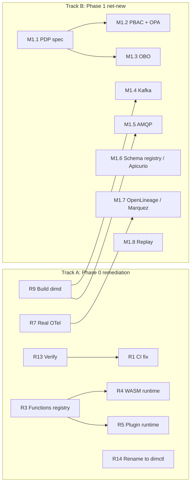

# Phase 1 Implementation Plan — Declarative Integration Middleware

**Type:** Engineering plan, opening with an as-built review of Phase 0. Scope for Phase 1 is drawn from `eip-middleware-design.md` §19's roadmap; the review below is new information this round, gathered by actually reading the shipped code.
**Builds on:** `eip-middleware-design.md` (v8), `phase-0-implementation-plan.md` (v5), and the repository at `github.com/naren-chakraview/dim`, reviewed at commit `606e63c` (2026-09-03), tagged `v0.5.0`.
**Status:** Draft v3 — no open questions remain; ready to start Track A
**Date:** 2026-09-04

## Revision history

| Version | Date | Summary |
|---|---|---|
| v1 | 2026-09-03 | Initial Phase 1 plan. Opens with a code-level review of the `dim` repo's Phase 0 delivery (commit `606e63c`), which surfaced several gaps between what `README.md`/`CHANGELOG.md` claim and what the code does. Structures the work as two tracks: Track A closes those gaps before they compound; Track B is the net-new Phase 1 scope from the design's roadmap (Kafka/AMQP, PBAC+OPA, the formal PDP spec, OBO, OpenLineage+Marquez, schema-registry-backed contracts+Apicurio, replay tooling). |
| v2 | 2026-09-03 | Resolved round-1 open questions: Track A and Track B interleave rather than gating as sequential phases, governed purely by the per-item dependency graph; R9 resolved as "keep `dimd`, build it out as the real engine daemon" with a new paired item R14 renaming `midctl` → `dimctl` throughout; both tracks broken down to the Phase-0-style subtask level (R1–R14 already at subtask grain, M1.1–M1.8 each decomposed into M1.x.y subtasks) with a dependency table per track/milestone. Two new open questions posed on the rename's transition handling and whether Phase 0's own historical docs should be touched. |
| v3 | 2026-09-04 | Resolved round-2 open questions: R14 is a hard cut with no `midctl` transition alias, confirmed as a non-issue since the tool has no external adoption yet; `README.md`/`USER_GUIDE.md`/`DEVELOPMENT.md` get updated in place to `dimctl` as living reference docs, while `CHANGELOG.md`/`RELEASE_NOTES_v0.5.0.md`/the M0.x planning docs stay untouched as historical record. The now-resolved rename risk was removed from the risk register. No new open questions — the plan is ready for Track A to start. |

## 1. Purpose and how to read this

You asked for two things at once: review the Phase 0 implementation, and present the Phase 1 plan. Those turned out to be the same task, because what Phase 1 should actually do depends on what Phase 0 actually built — not on what its own release notes say it built. So §2 below is the review, done by cloning the repository (you flipped it to public for this) and reading the source directly rather than trusting `README.md`, `CHANGELOG.md`, or `RELEASE_NOTES_v0.5.0.md`, all three of which describe a more complete system than the code backs up in a few specific, checkable places.

That review changes the shape of this plan. Rather than handing you the original Phase 1 roadmap unmodified, this document splits the work into **Track A** (closing Phase 0 gaps that were supposed to be done and are claimed as done, but aren't) and **Track B** (the genuinely new Phase 1 scope: Kafka/AMQP, PBAC, OBO, OpenLineage, schema-registry contracts, replay). The two tracks interleave rather than gating as sequential phases — each Track B item lists exactly which Track A item(s) it depends on (§4), and starts as soon as those are done, not when the whole of Track A is done. Building Kafka adapters or PBAC directly on top of a functions registry that's a four-line stub would still compound the gap, so the per-item dependencies still matter — they're just tracked at the item level, not the track level.

One housekeeping note before anything else: **please flip the repository back to private now** — it was made public solely so this review could clone it, and there's no reason for it to stay open.

## 2. Phase 0 as-built review

### 2.1 Methodology and its limits

I cloned `github.com/naren-chakraview/dim` at commit `606e63c` and read the source directly — the directory structure, `go.mod`, the CI workflow, and the implementation of the areas most likely to diverge from the design (observability, the functions registry, authorization, lineage, hot reload). I could **not** run `go build`, `go vet`, or `go test` myself: `go.mod` declares `go 1.26.7`, my review sandbox only has an older toolchain, and its network egress policy blocks `proxy.golang.org`, so the automatic toolchain download that `go build` attempted failed outright. That means the "440+ tests passing," "all tests pass... no race conditions," and the specific benchmark numbers in `RELEASE_NOTES_v0.5.0.md` are **unverified by me** — not confirmed false, just not independently checked. Track A's first item (§3, R13) is to actually verify those claims in an environment that can build the project, before anything else in this plan proceeds.

Everything else below — the stubs, the missing SFTP code, the observability gap, the metrics format bug, the committed binary — I confirmed by reading the actual source files, not by inference.

### 2.2 What's solidly built

Several milestones hold up well under inspection:

- **M0.1's core pipeline** — message envelope, bounded channel, executor, `filter`/`translate`/`route`/`idempotent` steps, HTTP source, file sink, dead-letter path — is real, substantive code, not scaffolding.
- **M0.2's hot-reload generation state machine** (`internal/engine/generation.go`) is a genuine implementation: a real `GenerationState` lifecycle (Active/Draining/Expired), background draining with a deadline, and a `DoneCh` for callers to wait on — this was the highest-risk item in the original risk register, and it doesn't look like it was shortcut.
- **M0.3's authorization** (`internal/steps/authorize.go`) has real RBAC and ABAC modes, with the ABAC expression compiled at construction time to catch syntax errors early — solid, tested code. `mode: pbac` correctly does not appear anywhere in the schema or the step, matching the Phase 0 decision to defer it entirely rather than stub it.
- **M0.4's lineage store** (`internal/lineage/store.go`) genuinely uses `modernc.org/sqlite` in WAL mode as planned, not a fake in-memory stand-in.
- **The Prometheus text-exposition endpoint** is hand-written (not using `client_golang`, a deviation from the plan's library choice — see §3, R8) but the counter/gauge output is spec-correct `# HELP`/`# TYPE` text format that a real Prometheus server could scrape.
- Claude Code appears to have done some of its own review along the way — `M0.2.1_CODE_REVIEW.md` catches and documents a real placeholder function (`inferStepType()`) that was left half-built, which is exactly the kind of self-catch you'd want.

### 2.3 What's stubbed or missing despite being claimed complete

This is the part that changes Phase 1's shape:

- **The functions registry itself is a four-line stub.** `internal/expr/functions.go` is a package declaration and a comment — no registration, no lookup, nothing. This is the piece the design's `functions:` config block (§6.1) and both the plugin and WASM function types are supposed to wire into. Its absence is more consequential than either runtime being unfinished individually.
- **The WASM function runtime is a four-line stub** (`internal/expr/wasm_runtime.go`) — no `wazero` import, no execution path. The file's own comment reads "This will be implemented in Phase 0," which Phase 0 itself does not appear to have done.
- **The native plugin runtime is a three-line stub** (`internal/expr/plugin_runtime.go`) — no `hashicorp/go-plugin` import, same "will be implemented in Phase 0" comment. Neither of these packages appears in `go.mod` at all.
- **SFTP was never implemented.** `internal/adapters/file/file.go` contains the comment `// file and SFTP adapters` and nothing else SFTP-related; there's no `pkg/sftp` dependency in `go.mod`. Only local-file polling exists. This is a direct miss against the original M0.2.11 exit criterion ("integration test polls a local directory **or SFTP server**").
- **Tracing is not OpenTelemetry**, despite `CHANGELOG.md` and `RELEASE_NOTES_v0.5.0.md` both stating "OpenTelemetry distributed tracing with OTLP exporters." `internal/observability/tracing.go` defines its own `Span`/`TracingProvider` structs — in-memory, hand-rolled, no import of `go.opentelemetry.io/otel` anywhere in the module. This means the design's Tier 2 observability story (§9.3: compose with a real OTel collector → Tempo/Jaeger → Grafana Node Graph) is not actually reachable with what's shipped — there's no OTLP export path for a real collector to receive.
- **The metrics histogram is exported in the wrong shape.** `dim_message_latency_ms` is declared `# TYPE ... histogram` but the actual series emitted are `quantile="0.5"`/`"0.9"`/`"0.99"` labels — that's a Prometheus *Summary* shape, not a *Histogram* one. A histogram needs cumulative `_bucket{le="..."}` series for PromQL's `histogram_quantile()` to work. As shipped, `histogram_quantile()` queries against this metric will return nothing, and the shipped Grafana dashboard may be querying a shape the data doesn't have.
- **`cmd/dimd/main.go` is an empty placeholder** — literally `func main() { // Engine daemon entrypoint - placeholder for Phase 0 }`. All actual functionality lives under `midctl run`. This is a real architectural fork from the design, which treats `dimd` (the engine) and `midctl` (the operator CLI) as distinct — and it specifically matters for the Phase 3 roadmap item of a distributed control plane, which assumes a standalone engine process to distribute. **Resolved this round** (§3, R9/R14): `dimd` stays and gets built out for real; `midctl` is renamed to `dimctl`.
- **No adapted version of design §16's full worked example exists.** The plan's M0.6.1 called for adapting that example (imports, functions, authorization, contracts, wiretap, dead-letter, all together) into `examples/order-processing/`. What's there instead is several smaller, disconnected example YAMLs (`dual-route.yaml`, `observability.yaml`, `ordered-route.yaml`, fragments) that don't appear to exercise everything together in one place.
- **An unplanned feature shipped**: `internal/ordering` (message ordering by correlation ID, surfaced in `CHANGELOG.md` under M0.2) does not appear anywhere in the phase-0-implementation-plan.md's scope, milestone list, or subtask breakdown. It may well be a reasonable addition, but it went in without being scoped, reviewed, or tested to the bar the plan set for everything else.
- **Repository hygiene**: a compiled `midctl` binary (21MB, unstripped, with debug info) is committed at the repo root; `output/messages.jsonl`, `output/errors.jsonl`, and `internal/factory/output.jsonl` (runtime-generated files) are committed; and a `graphify-out/` directory (~1.5MB — looks like a code-graph-visualization tool's cache, unrelated to the project) is committed too. `.gitignore` doesn't cover any of these.
- **CI pins a Go version inconsistent with `go.mod`.** `.github/workflows/ci.yml` sets up Go **1.21** via `actions/setup-go`, while `go.mod` requires **`go 1.26.7`**. Go's automatic toolchain download (default since 1.21) will likely paper over this on a GitHub-hosted runner with normal network access — but it's a real inconsistency, the pinned `1.21` is misleading dead weight, and it's exactly the kind of mismatch that breaks silently in a more locked-down CI environment. The workflow also has no cross-compile step and no `golangci-lint` step, both of which the phase-0-implementation-plan.md's CI strategy called for.
- **Process**: the whole of Phase 0 landed as one squashed commit (`606e63c Phase 0 (M0.1-M0.6): Production-Ready dim Middleware v0.5.0`), with no PR history. The phase-0-implementation-plan.md's tiered, PR-based human review requirement — reaffirmed across three separate rounds of that document's own revisions — clearly wasn't exercised here. That's a reasonable one-time bootstrapping choice for a from-scratch scaffold done by a single coding-agent session, but it shouldn't be the pattern for Phase 1, where the new surface area (OPA integration, OBO token exchange, Kafka offset handling) is exactly the kind of thing the tiered review policy was written for.

### 2.4 What this means for scoping Phase 1

None of this is a reason to distrust the parts that do check out — M0.1 through M0.4's core logic looks genuinely solid. But it is a reason not to build Track B's new scope directly on top of the gaps in §2.3 without closing them first: PBAC (Track B) needs a real PDP contract layer, which is fine since it doesn't depend on the functions registry; but Kafka/AMQP adapters (Track B) will want the same reliability/hot-reload integration bar the file/HTTP adapters were held to, and OpenLineage export (Track B) is pointless to build on top of tracing spans that already don't leave the process — fixing that is really the same piece of work as OpenLineage export, not separate from it.

## 3. Track A — Phase 0 remediation

These aren't new features; they're closing the distance between `RELEASE_NOTES_v0.5.0.md`'s claims and the code. Already at Phase-0-style subtask grain (each item below is one coherent, independently-mergeable unit of work), so — unlike Track B — Track A doesn't need a further layer of decomposition, just the dependency table.

**Subtasks:**

- **R13 — Verify Phase 0's actual build/test health.** Run `go build ./...`, `go vet ./...`, `go test ./... -race`, and `govulncheck ./...` in an environment with the matching Go toolchain and full network access; record the real results. Exit: a written record of actual pass/fail, superseding the unverified claims in `RELEASE_NOTES_v0.5.0.md` (§2.1).
- **R1 — Fix the CI Go-version mismatch.** Pin `actions/setup-go` to the version `go.mod` actually requires (or vice versa, if `go 1.26.7` was accidental). Add the missing cross-compile step and `golangci-lint` step the phase-0-implementation-plan.md's CI strategy called for. Exit: a CI run on a real PR builds, vets, tests, and cross-compiles cleanly with no version mismatch warnings.
- **R2 — Repository hygiene.** `git rm` the committed `midctl` binary and the runtime-generated `output/*.jsonl` / `internal/factory/output.jsonl` files; remove `graphify-out/`; extend `.gitignore` to cover extensionless binaries, `output/`, `*.jsonl`, and stray tool-cache directories. Exit: a fresh `git clone` plus `go build` produces no untracked build artifacts that were previously committed, and `git status` stays clean after a local run.
- **R3 — Implement the functions registry for real.** `internal/expr/functions.go`: registration, lookup, and the wiring point `translate`/`filter` steps use to call a named custom function. Exit: a route referencing a registered custom function by name resolves and calls it at evaluation time (unit test, no real plugin/WASM backend needed yet).
- **R4 — Implement the WASM function runtime via `wazero`.** Per the original M0.2.8 spike-plus-build subtask: calling-convention spike first, then the real implementation. Exit: a sample WASM function is callable from a route through R3's registry.
- **R5 — Implement the native plugin runtime via `hashicorp/go-plugin`.** Per the original M0.2.9 subtask. Exit: a sample native-plugin function is callable from a route through R3's registry.
- **R6 — Implement the SFTP adapter.** Extends `internal/adapters/file`, per the original M0.2.11 exit criterion. Exit: integration test polls a local SFTP server and ingests new files on schedule.
- **R7 — Wire real OpenTelemetry.** Replace or supplement `internal/observability/tracing.go`'s hand-rolled `Span`/`TracingProvider` with the actual `go.opentelemetry.io/otel` SDK and an OTLP exporter. If the team decides not to do this, correct `README.md`/`CHANGELOG.md` to stop claiming OTLP support, since Tier 2 composition (design §9.3) genuinely doesn't work without it. Exit: a local OTel collector/Tempo instance receives real spans for a processed message.
- **R8 — Fix the Prometheus histogram bug.** `dim_message_latency_ms` is declared `# TYPE histogram` but emits Summary-shaped `quantile=` series. Either emit real `_bucket{le=...}` series or change the declared type to `summary`. Verify the shipped Grafana dashboard (`deploy/grafana/dashboard.json`) actually queries whichever shape is chosen. Exit: a `histogram_quantile()` PromQL query (if histogram is chosen) or the dashboard's existing panels (if summary is chosen) return correct data against a live instance.
- **R9 — Build out `cmd/dimd` as the real engine daemon.** Resolved this round: keep `dimd`, don't retire it. `midctl` (paired with R14, becoming `dimctl`) becomes the operator CLI against a running `dimd`, matching the design's original engine/CLI split. Exit: `dimd` run standalone accepts and processes messages through at least one route, independent of any `midctl run`-style all-in-one invocation.
- **R14 — Rename `midctl` to `dimctl`.** Throughout: the Go package/binary itself, all CLI invocations in code and tests, and — updated in place, since they're living reference docs, not history — `README.md`, `USER_GUIDE.md`, and `DEVELOPMENT.md`, plus the CI workflow and `deploy/` configs. Hard cut, no transition alias: confirmed this round, since `dim`/`midctl` has no external adoption yet — nothing to migrate. `CHANGELOG.md`, `RELEASE_NOTES_v0.5.0.md`, and the M0.x planning docs are the deliberate exception, staying as accurate history of what Phase 0 actually shipped under the old name. Exit: no remaining reference to `midctl` anywhere in the repository except that historical record.
- **R10 — Build `examples/order-processing/`.** Adapting design §16's full worked example (imports, functions, authorization, contracts, wiretap, dead-letter, together), per the original M0.6.1 exit criterion. Exit: the adapted example runs end to end via `dimctl run` (post-R14) or `dim run`, exercising every feature the original example does.
- **R11 — Decide the fate of `internal/ordering`.** Unplanned in Phase 0. Retroactively scope, document, and test it to the same bar as everything else, or gate it behind a flag until it's properly scoped. Exit: either a written scope decision plus test coverage matching Phase 0's bar, or the feature is flagged off by default pending that.
- **R12 — Re-establish the PR-based, risk-tiered human review workflow** from phase-0-implementation-plan.md for all Phase 1 work — including Track A itself. Exit: every subsequent Track A/B item merges through a reviewed PR, not a direct commit.

**Dependency graph** (Track A items are already subtask-grain, so one table covers all of them):

| Subtask | Depends on |
|---|---|
| R13 | — |
| R1 | — |
| R2 | — |
| R3 | — |
| R4 | R3 |
| R5 | R3 |
| R6 | — |
| R7 | — |
| R8 | — |
| R9 | — |
| R14 | — (paired with R9, not blocked by it) |
| R10 | R3, R4, R5 |
| R11 | — |
| R12 | — |

**Exit criteria:** the specific claims in `RELEASE_NOTES_v0.5.0.md` and `CHANGELOG.md` are either true (per R13's verification) or corrected; the functions registry and both its runtimes are real (R3–R5); SFTP works (R6); tracing and metrics are either genuinely OTel/Prometheus-compatible or accurately documented as not (R7–R8); the daemon/CLI split is resolved and renamed (R9, R14); the repo is clean of committed artifacts (R2) and CI matches its own `go.mod` (R1); and every item from here forward went through PR review (R12).

## 4. Track B — Phase 1 net-new scope

This is `eip-middleware-design.md` §19's Phase 1 roadmap, sequenced with dependencies in mind and broken down to the Phase-0-style subtask level, per this round's decision. Design section references are to v8 of that document.

### M1.1 — Formal PDP contract spec

**Scope:** publish the neutral, engine-agnostic policy-decision-point contract (design §13.3) as a versioned spec — the thing Phase 0 explicitly deferred. Neutral by design: not OPA-shaped, BYO PDP stays supported.

**Subtasks:**
- **M1.1.1 — Draft the contract shape.** The decision request/response payload and policy inputs, as OpenAPI/JSON Schema, engine-agnostic. Exit: a versioned spec file validates a hand-written example decision request/response.
- **M1.1.2 — Publish the spec with its own version number**, independent of `route_version`/`contract_version` (design §13.3's "formally specified" requirement). Exit: the spec carries an explicit version field; a changelog for the spec itself exists.
- **M1.1.3 — Write a BYO-PDP conformance guide**: how a non-OPA PDP implementer would conform to the contract, without assuming OPA specifics. Exit: the guide is reviewed by someone who hasn't seen the OPA adapter (M1.2) implementation.

**Dependency graph:**

| Subtask | Depends on |
|---|---|
| M1.1.1 | — |
| M1.1.2 | M1.1.1 |
| M1.1.3 | M1.1.1 |

**Exit criteria:** the PDP contract is published as a versioned, engine-agnostic spec that a BYO implementer could conform to without reading the OPA adapter's code.

### M1.2 — PBAC + OPA reference adapter

**Scope:** add `mode: pbac` to the `authorize` step (correctly absent since Phase 0), backed by M1.1's contract; OPA as the reference adapter, fronted by its own translation layer so the contract itself stays engine-agnostic (design §13.3).

**Subtasks:**
- **M1.2.1 — Add `mode: pbac` to the route config schema.** Previously absent by design. Exit: a route with `mode: pbac` validates against the schema (schema-level acceptance only, not yet evaluated).
- **M1.2.2 — Implement the PBAC evaluator**, calling out to a PDP per M1.1's contract. Exit: fixture test with a mock PDP allows/denies per its response.
- **M1.2.3 — OPA reference adapter + translation layer**, translating the neutral contract to/from Rego evaluation. Exit: fixture test runs a real embedded OPA instance and gets correct allow/deny for a sample policy.
- **M1.2.4 — BYO-PDP conformance test.** Implement a second, trivial non-OPA PDP (even a simple HTTP stub) against M1.1's contract and confirm the `authorize` step works against it unchanged. Exit: M1.2.2's fixture suite passes against the stub PDP with zero code changes to the `authorize` step.

**Dependency graph:**

| Subtask | Depends on |
|---|---|
| M1.2.1 | M1.1.2 |
| M1.2.2 | M1.1.1, Track A's R3 |
| M1.2.3 | M1.2.2 |
| M1.2.4 | M1.2.2 |

**Exit criteria:** a route with `mode: pbac` is evaluated correctly against both the OPA reference adapter and a non-OPA stub PDP, with no `authorize`-step code differing between the two.

### M1.3 — OBO (on-behalf-of) delivery

**Scope:** delegated token exchange for downstream calls made on a message's behalf (design §13.4), building on Phase 0's JWT principal propagation and M1.1's PDP contract.

**Subtasks:**
- **M1.3.1 — Design the token-exchange flow** against M1.1's contract and Phase 0's JWT principal propagation. Exit: a written flow description (sequence diagram or equivalent), reviewed.
- **M1.3.2 — Implement OBO token exchange.** Exit: integration test where a downstream call carries an exchanged, scoped-down token derived from the original principal's.
- **M1.3.3 — Wire OBO into at least one adapter** that makes downstream calls on a message's behalf (e.g. the HTTP sink). Exit: integration test confirms the downstream request carries the OBO token, not the original.

**Dependency graph:**

| Subtask | Depends on |
|---|---|
| M1.3.1 | M1.1.1 |
| M1.3.2 | M1.3.1 |
| M1.3.3 | M1.3.2 |

**Exit criteria:** a message processed under a given principal triggers a downstream call carrying a correctly scoped, exchanged token rather than the original.

### M1.4 — Kafka adapter

**Scope:** source and sink, consumer-group offset handling, integrated with the existing reliability model (retry/DLQ) and hot-reload generation draining at the same bar the HTTP/file adapters were held to.

**Subtasks:**
- **M1.4.1 — Kafka client library spike** (`segmentio/kafka-go` vs. `confluent-kafka-go`), per the risk register (§6). Exit: spike findings documented; library selected and pinned.
- **M1.4.2 — Kafka source adapter** with consumer-group offset handling. Exit: integration test against a local Kafka instance consumes messages and commits offsets correctly only after successful processing.
- **M1.4.3 — Kafka sink adapter.** Exit: integration test produces messages to a topic and a separate consumer confirms delivery.
- **M1.4.4 — Integrate with the reliability model and hot-reload draining**, at the same bar as HTTP/file. Exit: `-race`-enabled integration test reloads a route with an active Kafka consumer mid-traffic; in-flight messages complete, no offset loss or unexpected duplication beyond normal at-least-once semantics.

**Dependency graph:**

| Subtask | Depends on |
|---|---|
| M1.4.1 | — |
| M1.4.2 | M1.4.1, Track A's R9 |
| M1.4.3 | M1.4.1 |
| M1.4.4 | M1.4.2, M1.4.3 |

**Exit criteria:** a Kafka-sourced route survives a hot reload mid-traffic with correct offset handling and no message loss.

### M1.5 — AMQP adapter

**Scope:** source and sink, same reliability/hot-reload integration bar as M1.4.

**Subtasks:**
- **M1.5.1 — AMQP client library selection** (e.g. `rabbitmq/amqp091-go`). Exit: library selected and pinned.
- **M1.5.2 — AMQP source adapter.** Exit: integration test against a local RabbitMQ instance consumes and acknowledges messages correctly.
- **M1.5.3 — AMQP sink adapter.** Exit: integration test publishes and a separate consumer confirms delivery.
- **M1.5.4 — Integrate with the reliability model and hot-reload draining**, same bar as M1.4.4. Exit: same shape of `-race`-enabled integration test as M1.4.4, for AMQP.

**Dependency graph:**

| Subtask | Depends on |
|---|---|
| M1.5.1 | — |
| M1.5.2 | M1.5.1, Track A's R9 |
| M1.5.3 | M1.5.1 |
| M1.5.4 | M1.5.2, M1.5.3 |

**Exit criteria:** an AMQP-sourced route survives a hot reload mid-traffic with no message loss, at the same bar as M1.4.

### M1.6 — Schema-registry-backed contracts, Apicurio reference

**Scope:** extend Phase 0's inline-JSON-Schema-only contract model (design §11.1) to registry-backed contracts, with Apicurio (Apache 2.0) as the reference implementation (design §11.3); Confluent/Glue/Azure remain BYO, not reference implementations, as originally decided.

**Subtasks:**
- **M1.6.1 — Stand up a local Apicurio instance** for development/testing, per the risk register (§6). Exit: Apicurio reachable locally; a schema can be registered and fetched via its API.
- **M1.6.2 — Extend the contract model** to support a registry-backed contract reference alongside Phase 0's inline-only model. Exit: a route referencing a registry-backed contract resolves the schema from Apicurio at load/validate time.
- **M1.6.3 — Confirm compatibility-rule delegation to Apicurio itself**, not reimplemented locally (design §11.3's "not reimplemented" principle). Exit: a backward-incompatible schema change registered in Apicurio is rejected by Apicurio, and the route loader surfaces that rejection clearly.
- **M1.6.4 — `contract_version` tagging for registry-backed contracts**, extending Phase 0's inline `contract_version` (design §11.4). Exit: unit test confirms `contract_version` reflects the registry schema's version, not just a route-local hash.

**Dependency graph:**

| Subtask | Depends on |
|---|---|
| M1.6.1 | — |
| M1.6.2 | M1.6.1 |
| M1.6.3 | M1.6.2 |
| M1.6.4 | M1.6.2 |

**Exit criteria:** a route with a registry-backed contract validates against Apicurio, correctly rejects an incompatible schema change, and stamps a registry-derived `contract_version`.

### M1.7 — OpenLineage export, Marquez reference

**Scope:** continuous OpenLineage export (design §10.5) with Marquez as the OSS reference catalog, including `SchemaDatasetFacet` publication tying into M1.6's contracts.

**Subtasks:**
- **M1.7.1 — Stand up a local Marquez instance** for development/testing. Exit: Marquez reachable locally, accepts a hand-crafted OpenLineage event via its API.
- **M1.7.2 — Wire OpenLineage event emission** to the now-real tracing spans from Track A's R7 (job/run facets). Exit: a processed message emits a valid OpenLineage `RunEvent` to Marquez, visible in its UI.
- **M1.7.3 — `SchemaDatasetFacet` publication** tying into M1.6's contracts (design §11.6). Exit: a dataset's OpenLineage entry in Marquez shows the schema facet matching its registered contract.
- **M1.7.4 — Continuous export mode** (vs. one-off), configurable per route. Exit: a long-running route continuously emits lineage events without manual triggering.

**Dependency graph:**

| Subtask | Depends on |
|---|---|
| M1.7.1 | — |
| M1.7.2 | M1.7.1, Track A's R7 |
| M1.7.3 | M1.7.2, M1.6.4 |
| M1.7.4 | M1.7.2 |

**Exit criteria:** a long-running route continuously and correctly publishes OpenLineage events, including schema facets, to Marquez.

### M1.8 — Replay tooling

**Scope:** full `dimctl replay` (design §7.3, name updated per R14), beyond what the dead-letter envelope already enables manually today.

**Subtasks:**
- **M1.8.1 — `dimctl replay` command**: replay from a dead-letter target back into a route, with filtering (design §7.3's example: `--filter 'error_type == "timeout"'`). Exit: the command replays matching dead-lettered messages and they reprocess successfully.
- **M1.8.2 — Replay safety**: interaction with idempotency (a replayed message already successfully processed once should be deduplicated by the `idempotent` step if configured, not treated as new). Exit: integration test confirms no double-processing when idempotent dedup is enabled.
- **M1.8.3 — Replay audit trail**: replayed messages get a lineage record noting they were replayed, linking back to the original. Exit: unit test confirms the lineage record for a replayed message references its original message ID.

**Dependency graph:**

| Subtask | Depends on |
|---|---|
| M1.8.1 | — |
| M1.8.2 | M1.8.1 |
| M1.8.3 | M1.8.1 |

**Exit criteria:** dead-lettered messages can be selectively replayed via `dimctl replay`, safely interact with idempotent dedup, and leave an auditable lineage trail back to the original.

## 5. Process for Phase 1

Restating this deliberately, given §2.3's finding: every Track A and Track B item above goes through a pull request with a required human review approval, tiered by risk exactly as phase-0-implementation-plan.md settled on — specialist review for anything touching authorization or the PDP contract (M1.1–M1.3, R3–R5), standard review for everything else. Enforcement stays by reviewer self-selection, not `CODEOWNERS` tooling, consistent with that plan's own final decision — no reason to add process weight here that wasn't wanted there.

## 6. Risk register

| Risk | Impact | Mitigation |
|---|---|---|
| Phase 0's actual test/build health is unverified (§2.1) | Track A/B work could be built on a foundation that doesn't currently pass CI at all | R13 runs first, before any other Track A or Track B item starts |
| OPA integration complexity (M1.2) | The translation layer between the neutral PDP contract and OPA's own policy language (Rego) is nontrivial; a leaky abstraction here undermines the "neutral, BYO-supported" design goal | Build M1.1's contract and its OpenAPI/JSON Schema spec first, independent of OPA, then treat the OPA adapter as one implementation against a contract that's already fixed — not the other way around |
| Kafka client library choice (M1.4) undecided | No Go Kafka client has been evaluated yet (e.g. `segmentio/kafka-go` vs `confluent-kafka-go`, the latter requiring cgo) | Time-boxed spike at the start of M1.4, similar in spirit to Phase 0's JSONata/WASM spikes; a cgo dependency would be a real trade-off against the single-static-binary goal (phase-0-implementation-plan.md's stack decision record) the same way the JSONata shell-out fallback was |
| Apicurio compatibility (M1.6) unverified | The neutral schema-registry contract (design §11.3) was designed against Apicurio's API shape from documentation, not tested against a running instance | Stand up a local Apicurio instance early in M1.6 and validate against it directly, rather than late in the milestone |
| Track A and Track B compete for the same review bandwidth | Given the tiered specialist-review requirement (§5), authorization-adjacent work (R3–R5, M1.1–M1.3) all needs the same reviewer pool | Sequence R3 before M1.2 explicitly (already reflected in §4's dependency tables) rather than parallelizing work that will bottleneck on the same reviewers anyway |

## 7. Open questions for this round

Resolved this round: Track A and Track B interleave rather than gating as sequential phases (§1, §4 — governed by the per-item dependency tables, not a track-level gate); R9 is "keep and build out `dimd`," with R14 renaming `midctl` → `dimctl` as a hard cut and no transition alias, since the tool has no external adoption yet; `README.md`/`USER_GUIDE.md`/`DEVELOPMENT.md` get updated in place to the new name as living reference docs, while `CHANGELOG.md`/`RELEASE_NOTES_v0.5.0.md`/the M0.x planning docs stay as historical record of what shipped as `midctl`; both tracks are broken down to the Phase-0-style subtask level with dependency tables (§3, §4).

None. This round's two resolutions closed cleanly, without opening a new tradeoff — the rename risk row that was in §6 pending these answers has been removed as a resolved non-issue, not a live risk. This plan is ready to start Track A; the next open questions, if any, are expected to surface from actually working through R13's verification and R3's functions-registry implementation rather than from further review of this document.
