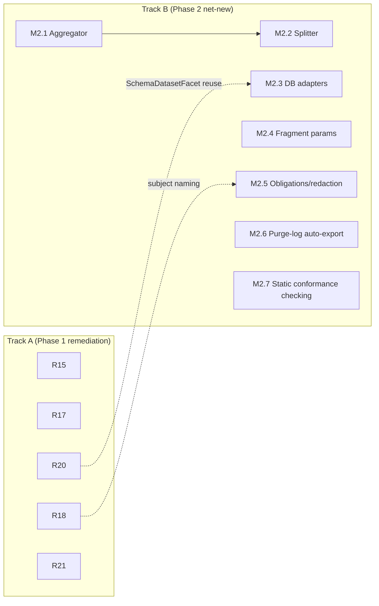

# Phase 2 Implementation Plan

**Type:** Implementation plan (review + forward plan)
**Builds on:** `eip-middleware-design.md` (v8), `phase-1-implementation-plan.md` (v3), and the repo at `github.com/naren-chakraview/dim`, reviewed at commit `e305349` (tagged `v0.6.0-alpha`, 2026-09-04)
**Status:** Draft v2 — no open questions remain; ready to start Track A
**Date:** 2026-09-05

## Revision History

| Version | Date | Changes |
|---|---|---|
| v1 | 2026-09-05 | Initial draft: Phase 1 as-built review, Track A (Phase 1 remediation, R15–R21), Track B (Phase 2 net-new, M2.1–M2.7), open questions posed |
| v2 | 2026-09-05 | Round-1 answers: purge-log expiry warning is alert *plus* auto-export (M2.6 un-gated, scoped); static contract conformance checking confirmed worth shipping (M2.7 un-gated, scoped); SFTP (R21) scheduled this phase and broken into subtasks (R21.1–R21.4); R18 (schema registry) broken into subtasks (R18.1–R18.4) specifically so a coding agent can't silently under-deliver it again |

## 1. Purpose

Like `phase-1-implementation-plan.md`, this document does two things at once: it is a source-level review of what Phase 1 actually shipped against what `phase-1-implementation-plan.md` v3 committed to, and it is the forward plan for Phase 2 as scoped by `eip-middleware-design.md` §19. The two tracks below interleave rather than gate sequentially, consistent with the pattern established last round: Track A closes out Phase 1 loose ends, Track B builds Phase 2's net-new scope, and neither blocks the other except where a specific dependency is called out.

The review in §2 was done by cloning the repository and reading source files directly — not by trusting `FINAL_STATUS_REPORT.md`, `PHASE_1_TRACK_B_SUMMARY.md`, or `OKF.md` — the same methodology used for the Phase 0 review, and for the same reason: the Phase 0 review found the shipped release notes overstated completion in specific, checkable ways, and this round's review found the same pattern again (see §2.3). As before, the repository was briefly made public for this review. **Please flip `naren-chakraview/dim` back to private now that the review is complete.**

## 2. Phase 1 as-built review

### 2.1 Methodology and limits

The repo was cloned at commit `e305349` (`git clone --depth 100`), 70 commits ahead of the Phase 0 commit (`606e63c`) reviewed last round. `git log`, `go.mod`, and source files across `internal/`, `cmd/`, `design/`, and the repo-root status docs were read directly.

As in the Phase 0 review, `go build`/`go test` could not be run in this review sandbox: the pinned toolchain (`go1.26.7`, matching `go.mod`) is not installed locally, and the sandbox's network egress blocks `proxy.golang.org`, so the toolchain cannot be downloaded either. This means the 53 new tests Track B's own status docs claim ("all passing") were not independently re-run this round, exactly as Track A's own tests weren't independently re-run last round. `design/R13_VERIFICATION.md` is Track A's own attempt to close this same gap for Phase 0 — its presence and R13's dependency-free position at the top of Track A's table last round confirms the team already recognizes this as a real risk, not a rubber stamp. This round's Track A (§3) carries the same concern forward as R15's neighbor items rather than a new R13, since R13 itself already exists and its job doesn't need repeating — what's missing is the same verification applied to Track B's 53 new tests specifically.

### 2.2 What's solidly built

Track A (Phase 1's own remediation of Phase 0) closed out cleanly on nearly every item:

- **R1/R2** — CI's Go version now matches `go.mod` (`1.26.7` in both `.github/workflows/ci.yml` and `go.mod`), and `.gitignore` now excludes build outputs, `output/*.jsonl`, and `graphify-out/` by name; no committed binaries or generated artifacts were found in the current tree.
- **R3** — the functions registry (`internal/expr/functions.go`) is a real 94-line implementation, not the 4-line stub found last round.
- **R4** — the WASM function runtime (`internal/expr/wasm_runtime.go`, 157 lines) is real, and `github.com/tetratelabs/wazero` is a genuine (non-indirect-only-in-name) dependency in `go.mod`.
- **R5** — the native plugin runtime (`internal/expr/plugin_runtime.go`, 132 lines) is real, backed by `github.com/hashicorp/go-plugin` in `go.mod`.
- **R8** — the Prometheus histogram/Summary shape bug is fixed via a dedicated commit ("R8: Fix the Prometheus histogram/summary type mismatch").
- **R9** — `cmd/dimd/main.go` is now a real 273-line daemon entrypoint, not the empty placeholder found last round.
- **R12** — a PR-based review workflow is genuinely in effect, not just documented: all 70 commits since `606e63c` are organized into per-item feature branches merged via 29 numbered GitHub pull requests, matching `REVIEWERS.md` and `CODE_REVIEW_WORKFLOW.md`.
- **R14** — `midctl` is renamed to `dimctl` throughout: `cmd/midctl/` no longer exists, only `cmd/dimctl/` does. Two stray references survive, both in code comments (`internal/integration/phase0_test.go:750`, `internal/factory/pipeline_test.go:41`), not in any functional path, CLI help text, or user-facing doc — cosmetic, not a rename gap.
- **Repo versioning discipline** — six tags now exist (`v0.1.0` through `v0.5.0`, plus `v0.6.0-alpha` at the reviewed commit), consistent with the plan's "Phase 0/Phase 1 milestone tagging" intent.

Track B's five headline milestones (per `PHASE_1_TRACK_B_SUMMARY.md`'s own framing: M1.2, M1.3, M1.5, M1.7, M1.8) are real, working code, not documentation-only claims:

- **M1.2 (PBAC + OPA)** — `internal/pdp/opa_adapter.go` (186 lines) is a genuine HTTP client against a real OPA server (`deploy/docker-compose.opa.yml` stands one up), translating dim's neutral `PDPDecisionRequest`/`PDPDecisionResponse` contract to and from OPA's `/v1/data/.../` input/output shape, including obligation parsing. `examples/opa/order-processing.rego` is a real Rego policy, not a placeholder.
- **M1.3 (OBO token exchange)** — `internal/obo/token_exchange.go` (174 lines) implements RFC 8693-style subject-token-to-access-token exchange with scope-subset validation, wired into `internal/adapters/http/http_sink.go`.
- **M1.5 (AMQP reliability)** — `internal/adapters/amqp/` includes real hot-reload/generation-tracking integration (`amqp_reliability_test.go`, 274 lines) — this is the one adapter that got the full M1.x.4-style reliability treatment.
- **M1.7 (OpenLineage/Marquez)** — `internal/lineage/openlineage.go` (219 lines) is a real HTTP emitter against the OpenLineage event shape (`Run`/`Job`/`Dataset` with `Facets`), including a real `SchemaDatasetFacet` type with its own tests. `deploy/docker-compose.marquez.yml` stands up a genuine Marquez + PostgreSQL stack, not a mock.
- **M1.1 (PDP contract spec)**, done earlier in the same track, is real: `design/PDP_CONTRACT_SPEC.md` (550 lines) plus `internal/pdp/stub_pdp.go` (62 lines) providing the BYO-PDP conformance fixture M1.1.3 called for.

### 2.3 What's stubbed, missing, or overstated

This is where this round's review earns its keep — several items `PHASE_1_TRACK_B_SUMMARY.md` and `FINAL_STATUS_REPORT.md` mark complete are partial, and one (M1.6) is not started at all despite a commit claiming otherwise:

- **M1.6 (schema-registry-backed contracts, Apicurio reference) — design only, zero implementation.** Commit `02e1780` is titled "M1.6: Schema registry integration design with Apicurio reference," and its own title is honest — but `design/M1_6_SCHEMA_REGISTRY_APICURIO.md` is exactly what shipped: a design document with `curl` examples and a `docker-compose` snippet, not Go code. A repo-wide search for `apicurio`, `SchemaRegistry`, or `RegistryClient` across every `.go` file returns nothing. `internal/config/contracts.go` has no registry-lookup code, and `contract_version` appears in exactly one place — a comment in `internal/steps/contract.go`, not a field anyone sets. Tellingly, both `PHASE_1_TRACK_B_SUMMARY.md` and `FINAL_STATUS_REPORT.md` list M1.2, M1.3, M1.5, M1.7, and M1.8 as Track B's delivered milestones and simply omit M1.6 from that list — the omission is itself the tell that this didn't ship, since the plan called it out as one of Track B's eight milestones. This is precisely the failure mode §3's R18 breakdown exists to prevent from recurring: a milestone with only a one-line description in a table is easy for a coding agent to interpret as "write the design doc" and move on.
- **M1.4 (Kafka adapter) — source/sink real, hot-reload integration (M1.4.4) missing.** `internal/adapters/kafka/` has real source and sink files backed by a genuine `github.com/segmentio/kafka-go` dependency, but unlike AMQP's `amqp_reliability_test.go`, there is no generation-tracking or hot-reload-drain code or test anywhere under `internal/adapters/kafka/` — a repo-wide search for `generation`/`Generation`/hot-reload in that package returns nothing. Kafka got the M1.4.1–M1.4.3 adapter but not M1.4.4's reliability integration; AMQP (M1.5) got the full treatment. Both status docs describe Kafka only in passing (a merge-commit message), which is consistent with this gap not having been noticed rather than deliberately deferred.
- **M1.8 (replay tooling) — command logic real but unreachable; the team's own "Known Limitations" note was still true at the final commit.** `internal/replay/replay.go` and `cmd/dimctl/replay.go` (real flag parsing, filtering, dry-run, parallelism) exist and have tests, but `cmd/dimctl/main.go` has no reference to `replay` at all — the command is dead code from the CLI's perspective. `PHASE_1_TRACK_B_SUMMARY.md`'s own "Known Limitations" section says exactly this ("Replay command not yet integrated into main dimctl... Future: Wire into dimctl CLI"), and the later, more confident `FINAL_STATUS_REPORT.md` ("✅ COMPLETE & MERGED") doesn't repeat or resolve it — the caveat was accurate and got dropped rather than fixed. Separately, `replay.Result.Summary()` has a real formatting bug: it builds its human-readable counts with `string(rune(r.Total))`, which converts an int to the Unicode code point at that value rather than its decimal digits — `Total: 5` renders as a control character, not `"5"`. Harmless today only because the command isn't wired in yet.
- **M1.7 (OpenLineage) — event emission and Marquez wiring are real; two of the four subtasks are explicitly partial by the team's own admission.** `PHASE_1_TRACK_B_SUMMARY.md`'s "Known Limitations" section states schema extraction from contracts is "not yet integrated" (M1.7.3's automatic contract→`SchemaDatasetFacet` conversion — the facet type and its tests exist, but nothing calls it from `internal/config/contracts.go` automatically) and that dead-lettering for failed lineage exports is "design only" (part of M1.7.4's continuous-export-mode robustness). Both are accurately self-reported, not caught by this review — worth noting because it means the team's own limitation-tracking is reliable when they write it down; the gap in this round's findings is items that went unmentioned (M1.6, Kafka's M1.4.4), not items whose self-reported caveats were wrong.
- **R6 (file polling + SFTP) — file polling real, SFTP honestly stubbed.** `internal/adapters/file/file_source.go` has a real local-filesystem polling source, and `pollSFTP` has the full config surface (host/port/user/key) wired through — but the function body is a documented placeholder that returns `fmt.Errorf("SFTP polling not yet implemented (phase 1 infrastructure); use local file source for now")`, and no SSH/SFTP client library appears in `go.mod`/`go.sum`. This is the same gap the Phase 0 review found, still open, and — refreshingly — the code says so itself rather than the surrounding docs claiming otherwise. Two phases of honest deferral is enough — §3's R21 schedules it for real this round.
- **R10 (order-processing worked example) — built, but predates Track B and was never updated.** `examples/order-processing/order-processing.yaml` was built in R10, before M1.2/M1.3/M1.6/M1.7 existed, and a search for PBAC, OBO, or contract-version configuration in it turns up nothing beyond a lineage retention-policy comment. The project's flagship example does not demonstrate any of Track B's new capabilities.
- **Authorization obligations are parsed but not enforced.** `internal/pdp/opa_adapter.go`'s `translateResponse` populates `PDPObligation` structs from an OPA policy's `result.obligations` array, and `internal/steps/authorize.go` carries `Obligations []PDPObligation` on the decision response — but nothing in `internal/steps/authorize.go` or the surrounding pipeline reads an obligation and acts on it (no redaction, no field-masking, no downstream enforcement of any obligation type). This isn't a Phase 1 gap — `phase-1-implementation-plan.md`'s M1.2 scope was the neutral contract and pass-through, not enforcement — but it's the exact, concrete starting point for the "authorization obligations/redaction" bullet already on Phase 2's roadmap (§19), so it's called out here rather than left implicit.
- **Fragment composition has no parameterization.** `internal/config/fragments.go` (212 lines) supports static fragment import/merge (`examples/fragments/base.yaml`, `auth.yaml`, `retry.yaml`, `composed.yaml`) but no templating or substitution syntax — confirming "fragment parameterization" is genuinely net-new Phase 2 scope, not an extension of partially-built work.
- **No aggregate/split steps, no database adapters exist yet.** `internal/steps/` has eight step types (`authorize`, `contract`, `factory`, `filter`, `idempotent`, `route_step`, `translate`, `wiretap`) and no `aggregate`/`split`; `internal/adapters/` has `amqp`, `file`, `http`, `kafka`, `s3` and no JDBC/database adapter. Both are clean, unstarted scope for Phase 2 — the EIP mapping table's "Deferred" markers in `eip-middleware-design.md` §4 held.
- **No static contract conformance checking exists.** `internal/steps/contract.go`'s `ValidateMessage` is the *runtime* `enforce: true` check design §11.2 calls the actual guarantee; there is no `dimctl validate`-time static check anywhere in the repo. Design §11.5's "real, but limited" static check was never built — it was explicitly gated on design §18 item 3, now resolved (§7): it's worth shipping. See M2.7.

### 2.4 What this means for scoping Phase 2

Two different kinds of unfinished work are now on the table, and this plan keeps them in separate tracks on purpose: genuine Phase 1 shortfalls that should be closed before they compound (M1.6's near-total absence, Kafka's missing hot-reload parity, replay's dead CLI wiring and formatting bug, the stale flagship example, and SFTP) go in Track A as R15–R21; net-new Phase 2 scope per `eip-middleware-design.md` §19 (`aggregate`/`split`, database adapters, fragment parameterization, closing the obligations loop, purge-log auto-export, and static contract conformance checking) goes in Track B as M2.1–M2.7. One design nuance surfaces while scoping R18 (M1.6 remediation): `eip-middleware-design.md` §18 already flags a `subject` naming collision between schema-registry usage (§11.3, a registry "subject" is a named schema group) and lineage/privacy usage (§10.2, `subject_id` is a data subject for privacy purposes) — that collision was inert while M1.6 was undocumented vapor, but becomes a real naming decision the moment R18 writes actual registry-client code. R18.2 below calls this out as its own explicit deliverable rather than something to silently pick a side on mid-implementation.

## 3. Track A — Phase 1 remediation

| Item | Depends on | One-line description |
|---|---|---|
| R15 | — | Wire `dimctl replay` into the `dimctl` CLI dispatcher — `cmd/dimctl/replay.go`'s command logic exists but `cmd/dimctl/main.go` never calls it. |
| R16 | — | Fix `replay.Result.Summary()`'s formatting bug (`string(rune(n))` → an actual decimal representation) and add a test asserting the rendered string contains the numeric values, so a regression like this fails CI next time. |
| R17 | — | Bring the Kafka adapter's hot-reload/generation-tracking integration up to parity with AMQP's (M1.5.4-equivalent for Kafka): in-flight consumer draining across a config reload, with the same concurrent-draining-cap pattern AMQP already has. |
| R18 | see §3.1 | Actually implement M1.6 (schema-registry-backed contracts, Apicurio reference) — broken into subtasks below rather than a single line, since the single-line version is exactly what got skipped last round. |
| R19 | — | Update `examples/order-processing/` to actually exercise PBAC (M1.2), OBO (M1.3), and OpenLineage export (M1.7) — the flagship example should demonstrate Track B's capabilities, not just Phase 0's. |
| R20 | — | Close M1.7's two self-reported gaps: wire automatic `SchemaDatasetFacet` generation from a route's declared contract (M1.7.3's missing half), and implement the lineage-export dead-letter path for permanently-failed OpenLineage/Marquez exports (M1.7.4's "design only" half). |
| R21 | see §3.2 | Implement real SFTP polling (carried over from Phase 0's R6, still an honest stub) — broken into subtasks below for the same reason as R18: scheduled for real this round, not deferred a third time. |

**Aggregate exit criteria for Track A:** `dimctl replay` is reachable and produces correct human-readable output; Kafka and AMQP have symmetric hot-reload behavior; M1.6 has real registry-backed contract resolution working against a local Apicurio instance end to end (register a schema, reference it by subject-version from a route, have `dimctl validate` and runtime `enforce` both honor it); the order-processing example demonstrates PBAC, OBO, lineage export, and SFTP ingestion in one runnable set of routes; OpenLineage's schema facet is populated automatically wherever a contract is declared, with a dead-letter path for export failures; `pollSFTP` connects to a real SFTP server and ingests files instead of returning a placeholder error.

### 3.1 R18 subtasks — schema-registry-backed contracts (Apicurio reference)

| Subtask | Depends on | Description |
|---|---|---|
| R18.1 | — | Stand up a local Apicurio instance for dev/test, per the `docker-compose` snippet `design/M1_6_SCHEMA_REGISTRY_APICURIO.md` already sketched — validate it actually runs and accepts a registered schema; the design doc's own commands were never executed against a real instance last round. |
| R18.2 | R18.1 | Implement the registry client: register a schema, fetch by subject-version, delegate compatibility checks to the registry (dim does not re-implement compatibility rules — per the design doc's own "compatibility rules delegated to registry" point). Resolve the `subject` naming collision (design §18 item 4) here, explicitly: pick and document distinct terms (or an unambiguous qualifier) for a registry "subject" (a named schema group) versus a lineage/privacy "subject" (`subject_id`, a data subject), since this is the first code that makes the collision real rather than theoretical. |
| R18.3 | R18.2 | Extend the contract model (`internal/config/contracts.go`) to accept subject-version registry references alongside today's inline contracts, and make `contract_version` an actual field that gets set from a resolved registry lookup — not just a word in a comment. |
| R18.4 | R18.3 | BYO-registry conformance test/guide, mirroring M1.1.3's BYO-PDP pattern: prove a second registry implementation (or a mock conforming to the same wire contract) can be swapped in without touching route configs, so "Apicurio reference, BYO support" (per the roadmap's own phrasing) is actually true and not aspirational. |

**Exit criteria:** a route can declare a contract as a subject-version reference against the local Apicurio instance; `dimctl validate` and the runtime `enforce: true` check both resolve and honor it; `contract_version` on lineage/dead-letter records reflects the resolved registry version, not a placeholder; a second, non-Apicurio registry implementation passes the same conformance test R18.4 defines.

### 3.2 R21 subtasks — SFTP polling

| Subtask | Depends on | Description |
|---|---|---|
| R21.1 | — | Choose and add a real SSH/SFTP client library to `go.mod` (e.g., `pkg/sftp` plus `golang.org/x/crypto/ssh`) — the concrete gap this review found: no such library exists in the dependency tree today. |
| R21.2 | R21.1 | Implement `pollSFTP` for real, replacing the `fmt.Errorf("SFTP polling not yet implemented...")` placeholder: connect, authenticate (both password and private-key modes, matching the config surface `FileSource` already exposes), list files, compare against `lastModTime`, and download new/changed files as messages. Route credentials through the existing secrets provider (`${SECRET:name}`, design §12) — this is dim's first adapter handling SSH credentials, and it should not introduce a second, parallel credential-handling path. |
| R21.3 | R21.2 | Tests against a real SFTP server — a Docker-based SFTP test container is the natural choice — covering both password and key auth, and the new/changed-file detection logic. |
| R21.4 | R21.3 | Demonstrate SFTP ingestion end-to-end in a worked example. Natural pairing with R19: both are touching the flagship example this round, so do this as part of the same example update rather than a second, competing example. |

**Exit criteria:** an SFTP source configured with either password or key auth connects to a real server, detects and ingests new files, and is demonstrated in a runnable example — `pollSFTP` no longer returns a placeholder error under any configuration.

## 4. Track B — Phase 2 net-new scope

### M2.1 — Aggregator (`aggregate` step)

**Scope:** a step that collects related messages (by correlation key, count, or time window) and emits a single combined message, mirroring the Aggregator EIP the design's §4 mapping table marks "Deferred" to this phase.

**Subtasks:**
- M2.1.1 — Design the completion-strategy surface: correlation key expression, and at least two completion triggers (count-based, time-window-based), plus what happens to an incomplete group on shutdown or hot reload.
- M2.1.2 — Implement the `aggregate` step, including its own generation-aware draining behavior (an in-flight aggregation group is itself state that a hot reload must not silently drop).
- M2.1.3 — Tests and a worked example route demonstrating aggregation (e.g., batching line items into an order).

**Dependency graph:** M2.1.2 ← M2.1.1; M2.1.3 ← M2.1.2.

**Exit criteria:** a route can aggregate N related messages into one by both a count and a time-window trigger, survives a hot reload without losing an in-progress group, and lineage correctly attributes the combined output to all of its inputs.

### M2.2 — Splitter (`split` step)

**Scope:** a step that takes one message and emits many, the mirror image of M2.1, also marked "Deferred" in §4.

**Subtasks:**
- M2.2.1 — Design the split expression surface (JSONata producing an array, one output message per element) and how correlation/lineage attribute each output back to the single input.
- M2.2.2 — Implement the `split` step.
- M2.2.3 — Tests and a worked example (e.g., splitting a batch order into per-line-item messages).

**Dependency graph:** M2.2.2 ← M2.2.1; M2.2.3 ← M2.2.2; M2.2.1 ← M2.1.1 (shares the same one-input/many-output lineage-attribution design question, so M2.2 can reuse M2.1's answer rather than re-deriving it).

**Exit criteria:** a route can split one message into N, each output carries lineage back to the single input, and a split-then-aggregate round trip (using M2.1) is demonstrated in the worked example.

### M2.3 — Database adapters (JDBC, then CDC)

**Scope:** per `eip-middleware-design.md` §19's explicit ordering, a JDBC-style polling adapter first, then change-data-capture second — not concurrently, since CDC's design depends on lessons from the simpler polling adapter.

**Subtasks:**
- M2.3.1 — JDBC-style source: polling query adapter (parameterized query, watermark-column-based incremental pull) against at least one real database (e.g., Postgres via `database/sql` + a driver).
- M2.3.2 — JDBC-style sink: parameterized upsert/insert adapter, sharing connection-pool plumbing with M2.3.1.
- M2.3.3 — CDC spike: evaluate log-based (e.g., a Debezium-style external connector dim consumes from) versus trigger-based capture, and pick one before implementing.
- M2.3.4 — CDC source implementation, per M2.3.3's chosen mechanism.

**Dependency graph:** M2.3.2 ← M2.3.1; M2.3.4 ← M2.3.3.

**Exit criteria:** a route can poll a database table on a schedule and produce one message per new/changed row (M2.3.1), write messages to a database table (M2.3.2), and — once M2.3.3/M2.3.4 land — consume row-level change events without polling.

### M2.4 — Fragment parameterization

**Scope:** extend `internal/config/fragments.go`'s existing static import/merge with substitutable parameters, so one fragment (e.g., `retry.yaml`) can be reused with different values per importing route rather than needing a copy per variant.

**Subtasks:**
- M2.4.1 — Design the parameter syntax and scoping rules (distinct from `${SECRET:name}`, design §12's secrets syntax, to avoid the same collision risk R18 hit with `subject`).
- M2.4.2 — Implement substitution in `internal/config/fragments.go`.
- M2.4.3 — Update `examples/fragments/` to demonstrate a parameterized fragment used two different ways.

**Dependency graph:** M2.4.2 ← M2.4.1; M2.4.3 ← M2.4.2.

**Exit criteria:** the same fragment file, imported twice with different parameter values, produces two different compiled routes; `examples/fragments/COMPOSITION_TEST.md`-style tests cover it.

### M2.5 — Authorization obligations and redaction

**Scope:** close the loop §2.3 identified — M1.2 already parses `PDPObligation` values out of an OPA (or any PDP's) decision response; nothing consumes them yet.

**Subtasks:**
- M2.5.1 — Define an initial obligation vocabulary (at minimum a field-redaction/masking obligation type) building on the `PDPObligation.Type`/`Parameters` shape M1.2 already ships.
- M2.5.2 — Implement obligation enforcement in the authorization pipeline: after an `allow` decision carrying obligations, apply them to the message (e.g., redact named fields) before the route continues.
- M2.5.3 — Update `examples/opa/order-processing.rego` to actually emit a redaction obligation, and add a test proving the field is redacted downstream, not just parsed.

**Dependency graph:** M2.5.2 ← M2.5.1; M2.5.3 ← M2.5.2.

**Exit criteria:** a route configured with a PDP that returns a redaction obligation actually has the named field redacted in the message the route continues to process, with lineage recording that a redaction obligation was applied (not just the underlying `allow` decision).

### M2.6 — Purge-log auto-export-on-expiry-warning

**Scope:** resolved this round (design §18 item 2, §7): the purge-log's expiry-warning mechanism (design §10.4) should do both — keep the existing alert (metric, log, `dimctl lineage purge-log status`) **and** automatically export expiring entries ahead of deletion, not alert-only.

**Subtasks:**
- M2.6.1 — Design the export target and format: reuse the existing S3 sink adapter (already shipped in Phase 1) as the export destination rather than inventing a new transport, and define the exported record shape (a JSONL export of purge-log entries crossing their `expiry_warning_lead` window is the natural fit with the log's own append-only shape).
- M2.6.2 — Implement auto-export, triggered by the same reaper/expiry-warning mechanism that already emits the alert (design §10.4) — additive to the existing alert path, not a replacement for it.
- M2.6.3 — Tests, and a demonstration in the worked example of an entry crossing the expiry-warning threshold producing both the alert and a verifiable exported record.

**Dependency graph:** M2.6.2 ← M2.6.1; M2.6.3 ← M2.6.2.

**Exit criteria:** an entry approaching its retention boundary triggers the existing alert (metric/log/CLI status) *and* an automatic export to the configured target before deletion; the exported record is independently verifiable against the original purge-log entry.

### M2.7 — Static contract conformance checking

**Scope:** resolved this round (design §18 item 3, §7): worth shipping — catching mismatches upfront is worth the partial-check tradeoff, provided the check is honest about its limits rather than implying a guarantee it can't give.

**Subtasks:**
- M2.7.1 — Identify the statically-analyzable JSONata subset — reuse the same subset-detection logic design §10.5 already defines for automatic column-lineage facets, rather than re-deriving a second definition of "simple enough to analyze."
- M2.7.2 — Implement the static check: where a `translate` step's JSONata falls within that subset, construct the shape it would produce and check it against the target sink's declared contract.
- M2.7.3 — Wire into `dimctl validate`, with a prominent, unavoidable caveat in the CLI output itself (not only in docs) that this is a best-effort partial check, and that passing it is not a substitute for the runtime `enforce: true` guarantee (design §11.2) — the false-confidence risk design §18 item 3 raised is real, and the mitigation is making the caveat impossible to miss, not just documenting it.
- M2.7.4 — Tests, including a deliberately out-of-subset transformation, to prove the checker correctly declines to claim confidence on it rather than silently reporting a false pass.

**Dependency graph:** M2.7.2 ← M2.7.1; M2.7.3 ← M2.7.2; M2.7.4 ← M2.7.3.

**Exit criteria:** `dimctl validate` catches at least one class of real contract mismatch before deployment for statically-analyzable transforms; it visibly and clearly declines to check anything outside that subset rather than false-passing; its verdict never contradicts the runtime `enforce` check when both run against the same route.

## 5. Process for Phase 2

Unchanged from `phase-1-implementation-plan.md` §5: PR-based review, self-selected reviewer tier by risk. This round's specialist tier: M2.5 (authorization obligations — same specialist tier as M1.1–M1.3 last round, since it's still authorization-surface work), R18 (schema registry — new external dependency, registry compatibility semantics), and R21 (SFTP — new credential-handling surface, per R21.2's requirement to route through the existing secrets provider rather than a new path). Standard tier otherwise, including M2.1–M2.4, M2.6, M2.7, and R15/R16/R17/R19/R20.

## 6. Risk register

- **Track B's 53 tests are unverified by this review**, for the same toolchain/network reason Phase 0's were — carried forward from §2.1 rather than re-litigated.
- **M1.6 was marked complete in a commit message and silently dropped from both status-report rollups without ever shipping code** — the same failure mode the Phase 0 review flagged (a squashed/rolled-up commit message overstating scope), recurring even with per-item branches and PR review in place. R18's subtask breakdown (§3.1) and Track A's exit criteria (§3) are written to require an end-to-end demonstration specifically so this can't repeat.
- **CDC (M2.3.4) is the highest-uncertainty single item in Track B** — the spike (M2.3.3) exists precisely because "which CDC mechanism" is a real open design decision, not an implementation detail; the JDBC-first ordering in design §19 is deliberate risk sequencing.
- **Aggregator/Splitter hot-reload semantics (M2.1, M2.2) are new territory** — every other step type is stateless per-message; an in-flight aggregation group is the first step-level state that must survive a generation transition, and the existing hot-reload draining model (design §14.1) was designed around channels and in-flight *messages*, not partially-built *groups*. This may require revisiting §14.1 itself, not just adding a new step.
- **Obligation enforcement (M2.5) changes what "allow" means** — today an `allow` decision is unconditional; once obligations can mutate the message, a downstream consumer's expectations about message shape after authorization changes. Needs clear documentation, not just code.
- **Static conformance checking (M2.7) ships despite the design doc's own false-confidence caveat.** The decision to build it is made (§7); the risk didn't go away, it moved from "should we build this" to "will users over-trust a passing check." M2.7.3's CLI-output caveat is the mitigation — this is worth watching in practice, not just at ship time.
- **SFTP (R21) is the first adapter to handle SSH credentials.** R21.2 requires routing them through the existing `${SECRET:name}` provider (design §12) rather than a parallel mechanism; the specialist review tier (§5) exists specifically to catch a deviation from that during PR review, not after.

## 7. Open questions for this round

**Resolved this round:**

1. Design §18 item 2 (purge-log expiry warning) — **alert plus auto-export**, not alert-only. M2.6 is scoped accordingly (§4).
2. Design §18 item 3 (static contract conformance checking) — **yes, worth shipping**; catching mismatches upfront outweighs the partial-check risk, provided the caveat is prominent. M2.7 is scoped accordingly (§4).
3. R21 (SFTP) — **yes, schedule it this phase.** Broken into R21.1–R21.4 (§3.2).
4. R18 (schema registry) sequencing — **break it down into subtasks now**, the way M1.6 originally was, specifically so a coding agent can't quietly deliver only the design doc again. Done as R18.1–R18.4 (§3.1).

None. This round's four resolutions closed cleanly with no new questions surfacing in their place. This plan is ready to start both tracks.
