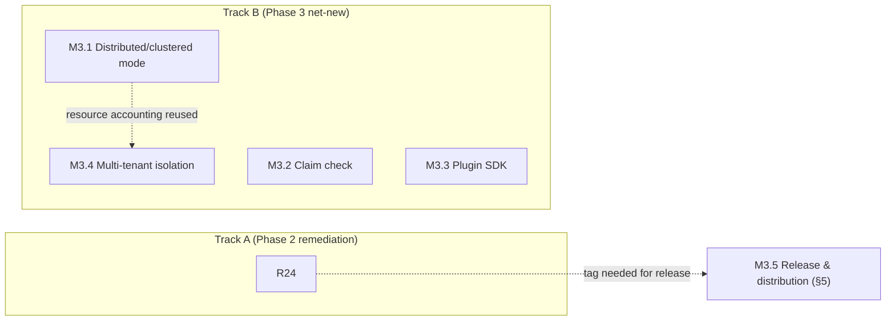

# Phase 3 Implementation Plan

**Type:** Implementation plan (review + forward plan)
**Builds on:** `eip-middleware-design.md` (v10), `phase-2-implementation-plan.md` (v2), and the repo at `github.com/naren-chakraview/dim`, reviewed at commit `155d8db` (2026-09-05, no tag yet — see §3)
**Status:** Draft v4 — no open questions remain; ready to start Track A, M3.5 (scoped to channels a+b), and M3.1–M3.4's design/spike subtasks
**Date:** 2026-09-05

## Revision History

| Version | Date | Changes |
|---|---|---|
| v1 | 2026-09-05 | Initial draft: Phase 2 as-built review (the cleanest yet — see §2), Track A (Phase 2 remediation, R22–R24), Track B (Phase 3 net-new, M3.1–M3.4), a new release-and-distribution section (§5) per explicit request, and a pointer to the standalone visual-route-builder feasibility analysis (§6). Open questions posed. |
| v2 | 2026-09-05 | R22 resolved: the CDC dual-mechanism outcome was an explicit, deliberate instruction, not a coding-agent deviation — log-based CDC was specifically requested despite trigger-based being the more direct fit for this project, with supporting reference architecture documentation already shipped in the repo's own `design/` folder (commit `e4cace4`). §2.3's framing, §3's Track A table, and §8's risk register updated accordingly. |
| v3 | 2026-09-05 | Remaining three open questions resolved. Release channels: (a) GitHub Releases via GoReleaser and (b) the install script/`go install` pairing are scoped now as M3.5's real subtasks; (c)–(e) (Homebrew, Docker image, native packages, Scoop/Chocolatey, the Helm chart) stay on the distribution roadmap for when adoption actually calls for them, not built speculatively. Visual route-authoring interface: not yet reviewed on your end, provisionally referred to as "Phase 4" in this plan's own bookkeeping — not added to `eip-middleware-design.md`'s own §19 roadmap, since that would front-run a decision you haven't finished making. M3.1.1's distribution-model spike stays a genuinely open mandate, now explicitly required to weigh multiple deployment platforms rather than assume one. |
| v4 | 2026-09-05 | You've now reviewed the visual-route-builder feasibility analysis and confirmed the local-tool scope, bundling it into Phase 4 alongside `self-service-feasibility-study.md`'s not-yet-adopted proposals (GitOps pipeline, `midctl scaffold`, discovery surface, domain-scoped secrets). That's no longer provisional — `eip-middleware-design.md` v10 now carries a real Phase 4 entry in §19, plus a clarified §1.1 non-goal (the old wording, "not a drag-and-drop route designer," would have flatly contradicted the new entry). §6 below updated to point at v10 instead of describing the placement as pending. |

## 1. Purpose

Same duality as the last two rounds: §2 is a source-level review of what Phase 2 actually shipped against `phase-2-implementation-plan.md` v2's commitments, and §4 onward is the forward plan — Phase 3's roadmap scope per `eip-middleware-design.md` §19, plus two things outside that roadmap the user asked for directly this round: a real, installable release (§5), and a feasibility read on a point-and-click route-authoring interface (§6, answered in full in a separate document).

The review in §2 again means cloning the repo and reading source directly, not trusting status docs — worth doing every round regardless of how the last one went, and this round is a good demonstration of why it's still worth doing even when the news is good: it's the only way to *know* the news is good rather than assume it. As before, the repository was briefly made public for this review. **Please flip `naren-chakraview/dim` back to private now that the review is complete.**

## 2. Phase 2 as-built review

### 2.1 Methodology and limits

The repo was cloned at commit `155d8db`, 64 commits ahead of the Phase 2-plan commit (`e305349`) reviewed last round. Same limitation as every prior round: `go build`/`go test` cannot be run in this review sandbox (pinned `go1.26.7` toolchain, `proxy.golang.org` blocked by egress rules), so the test suite's actual pass/fail status is taken on faith from `PHASE_2_STATUS_REPORT.md`'s claim ("All tests passing: `go test ./... -race` ✅"), same as every prior round's tests. This has now been an open, unverified risk across three consecutive reviews — see §8's carried-forward note on that.

### 2.2 What's solidly built — and this round, that's nearly everything

This is worth stating plainly rather than burying in a wall of bullet points: **every single item in `phase-2-implementation-plan.md` v2 — all 8 Track A items (R15–R21, including all eight R18.x/R21.x subtasks individually) and all 7 Track B milestones (M2.1–M2.7, including every numbered subtask) — has its own dedicated commit and real, working code behind it.** This is a marked change from the Phase 0→1 and Phase 1→2 reviews, both of which found at least one milestone (`cmd/dimd`, then M1.6) that was claimed complete and wasn't. Spot checks this round, chosen specifically against the areas that broke last time:

- **R18 (schema registry)** is real: `internal/schema/registry.go`, `apicurio.go`, and `mock_registry.go` exist, `internal/config/contracts.go` has genuine `ContractVersion` resolution for both inline and registry-backed contracts, and — notably — the `subject` naming collision (design §18 item 4) is resolved in code, not just documented: `registry.go`'s own comment states the convention ("always using the full qualified name 'registry subject' in code... NOT a data subject") and the `Subject` field itself carries a clarifying comment. This is exactly the kind of concrete, checkable follow-through R18's subtask breakdown was designed to force.
- **R21 (SFTP)** is real: `golang.org/x/crypto/ssh` and `github.com/pkg/sftp` are genuine dependencies in `go.mod`, `pollSFTP` implements both password and key auth, and credentials route through the existing `resolveSecret()` — the secrets-provider integration R21.2 required, not a parallel credential path.
- **R17 (Kafka hot-reload parity)** is real: `internal/adapters/kafka/kafka_source.go` has the same in-flight-counter/drain-cap/`Drain()` pattern AMQP has, backed by a dedicated 247-line `kafka_reliability_test.go`.
- **R20 (OpenLineage's two self-reported gaps)** is real: `ContractSpec.ToSchemaDatasetFacet()` in `internal/config/contracts.go` closes the automatic-facet-generation gap, and `internal/lineage/openlineage.go` now has a genuine dead-letter-routing path for permanently-failed exports.
- **M2.5 (obligations/redaction)** is real: `internal/steps/authorize.go` has a working `redact_fields` obligation handler with recursive field-path navigation and message cloning (so redaction doesn't mutate a shared message), plus lineage records an obligation-applied facet — not just the underlying allow decision, per last round's exit criteria.
- **M2.6 (purge-log auto-export)** is real: `internal/lineage/purgelog.go` has a genuine export worker goroutine queuing to S3, additive to (not replacing) the existing alert path, exactly as resolved last round.
- **M2.7 (static conformance checking)** is real, and its CLI caveat requirement was taken seriously: `cmd/dimctl/main.go`'s `printStaticCheckCaveat()` prints an explicit, unambiguous "this static check is NOT a substitute for the runtime `enforce: true` check" — the false-confidence mitigation M2.7.3 called for is not just present but hard to miss, which was the actual bar.

R19's flagship-example refresh also delivered: `examples/order-processing/order-processing.yaml` now configures `mode: pbac` and ships a companion `.rego` policy, closing the "stale example" gap this review flagged twice.

### 2.3 What's still worth flagging

Nothing here rises to "didn't ship" — this round's findings are smaller and more about judgment calls and documentation hygiene than missing code:

- **The CDC spike (M2.3.3) was scoped to pick one mechanism; both shipped instead — resolved this round as an explicit instruction, not a deviation.** `internal/adapters/database/cdc_trigger.go` (watermark/trigger-based) and `cdc_kafka.go` (Debezium-style log-based, consumed via Kafka) both exist as production code. This review originally flagged the gap between "both shipped" and the plan's stated risk mitigation (a time-boxed spike specifically meant to *reduce* uncertainty by choosing one). You've since confirmed this was deliberate: log-based CDC was explicitly requested despite trigger-based being the more direct fit for this project, with reference architecture documentation for it already shipped in the repo's own `design/` folder (commit `e4cace4`, "Reference Architecture: Log-Based CDC with Debezium, Kafka, and Alternatives"). R22 (§3) is closed on that basis — the plan's original assumption (that a spike implies choosing one mechanism) simply didn't match what was actually wanted here.
- **`PHASE_2_STATUS_REPORT.md`'s own "Next Phase" section contradicts both the real roadmap and this round's own shipped work.** It lists "Schema registry integration (Apicurio reference, Confluent/AWS/Azure BYO)" as Phase 3, future work — but R18 shipped exactly that this round, in the very report describing it. The actual `eip-middleware-design.md` §19 Phase 3 roadmap (distributed/clustered mode, claim check, formal plugin SDK, multi-tenant policy isolation) isn't mentioned in that section at all. This is the same category of self-reported-doc unreliability found in every prior round's status docs — the difference this time is it's not hiding a real gap, just guessing wrong about what's next. See R23.
- **No version tag exists for Phase 2's completion.** The last tag is still `v0.6.0-alpha`, cut at the Phase 1 review commit; 64 commits and every Track A/B item of Phase 2 have landed since with no corresponding tag. This matters more than it would have last round, because §5 below is about cutting real, installable releases — that starts from having something tagged. See R24.
- **`eip-middleware-design.md`'s own EIP mapping table (§4) is stale, independent of anything the repo did.** It still reads "Claim Check | Deferred, same phase as Splitter/Aggregator" — written back when all three were grouped together, before §19's roadmap split them (Aggregator/Splitter to Phase 2, Claim Check held for Phase 3). This is a pre-existing inconsistency in the core design doc itself, not something this round's implementation work caused, and this plan doesn't touch `eip-middleware-design.md` without being asked — flagged here for awareness, not acted on.

### 2.4 What this means for scoping Phase 3

Track A this round is genuinely small — three light housekeeping items (R22–R24), not the substantial remediation work Track A carried the last two rounds — because Phase 2 didn't leave substantial remediation work behind. Track B is `eip-middleware-design.md` §19's Phase 3 scope, verified clean and unstarted: no `claim_check` step, no clustering/distribution code, and `pkg/sdk/sdk.go` is still exactly what it was left as — a 3-line placeholder ("public SPI for plugin/WASM function authors") — meaning M3.3 starts from a marked-but-empty seed, not from nothing and not from something further along than it looks.

## 3. Track A — Phase 2 remediation

| Item | Depends on | One-line description |
|---|---|---|
| R22 | — | **Resolved this round.** Both CDC mechanisms are intentionally maintained: log-based CDC was explicitly requested despite trigger-based being the more direct fit for this project, with reference architecture documentation already shipped in the repo's own `design/` folder (commit `e4cace4`). No further action needed — noted here rather than removed from the table so the decision stays visible in the same place it was first raised. |
| R23 | — | Correct `PHASE_2_STATUS_REPORT.md`'s "Next Phase" section so it reflects the actual `eip-middleware-design.md` §19 Phase 3 scope instead of a list that already contradicts the same report's own R18 findings. |
| R24 | — | Cut a proper version tag for Phase 2's completion (e.g. `v0.7.0`) at the current `HEAD` — the versioning discipline every prior phase closed with; this one hasn't yet, and §5 below needs a real tag to build a release from regardless. |

**Aggregate exit criteria for Track A:** the repo's own status docs no longer claim R18 as future work; a tag exists marking Phase 2's completion. (R22 already meets its bar — see above.)

## 4. Track B — Phase 3 net-new scope

### M3.1 — Distributed/clustered mode

**Scope:** the largest single item this project has scoped so far. Today, `dimd` is a single process: in-memory channels, a per-instance embedded SQLite lineage store, a per-instance idempotent-dedup store, and per-instance generation-tracked hot reload (design §14.1). The original design (v5, per its own revision history) deliberately chose "lineage stays per-instance-local, with on-demand export for cross-instance aggregation" — an answer that was correct for a single, non-clustered deployment model but becomes a live design question the moment multiple instances are meant to cooperate rather than just coexist. This milestone doesn't get to skip that question by implementation convenience; the spike below exists to answer it deliberately.

**Subtasks:**
- M3.1.1 — Distribution-model spike: evaluate and choose among shared-nothing partitioned (each instance owns a disjoint subset of routes/partitions, coordinator- or config-assigned), active-active with a shared external state store, and leader-follower with failover. Deliberately open mandate, confirmed this round: no coordination service or deployment platform is assumed going in, and the spike must explicitly weigh that the answer may need to work across multiple platforms (different clouds, on-prem, hybrid) rather than optimize for one and retrofit the rest later — a Kubernetes-only answer, for instance, would be a real constraint disguised as a default. Exit: a chosen model, written down, with the tradeoff it accepts made explicit and which platforms it was actually evaluated against — not a menu left open, and not silently scoped to whichever platform was easiest to prototype on.
- M3.1.2 — Shared idempotent-dedup store: extend beyond per-instance in-memory dedup so two instances processing overlapping traffic don't double-process the same message. Depends on M3.1.1's chosen model.
- M3.1.3 — Cluster answer for the lineage store: replicate the embedded store, or offer an external-backend option (e.g. Postgres) for cluster mode while keeping embedded SQLite the single-instance default — a BYO-backend shape, similar in spirit to R18's registry abstraction. Depends on M3.1.1.
- M3.1.4 — Coordinated hot reload across instances: today's generation-tracked drain (§14.1) is per-instance; decide whether a cluster rolls out a config change staggered (accepting a transient mixed-generation window) or coordinated (all instances transition together), and implement the chosen behavior.
- M3.1.5 — Cluster membership/discovery: static config list is the minimum viable answer; a coordination service (etcd/Consul) or platform-native discovery (Kubernetes) are the alternatives — pick based on M3.1.1's model and the deployment targets §5 settles on.
- M3.1.6 — Tests and a worked example: a docker-compose (or equivalent) standing up 2–3 `dimd` instances processing a shared route set, demonstrating no duplicate processing and a successful coordinated or staggered reload.

**Dependency graph:** M3.1.2 ← M3.1.1; M3.1.3 ← M3.1.1; M3.1.4 ← M3.1.1; M3.1.5 ← M3.1.1; M3.1.6 ← M3.1.2, M3.1.3, M3.1.4, M3.1.5.

**Exit criteria:** multiple `dimd` instances process a shared set of routes with no duplicate message processing, lineage is queryable across the cluster (not just per-instance-then-exported), and a config change reaches all instances without an outage, per whichever rollout model M3.1.1 chose.

### M3.2 — Claim check

**Scope:** the Claim Check EIP, marked "Deferred" in the design's §4 EIP mapping table. A large payload is stored in an external store and replaced in-flight with a lightweight reference; downstream steps retrieve the full payload via the reference only when needed.

**Subtasks:**
- M3.2.1 — Design the claim-check store interface, reusing the existing S3 sink adapter as the reference backend (the same reuse-what-you-already-shipped pattern M2.6 used for purge-log export) rather than inventing a new storage integration.
- M3.2.2 — Implement a `claim_check` step: stores the payload, replaces the message body with a reference/ticket plus minimal metadata (size, content-type, checksum).
- M3.2.3 — Implement retrieval: a companion mechanism for a downstream step or adapter to resolve the ticket back into the full payload when it's actually needed, rather than eagerly rehydrating it everywhere.
- M3.2.4 — Tests and a worked example (e.g., an order route carrying a large attachment).

**Dependency graph:** M3.2.2 ← M3.2.1; M3.2.3 ← M3.2.2; M3.2.4 ← M3.2.3.

**Exit criteria:** a route can check a large payload into external storage and continue carrying only a reference; a downstream step retrieves the full payload on demand; lineage correctly reflects the claim-check step without inlining the full payload into lineage records.

### M3.3 — Formal third-party plugin SDK

**Scope:** `pkg/sdk/sdk.go` exists today as exactly what its own comment says it is — a 3-line marker for "public SPI for plugin/WASM function authors" — not a started implementation. The native plugin runtime (R5, `hashicorp/go-plugin`) and WASM runtime (R4, `wazero`) are real and working internally, but nothing publishes a stable, versioned contract a third party could target without reading dim's own internals.

**Subtasks:**
- M3.3.1 — Design and publish a versioned plugin contract spec covering both surfaces (native RPC and WASM ABI), mirroring the pattern M1.1 already established for the PDP contract: a standalone spec doc with its own version number, independent of the engine's own release cadence.
- M3.3.2 — Extract and stabilize the actual Go interface into `pkg/sdk` as a real, publishable module boundary — not internal-package types a plugin author would have to reach into `internal/` to use.
- M3.3.3 — A conformance test suite, so a third party can validate their plugin against the published contract without needing dim's own test infrastructure — the same BYO-conformance pattern R18.4 and M1.1.3 already used for registries and PDPs.
- M3.3.4 — A real example third-party plugin (one native, one WASM), built only against the published `pkg/sdk` surface, as proof the SDK doesn't secretly require internal access.

**Dependency graph:** M3.3.2 ← M3.3.1; M3.3.3 ← M3.3.2; M3.3.4 ← M3.3.3.

**Exit criteria:** a plugin author can write, build, and validate a function plugin using only `pkg/sdk` and the published conformance suite — no `internal/` imports, no reading engine source to guess the contract.

### M3.4 — Multi-tenant policy isolation

**Scope:** resource quotas and blast-radius containment for multiple domains/tenants sharing one instance — flagged as a real gap and correctly deferred by both `data-mesh-feasibility-analysis.md` and `self-service-feasibility-study.md`, both of which note the existing escape hatch (run separate instances per tenant) as sufficient until this lands. M3.1's clustering work and this milestone are related but distinct: clustering is about scaling *across* instances, this is about safely sharing *one*.

**Subtasks:**
- M3.4.1 — Design per-tenant resource accounting: what "blast radius" means concretely here (message-rate limits, worker-pool partitioning, lineage-storage quotas per tenant), keyed on the `domain:` label the reference architecture already proposes but the engine doesn't yet enforce.
- M3.4.2 — Implement per-tenant enforcement: rate limiting and/or worker-pool partitioning by domain, so one tenant's overload doesn't starve another's routes on the same instance.
- M3.4.3 — Tests and a worked example: two domains sharing one instance, one deliberately overloaded, demonstrating the other's routes are unaffected.

**Dependency graph:** M3.4.2 ← M3.4.1; M3.4.3 ← M3.4.2.

**Exit criteria:** a deliberately overloaded tenant on a shared instance does not measurably degrade another tenant's route latency or throughput on the same instance.

## 5. Release and distribution

This is new scope this round, not part of `eip-middleware-design.md` §19's original roadmap — added because you asked for it directly. The goal: a fully functional release a user can actually install, not just a tagged commit they have to build themselves.

### 5.1 Where this starts from

CI already cross-compiles two targets on every push (`.github/workflows/ci.yml`'s "Cross-compile" step): `linux/amd64` and `darwin/arm64`, for both `dimd` and `dimctl`. That's a real head start — the single-static-binary stack decision (`phase-0-implementation-plan.md`'s stack decision record) was made specifically so this would be easy. What's missing is turning "CI builds these on every push" into "a tagged release publishes these somewhere a user can find and download them," plus broader platform coverage (today's two targets miss `darwin/amd64`, `linux/arm64`, and Windows entirely) and any distribution channel beyond "download a raw binary from a CI artifact."

R24 (§3) — cutting a real version tag — is the literal prerequisite for everything below: a release is built from a tag, and there isn't one yet for anything past `v0.6.0-alpha`.

### 5.2 Distribution channel options

| Channel | Effort | Audience fit | Notes |
|---|---|---|---|
| **GitHub Releases with prebuilt binaries** (GoReleaser-driven, triggered on tag push) | Low | Broadest — anyone who can download a file | Formalizes what CI already does; add checksums and the missing platform targets. The natural foundation everything else builds on. |
| **Install script** (`curl \| sh`, detects OS/arch, fetches the matching GitHub Release asset) | Low | Lowers friction for trial users who don't want to think about which binary to grab | Standard pattern; worth being upfront with users about the usual curl-pipe-to-shell trust tradeoff rather than treating it as costless. |
| **`go install github.com/naren-chakraview/dim/cmd/dimd@latest`** | Near-zero | Go developers specifically | Already works today, no work required — just needs to be documented as a supported path. Poor fit for non-Go-developer operators. |
| **Homebrew tap** | Low–Medium (once GoReleaser is in place — it generates formulas natively) | macOS and Linuxbrew users | Good reach for the same audience the `curl` script serves, with update-in-place via `brew upgrade`. |
| **Docker/OCI image** (multi-arch, GHCR or Docker Hub) | Medium | Anyone already running the project's other `docker-compose.*.yml` dependencies (OPA, Apicurio, Marquez) | Completes a story that's currently one-sided — dim already expects Docker for its dependencies but isn't itself offered as an image. Needs a genuinely minimal base (scratch/distroless) to honor the single-static-binary design goal, not just "works." |
| **Native OS packages** (`.deb`/`.rpm` via `nfpm`, which pairs naturally with GoReleaser) | Medium | Teams wanting `apt`/`yum` install plus a systemd unit for `dimd` as a managed service | Real value for on-prem/enterprise operation, lower priority without a specific ask for it. |
| **Scoop/Chocolatey** (Windows) | Medium | Native Windows users (not WSL) | Only worth it if Windows-native (not WSL) is a real target audience — no signal either way yet. |
| **Helm chart** (Kubernetes) | Medium–High | Cluster operators | Most valuable once M3.1 (clustered mode) is real — a Helm chart for a single non-clustered instance is a much smaller win than one that actually deploys a cluster. Natural to sequence after M3.1, not before. |

### 5.3 Decided this round: (a) and (b) now, (c)–(e) stay on the roadmap

Resolved (§9): **(a)** GitHub Releases via GoReleaser and **(b)** the install script paired with documenting `go install` are sufficient for now and are scoped as M3.5's real subtasks below. **(c)** Homebrew tap and the Docker image, **(d)** native OS packages and Scoop/Chocolatey, and **(e)** the Helm chart are explicitly *not* dropped — they stay on the distribution roadmap, to be picked up if and when broader adoption actually calls for them, rather than built speculatively ahead of any signal that they're needed. (e) in particular still makes most sense sequenced after M3.1, per §5.2's own note, whenever it does get picked up.

### M3.5 — Release and distribution

**Scope:** (a) and (b) from §5.2, per this round's decision — a tagged release produces real, downloadable, checksummed binaries across a broadened platform matrix, plus the two lowest-friction install paths on top of it. (c)–(e) stay out of this milestone's scope entirely, tracked in §5.3 instead of as unscoped subtasks here.

**Subtasks:**
- M3.5.1 — GoReleaser configuration (`.goreleaser.yml`) replacing/extending the current CI cross-compile step, with a broadened platform matrix — at minimum adding `darwin/amd64` and `linux/arm64` to today's `linux/amd64`/`darwin/arm64`, plus checksums for every artifact. Whether to also cover `windows/amd64` is a call to make at this point, not before — nothing here depends on it either way.
- M3.5.2 — A release workflow (e.g. `.github/workflows/release.yml`) triggered on tag push, running GoReleaser and publishing binaries plus checksums as GitHub Release assets. Depends on M3.5.1.
- M3.5.3 — Install script (`curl | sh`-style): detects OS/arch, fetches the matching release asset, installs it, and is upfront in its own output about what it's doing (the usual curl-pipe-to-shell trust tradeoff noted in §5.2 isn't erased by shipping the script, just made as legible as possible to whoever runs it). Depends on M3.5.2.
- M3.5.4 — Document `go install github.com/naren-chakraview/dim/cmd/dimd@latest` (and the `dimctl` equivalent) as an officially supported install path in `README.md`, alongside the install script — this already works today and needs documentation, not code.
- M3.5.5 — End-to-end smoke test of the release pipeline itself: cut a real tag, confirm the expected assets appear on the resulting GitHub Release, and confirm the install script correctly installs a working binary from it. Depends on M3.5.2, M3.5.3.

**Dependency graph:** M3.5.2 ← M3.5.1; M3.5.3 ← M3.5.2; M3.5.5 ← M3.5.2, M3.5.3. (M3.5.4 has no dependency — pure documentation, can happen any time after `go install` is confirmed to still work, which it does today.)

**Exit criteria:** tagging a commit produces a GitHub Release with checksummed binaries for at least `linux/amd64`, `linux/arm64`, `darwin/amd64`, and `darwin/arm64`; the install script correctly detects platform and installs a working `dimd`/`dimctl`; `go install` is documented as a supported path; the pipeline has been proven end-to-end on a real tag, not just read through.

## 6. Visual route-authoring interface — feasibility

You asked for a feasibility read on a point-and-click interface for building route configurations, distinct from the runtime visualization already delivered in Phase 0 (design §9's built-in Tier 1 viewer and the shipped Tier 2 Grafana dashboard — that's *watching a route run*; what you're describing now is *building a route's definition*, a config-time tool rather than a runtime one). That's a substantial enough question to deserve its own document rather than a subsection here, matching how `self-service-feasibility-study.md` and `data-mesh-feasibility-analysis.md` were handled — **see the companion document, `visual-route-builder-feasibility-analysis.md`, delivered alongside this plan.**

The one-paragraph version: it's genuinely feasible as a **local, file-based visual editor** that generates and re-parses the same YAML routes already use, reusing `midctl validate`/`midctl test` for live feedback rather than reinventing validation — this doesn't conflict with any scope decision already made, including the deliberately-deferred control-plane API (`self-service-feasibility-study.md` §6). It is **not** feasible as a fully point-and-click experience for the JSONata expressions inside `translate`/`filter`/`authorize` steps — those need a hybrid (visual wiring, text/code editing for expressions), the same shape every comparable EIP/pipeline visual tool (Node-RED, Apache Camel Karavan, cloud workflow designers) has converged on for the same reason. Full details, a recommended scope, and the specific risks are in the companion document.

**Resolved, following your review:** you've read the companion feasibility document and confirmed the local-tool scope it recommends. This is now a real entry — **`eip-middleware-design.md` v10's §19 carries "Phase 4 — self-service and visual tooling,"** bundling the visual route-authoring interface together with `self-service-feasibility-study.md`'s not-yet-adopted proposals (its GitOps pipeline, `midctl scaffold`, the discovery surface, domain-scoped secrets) — your call to group them, since all four are "self-service items not yet implemented" in the same sense. v10 also had to clarify §1.1's non-goals bullet alongside it: the original wording ("not a drag-and-drop route designer") would have flatly contradicted the new entry, so it's now scoped to what the feasibility analysis actually found — a local tool operating on the same config is fine, a hosted system-of-record is still out. Phase 4 itself isn't broken down to subtask grain yet — that's for whenever a round actually plans it, the same treatment Phase 0 through 3 each got in their own turn, not before.

## 7. Process for Phase 3

Unchanged in shape from prior rounds: PR-based review, self-selected reviewer tier by risk. This round's specialist tier: **M3.1** (distributed/clustered mode — the highest-stakes architectural change in the project to date, touching every piece of per-instance state), **M3.4** (multi-tenant isolation — same reasoning as always for anything touching authorization/isolation boundaries), and **M3.3** (plugin SDK — a published, versioned external contract is expensive to change after third parties depend on it, same category of care as M1.1's PDP contract). Standard tier for M3.2, M3.5, and R22–R24.

## 8. Risk register

- **Three consecutive rounds of unverified test suites.** Every phase's "all tests passing" claim has been taken on the review's own terms, never independently re-run, for the same toolchain/network reason each time. This has held up fine so far (Phase 2's review found the claims accurate), but the risk itself hasn't shrunk just because it hasn't bitten yet — worth a real fix (a CI artifact this review process could actually download and inspect, or running the review from an environment with matching network access) rather than carrying the same caveat a fourth time.
- **M3.1 (distributed/clustered mode) is by a wide margin the highest-uncertainty item this project has scoped — and this round widened it further, deliberately.** Every other milestone across three phases has been a bounded addition to a single-instance model; this one revisits a foundational design decision (lineage staying per-instance-local) made back in design v5. The spike (M3.1.1) is there because this genuinely could go several different directions, not as a formality — and confirming it must weigh multiple deployment platforms rather than assume one means the spike is doing real work, not picking a foregone conclusion. Worth budgeting for accordingly rather than treating M3.1.1 as a quick decision on the way to M3.1.2.
- **A published plugin SDK (M3.3) is a one-way door.** Once third parties build against `pkg/sdk`, breaking changes to it carry real external cost in a way internal refactors don't — hence the specialist review tier, and hence M3.3.1's spec being versioned independently of the engine's own release cadence, the same protection M1.1 gave the PDP contract.
- **Release channels (§5) multiply ongoing maintenance, not just one-time setup cost.** Every channel added is another thing that can silently go stale (a Homebrew formula pointing at a dead URL, a Docker image nobody rebuilt in months) — the phased sequencing in §5.3 is as much about not committing to more upkeep than can actually be sustained as it is about initial effort.

## 9. Open questions for this round

**Resolved (from last round):**

1. R22 (CDC dual-mechanism) — **commit to maintaining both**, not consolidate. Log-based CDC was an explicit ask, not a spike outcome, and its reference architecture documentation already exists in the repo's `design/` folder. §2.3 and §3 updated accordingly.

**Resolved this round:**

2. Release channels (§5.2) — **(a) GitHub Releases via GoReleaser and (b) the install script/`go install` pairing are sufficient for now**; further adoption may call for the rest, so (c) Homebrew/Docker, (d) native packages/Scoop/Chocolatey, and (e) the Helm chart stay on the distribution roadmap rather than being dropped. M3.5 (§4) scoped accordingly with real subtasks; §5.3 renamed to reflect the decision.
3. Visual route-authoring interface (§6) — **reviewed and confirmed: local-tool scope, grouped into "Phase 4" alongside the self-service study's other unimplemented proposals.** Now a real entry in `eip-middleware-design.md` v10's §19, not provisional.
4. M3.1's distribution model (M3.1.1) — **stays a genuinely open mandate**, with the explicit note that it may need to cater to multiple platforms rather than assume one. M3.1.1's scope description updated to say so directly.

None. All four of this plan's open questions, across both rounds, are now resolved. This plan is ready to start Track A, M3.5, and M3.1–M3.4's initial subtasks.
