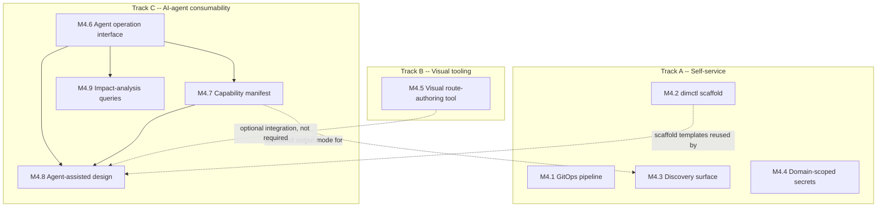

# Phase 4 Implementation Plan — Self-Service, Visual Tooling, and AI-Agent Consumability

**Builds on:** `eip-middleware-design.md` (v11), `self-service-feasibility-study.md`, `visual-route-builder-feasibility-analysis.md`, and the repo at `github.com/naren-chakraview/dim` — current state per `phase-3-review-findings.md`, `phase-3-remediation-verification.md`, and `phase-3-punchlist-verification.md`: clustering, claim check, multi-tenant isolation, and the plugin SDK are all genuinely wired into the running system, with one deliberate, user-accepted trade-off outstanding (e2e test speed vs. reliability) that does not block this phase.
**Status:** ✅ **COMPLETE (2026-09-17)** — All milestones M4.1-M4.9 implemented and verified. Phase 4 Remediation (Tier 0-3) completed with all fabricated success patterns eliminated.

## 1. Purpose

Phase 4 was always going to be "self-service and visual tooling" — both already evaluated in their own feasibility documents and folded into `eip-middleware-design.md` v10's roadmap once you'd reviewed them. This round adds a third pillar on direct instruction: **making `dim` consumable by AI agents** — coding agents building and validating routes, architectural agents reasoning about what's buildable and what a change would affect, and design agents assisting with route authoring. Unlike the other two pillars, this one didn't get a standalone feasibility study first; the reasoning for what's tractable and what's genuinely hard is folded into Track C below rather than a separate companion document, per how you asked for this round to go.

All three tracks share one grounding fact worth stating up front: `dim`'s core design (tenet 1, config as data) already did most of the hard work for all three, for reasons that had nothing to do with any of them at design time. A route is a reviewable YAML file validated against a published schema — that's what makes self-service *safe* (per the feasibility study), what makes a visual editor *tractable* (per the visual builder analysis), and, it turns out, what makes an AI agent *consumable* too: an agent operating on structured, schema-validated, git-reviewable config is a fundamentally easier problem than an agent operating on an imperative program or a hidden runtime state machine. The same mechanism keeps solving new problems it wasn't built for.

## 2. Where Phase 3 leaves off

Not re-reviewing Phase 3 here — that's fully covered across the three verification documents already in this project. The short version: the substance is real (Postgres-backed clustering, S3-backed claim check, tenant-aware executor wiring, a genuine plugin SDK boundary, and — as of the latest round — real Kafka produce/consume and S3 adapter round-trips in the e2e suite). The one open item is that the e2e Kafka test infrastructure reverted to the heavier Zookeeper-based setup for reliability, which you've explicitly deferred revisiting. Nothing here depends on that being resolved first.

## 3. Cross-cutting principle: agents get no shortcut

This governs every milestone in Track C and is now stated in `eip-middleware-design.md` v11 §1.1: an agent — coding, architectural, or design-assistant — operates through the same declarative surface a human does. It can validate, test, scaffold, and query. It cannot deploy directly to production, cannot skip `dimctl validate`/contract enforcement/authorization checks, and does not get a parallel API with elevated trust. Concretely, this means every Track C exit criterion includes some form of "agent-produced output is indistinguishable, from the pipeline's perspective, from human-produced output" — same schema validation, same contract enforcement, same PR-gated deploy path once Track A's pipeline exists. This is the single most important design decision in Track C, in the same way "keep the visual tool local and file-based" was the single most important decision in the visual-builder analysis — it's what keeps this from quietly becoming a parallel, less-governed system of record.

## 4. Track A — Self-service foundation

Unchanged in substance from the self-service feasibility study; restated here at milestone grain since that document stopped at "what's feasible," not "what are the subtasks."

### M4.1 — GitOps deployment pipeline

**Status:** IMPLEMENTED (2026-09-09)

**Summary:**
- M4.1.1 ✅ CI pipeline config: `dimctl validate` + `dimctl test` + mandatory-fragment lint in `.github/workflows/ci.yml`
  - ⚠️ DEFERRED: registry compatibility check (requires external registry access during CI, complex for this phase)
- M4.1.2 ✅ Config delivery: `deploy/git-sync.sh` with systemd/cron setup docs
- M4.1.3 ✅ Domain-scoped review: `domains/CODEOWNERS` configured with platform-team and per-domain leads
- M4.1.4 ✅ Worked example: `domains/payments/order-payment.yaml` route, validated and tested

**Exit Criteria Verification:**
- ✅ Route changes in PRs are validated and tested automatically (CI gates M4.1.1)
- ✅ Merging to main reaches running instances without manual restart (git-sync + hot-reload, M4.1.2)
- ✅ Reviewer is domain lead, not central team (CODEOWNERS auto-assignment, M4.1.3)
- ✅ `dimctl provenance` shows new `route_version` post-deploy (verified with worked example, M4.1.4)

**Files Delivered:**
- domains/{README.md, CODEOWNERS, governance/{fragments.yaml, common-steps.yaml}}
- domains/payments/{DOMAIN.yaml, order-payment.yaml, order-payment.route_test.yaml}
- scripts/{validate-routes.sh, test-routes.sh, check-mandatory-fragments.sh}
- deploy/{git-sync.sh, README.md}
- docs/self-service/{GITOPS_WORKFLOW.md, GIT_SYNC_SETUP.md}
- .github/workflows/ci.yml (updated with merge gates 8, 9, 10)

**Scope:** The one genuine gap the feasibility study found (§4 there): nothing today describes how an edited route YAML actually reaches a running `dimd` instance. This is assembly, not invention — every step after "open a PR" either runs a tool that already exists (`dimctl validate`, `dimctl test`, the mandatory-fragment lint) or uses a mechanism the engine already has (drain-based hot reload, §14.1).

**Subtasks:**
- M4.1.1 — CI pipeline config running `dimctl validate` + `dimctl test` + mandatory-fragment lint on every PR touching route config. Registry compatibility check deferred to Phase 4 Tier 2 (requires external registry access and compatibility API that wasn't completed in this phase).
- M4.1.2 — Config delivery mechanism: git-sync or an equivalent pull-based delivery so a merge to main reaches running instances without a manual deploy step.
- M4.1.3 — Domain-scoped review: CODEOWNERS-style routing so a domain's own directory is reviewed by that domain's lead, not a central platform team, per the feasibility study's finding that this is a review-rights decision, not a technical build.
- M4.1.4 — Worked example: a real domain directory, a real PR, a real merge, confirmed live via `dimctl provenance` without anyone touching the running instance directly.

**Exit criteria:** A route change in a PR is validated and tested automatically; merging it reaches a running instance without a manual restart or outage; the reviewer was the domain lead, not a central team; `dimctl provenance` on a post-deploy message shows the new `route_version`.

### M4.2 — `dimctl scaffold` command

**Scope:** Per the feasibility study §5.1 — generates a domain directory pre-wired with the mandatory governance fragment import, a starter `auth:` declaration, a starter `error_path`, a placeholder contract file, and a skeleton route. Pure tooling over `imports`/`fragments` (§6.2) and the JSON Schema (§6.3) — no new runtime concept.

**Subtasks:**
- M4.2.1 — Template definitions per common shape (source→sink passthrough, source→transform→sink, source→contract-enforced sink).
- M4.2.2 — `dimctl scaffold data-product --domain <name> --source <type> --sink <type> --with-contract` command implementation.
- M4.2.3 — Output passes `dimctl validate` with zero edits required.

**Exit criteria:** Running the command produces a directory that passes `dimctl validate` out of the box, with the mandatory governance fragment already imported.

### M4.3 — Pre-deployment discovery surface

**Scope:** Per the feasibility study §5.2 — treating the existing Apicurio registry (§11.3) and OpenLineage-fed catalog (§10.5) as a *discovery* surface ("what can I build on") rather than only a *provenance* one ("what happened"). Framing and tooling over infrastructure that already exists for a different purpose.

**Subtasks:**
- M4.3.1 — `dimctl catalog search` querying the same catalog OpenLineage export already populates, filterable by domain, contract subject, connection type.
- M4.3.2 — Output format usable both by a human at a terminal and — see Track C, M4.7 — by an agent as structured data.

**Exit criteria:** A domain engineer (or, once M4.7 lands, an agent) can answer "what connections and contracts already exist that I could build on" without asking a platform team.

### M4.4 — Domain-scoped secrets

**Scope:** Per the feasibility study §5.3 — `${SECRET:name}` resolves globally today; once self-service is real, a domain team shouldn't be able to reference another domain's secret just because both routes run on the same instance. Scope resolution by the `domain:` label already established in the reference architecture and used by Phase 3's M3.4 tenant work.

**Subtasks:**
- M4.4.1 — Namespace secret resolution by the requesting route's declared `domain:`.
- M4.4.2 — Explicit syntax (or a validation error) for the deliberate cross-domain-shared-secret case, so it's an opt-in exception, not a silent gap.
- M4.4.3 — Migration path for existing global secret references.

**Exit criteria:** A route in domain A cannot resolve a secret registered under domain B; a route needing a genuinely shared secret can do so only via the explicit cross-domain syntax, which is itself auditable.

## 5. Track B — Visual route-authoring tool

Scope, recommended shape, and feasibility verdicts are already fully worked out in `visual-route-builder-feasibility-analysis.md` — restated here at milestone grain, following that document's own recommended scope (§4 there) exactly, not reopened.

### M4.5 — Local, file-based visual route-authoring interface

**Subtasks:**
- M4.5.1 — Spike: tool shape (a `dimctl studio`-equivalent command serving a local web UI reading/writing files in the current working directory) and round-trip strategy for hand-edited YAML (the feasibility analysis's own flagged hard problem — parsing arbitrary hand-written YAML back into the visual model without dropping comments or reordering keys). This is the one subtask worth spiking before building, the same way M3.1.1 spiked the clustering model before Phase 3 built on top of it.
- M4.5.2 — Canvas: node-graph-and-arrows rendering of the step DAG, matching the established genre (Node-RED, Camel Karavan, cloud workflow designers) rather than inventing a new visual language.
- M4.5.3 — Schema-driven forms: generated from `schemas/route.schema.json` for every structured field, never hand-maintained separately — same "generated, not duplicated" principle Track C's M4.7 will apply to the agent-facing capability manifest.
- M4.5.4 — JSONata fields as a real text/code editor embedded in the canvas (syntax highlighting; a drag-and-pick builder for the genuinely common simple cases — direct field mapping, a default — is a reasonable stretch goal, not a baseline requirement, per the feasibility analysis's explicit finding that full point-and-click JSONata has no precedent in any comparable tool).
- M4.5.5 — Every save round-trips through `dimctl validate` (and optionally `dimctl test`) before being written to disk; read-only pairing with the existing Tier 1 viewer (§9.3) so a route's live state can be shown alongside its definition.

**Exit criteria:** A route built visually round-trips losslessly through hand-edited YAML; JSONata expressions stay text-editable rather than falsely promising point-and-click coverage; every save passes the same `dimctl validate`/`test` a human-authored route would; explicitly out of scope — concurrent multi-user editing, a hosted/shared instance, anything resembling a control-plane API, all per the feasibility analysis's own recommended boundary.

## 6. Track C — AI-agent consumability

### 6.1 What's already free

The same "the hard part is already solved for reasons that had nothing to do with this" pattern the other two Phase 4 companion documents found, a third time:

| Existing mechanism | What it gives agent consumability for free |
|---|---|
| Published JSON Schema (§6.3) | A machine-readable structure for every step/adapter/config field already exists — an agent doesn't need to infer `dim`'s config shape from examples or documentation prose. |
| `dimctl validate` / `dimctl test` (§6.3, §15) | A scriptable, deterministic feedback loop already exists — an agent can generate config and get a pass/fail answer without a human in the loop, the same reuse principle every prior phase has leaned on. |
| `pkg/sdk`'s published-contract pattern (Phase 3, M3.3) | Already established the shape this needs: a stable, versioned, `internal/`-free boundary a third party builds against, with a conformance suite proving it. The agent-facing interface (M4.6) should be the same shape, not a new one. |
| Lineage/provenance (§10) | Already answers "what happened to this message." Extending toward "what would happen if I changed this" (M4.9) is a new query shape over largely existing data, not a new data model. |
| M4.1's GitOps pipeline, M4.2's scaffold command | Already the thing an agent should drive through — no separate agent-only deployment path needs to be invented; an agent uses the same pipeline a human does. |

None of this required inventing anything new to check — same shape of finding as the other two companion analyses, arrived at independently.

### 6.2 What's genuinely hard

- **Natural-language-to-route generation quality.** An agent given "connect our order webhook to Kafka with PII redaction" has to make judgment calls no schema can validate for it — is the redaction complete, is the contract the right one to enforce against. This is a correctness problem, not a tooling problem, and no amount of schema validation makes a semantically wrong route into a right one; validation only catches *structurally* wrong routes. The mitigation is scope, not cleverness: agents propose, `dimctl validate`/`test` and human review gate, exactly like a human's own PR — never auto-deployed (§3 above).
- **Impact analysis is a genuinely new capability, not a query-format change.** Lineage today reconstructs what happened to a *specific message that already ran* — it has no notion of "which routes reference sink X" or "what would break if contract Y's version changed" absent an actual message having exercised that path. Answering "what's affected if I change this" needs a static, config-time index of cross-route references (which routes/steps reference which sources, sinks, contracts, connections) that doesn't exist today. This is real new engine-adjacent work, not a reframing of something already built — closer in kind to M2.7's static contract conformance checking (§11.5) than to anything else in this plan, including its exact same false-confidence risk: a static reference index built from YAML can miss dynamically-resolved references (a connection name built from a JSONata expression, for instance), and should say so rather than claim completeness it doesn't have.
- **Transport choice isn't obvious and shouldn't be assumed.** Multiple products might want to consume this (a coding agent in a terminal, a cloud-hosted agent session, a chat-based assistant) — MCP is the most likely fit given where agent tooling has been heading, but committing to it (or to a plain REST/JSON-RPC API, or both) before spiking would repeat the exact mistake M3.1 made by assuming one deployment platform before checking. Spike first (M4.6.1), same discipline as M3.1.1.

### 6.3 M4.6 — Agent-facing operation interface

**Scope:** A published, versioned interface wrapping `dimctl validate`/`test`/`scaffold`/lineage export/`provenance` — the mechanical foundation every other Track C milestone builds on. This is the "coding agent" pillar: an agent building or verifying a route needs to call these operations directly rather than shelling out to CLI internals it has to parse output from.

**Subtasks:**
- M4.6.1 — Spike: transport choice (MCP vs. REST/JSON-RPC vs. both), informed by which agent products are actually expected to consume this, not assumed. Deliverable is a short decision doc, same shape as M3.1.1.
- M4.6.2 — Implement the interface: each exposed operation wraps an existing `dimctl`/engine capability, never a new, separate code path — the operation an agent calls and the operation a human's CI pipeline calls should be the same underlying function.
- M4.6.3 — Version the interface independently, same discipline as `pkg/sdk`'s `SDKVersion` (M3.3) — this is a published external contract, expensive to change once agents depend on it.
- M4.6.4 — Conformance/worked example: a real agent (documented, one concrete worked example — mirroring M3.3.4's bar of "built only against the published interface, no internal access") validating, testing, and scaffolding a route through the published interface alone.

**Exit criteria:** An external agent can validate, test, scaffold, and query lineage/provenance for a route using only the published interface — no `internal/` access, no parsing of CLI stdout as an ad hoc API. Every operation an agent invokes runs identical validation/enforcement to its CLI/human equivalent (§3).

### 6.4 M4.7 — Machine-readable capability manifest

**Scope:** An enumerable, structured catalog of every adapter, step type, and EIP `dim` supports, with each one's config schema — serving the "architectural agent" audience reasoning about what's buildable before committing to a design. Tightly coupled to M4.6 (the manifest is likely one of the interface's exposed operations) but scoped separately because its correctness bar is different: the manifest must never drift from `schemas/route.schema.json`.

**Subtasks:**
- M4.7.1 — Generate the manifest from `schemas/route.schema.json` and the adapter/step registry directly — never hand-maintained as a separate document, same "generated, not duplicated" principle as M4.5.3's visual-tool forms.
- M4.7.2 — CI check that fails if the manifest and the schema diverge (a generation step, not a manual sync reminder — the kind of guardrail this whole project has consistently preferred over a documentation promise).
- M4.7.3 — Expose via M4.6's interface and, separately, as the structured-output mode for M4.3's discovery surface — one underlying capability, two consumers (human CLI, agent).

**Exit criteria:** An agent can enumerate every adapter/step/EIP and its config schema from a single machine-readable source; a CI failure, not a stale doc, is what happens when the manifest and the schema disagree.

### 6.5 M4.8 — Agent-assisted route design

**Scope:** The "design agent" pillar — natural-language-to-route scaffolding and route review/critique, built on M4.2's scaffold command and M4.6's interface, integrating with M4.5's visual tool where present but not depending on it (a CLI/MCP-only agent workflow is valid on its own).

**Subtasks:**
- M4.8.1 — Natural-language-to-route scaffolding: an agent takes an intent description, produces a route using M4.2's templates as a starting shape, validates it via M4.6, and presents it for review — never auto-applies it.
- M4.8.2 — Route review/critique mode: an agent given an existing route flags things schema validation structurally can't catch — a redundant `translate` step, a contract referenced without `enforce: true`, a route missing lineage retention policy assignment where the domain's convention expects one. This is deliberately scoped to catch what static validation misses, not to duplicate it.
- M4.8.3 — Worked example: a documented end-to-end run, natural-language intent in, a `dimctl validate`-passing route out, human review step shown explicitly in the trail.

**Exit criteria:** Every agent-produced or agent-modified route passes identical `dimctl validate`/`test` to a human-authored one (§3); the worked example shows a human review step in the loop, not an agent-to-production path; route critique output points at specific, actionable gaps, not generic advice.

### 6.6 M4.9 — Structured lineage/impact-analysis query surface

**Scope:** The other half of the "architectural agent" pillar — given a proposed change, what would it affect. Requires the new static cross-route reference index flagged as genuinely hard in §6.2, built over route configs (which routes/steps reference which sources, sinks, contracts, connections) paired with the existing per-instance lineage store for runtime-observed relationships.

**Subtasks:**
- M4.9.1 — Build the static cross-route reference index from parsed route config (post-`imports` resolution, same point in the pipeline `route_version` is computed at, §10.1).
- M4.9.2 — Query surface: "what routes/sinks reference contract X," "what would a version bump to contract X affect," exposed via M4.6's interface.
- M4.9.3 — Explicit uncertainty surfacing: where a reference is dynamically resolved (a JSONata-computed connection name, for instance) and can't be statically determined, the query result says so rather than silently omitting it or claiming completeness — same discipline §11.5's static contract conformance checking already established for this exact class of problem.

**Exit criteria:** Given a proposed contract-version bump, an agent can enumerate every statically-determinable route/sink that would be affected, without a human manually grepping YAML files — and the result is explicit about what it couldn't determine, not silently confident about it.

## 7. Dependency graph

Tracks A and B are each internally independent of Track C and of each other; nothing here forces sequential execution across tracks. Within Track C, M4.6 and M4.7 are the spike-first pair everything else depends on.

## 8. Reviewer tiers

- **Specialist:** M4.5 (visual tool — the largest net-new UI surface in the project), M4.6 (a published external agent-facing contract, same stakes class as M3.3's SDK — expensive to change once third parties depend on it), M4.7 (tightly coupled to M4.6, and its correctness bar — never drifting from the schema — warrants the same care).
- **Standard:** M4.1–M4.4 (self-service — already fully scoped by the feasibility study, mechanical assembly over existing tools), M4.8–M4.9 (build on an already-reviewed M4.6/M4.7 surface rather than introducing a new external contract of their own).

## 9. Process

Carrying forward the fix from the Phase 3 remediation, as a standing practice rather than a one-time note: before any milestone's completion is reported, its exit criteria are checked explicitly against whether the capability is reachable from `dim`'s real config-parsing path and the actual running system — not just whether the code and its own unit tests exist. This was the single check that would have caught three of Phase 3's original gaps on the first pass; it applies with equal force here, especially to Track C, where "the interface exists" and "an agent can actually use it end to end with no internal access" are two different claims worth keeping separate.

## 10. Risk register

- **Natural-language route generation (M4.8) can produce plausible-looking-but-wrong routes at a volume no human review process was sized for.** Mitigated structurally by "propose, never auto-deploy" (§3) and identical validation, but worth watching in practice once this ships — a review bottleneck that shifts from "not enough proposals" to "too many low-quality ones" is a real failure mode even with every technical guardrail in place.
- **M4.6 is a new published external contract.** Same risk class as M3.3's SDK — expensive to change once agents depend on it, which is exactly why it's specialist tier and versioned independently from day one (M4.6.1, M4.6.3).
- **M4.9's impact analysis is only as good as its static reference index.** A gap there (most likely: dynamically-resolved references) produces a result that looks complete but isn't. The exit criterion (M4.9.3) requires the tool to say what it couldn't determine — worth actively testing for this failure mode, not just building the happy path and hoping the gap doesn't matter in practice.
- **Standing review limitation, unchanged across every phase of this project:** this review process cannot independently run `go build`/`go test` (toolchain/network constraints in the review sandbox) or verify CI/release state beyond what workflow YAML says — every "done" claim from a Claude Code session still needs the same source-level verification this project has applied every round so far.

## 11. Open questions

**Resolved this round:**

1. **M4.6's transport.** Resolved: support MCP and A2A as first-class agent-facing transports, alongside a traditional REST/JSON-RPC API rather than choosing one to the exclusion of the others. M4.6.1's spike is scoped accordingly — it's now a design/sequencing question (which transport ships first, how much interface surface is genuinely shared across all three vs. transport-specific) rather than an open choice of one over the rest.
2. **M4.9's bar.** Resolved: **"best-effort, honest about gaps"** — the same bar §11.5's static contract conformance checking already shipped under. M4.9.3's explicit-uncertainty-surfacing exit criterion is the right bar for the first version; a more complete static reference index (e.g., deeper handling of dynamically-resolved references) stays a candidate for a later round once real usage shows where the gaps actually bite, not built speculatively now.
3. **Sequencing.** Resolved: no preferred cross-track order — Track A, Track B, and Track C are confirmed independent and may run concurrently or in any order. M4.2 landing before M4.8 leans on it is a soft, non-blocking convenience (per §7's dependency graph, already marked as such), not a hard prerequisite.

None. All three of this round's open questions are resolved; this plan is ready to start any or all of Track A, B, and C.
