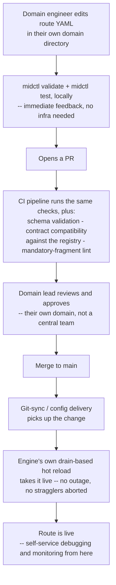

# Self-Service Capabilities: A Feasibility Study

**Type:** Evaluation only — nothing here changes `eip-middleware-design.md` (v8) or `data-mesh-reference-architecture.md`
**Evaluated against:** Declarative Integration Middleware — Design Document, v8, and the data mesh reference architecture
**Date:** 2026-09-01

## 1. Purpose and scope

The question: how feasible is it to let people build, ship, and operate routes on the DIM without a platform team standing between them and every change — and how would that actually be achieved? This document answers both halves, without touching either existing design document. Where an idea would need new engine or process work, it's marked **PROPOSED** and left unadopted, the same convention the reference architecture document uses for its domain model.

The first thing worth pinning down, because it decides most of what follows: **self-service over what?** Two very different things get called "self-service":

1. **Config self-service** — a domain team writes, validates, tests, ships, and operates its own routes, contracts, and policies without a central team reviewing or deploying every change for them.
2. **Infrastructure self-service** — a domain team provisions the underlying resources a route depends on (a new Kafka topic, a new schema registry subject, a new secret, a new database) without filing a ticket.

This study's finding, stated up front because it shapes everything else: **(1) is highly feasible, much of it close to already-there, and (2) is out of the DIM's scope by the same logic already used to draw its other non-goals.** The core design (v8, §1.1) already declines to be an identity provider, policy engine, catalog, or schema registry — it composes with those instead. Infrastructure provisioning is the same category of thing: an org's existing infra-as-code or service-catalog tooling (Terraform, Backstage, a cloud provider's self-service portal) is where that belongs, and the DIM's job is to make its own config layer easy to self-serve *on top of* whatever resources that tooling already granted. Trying to make the DIM itself a topic-provisioning tool would be scope creep in exactly the direction the design has consistently avoided.

Everything below is about (1).

## 2. What the existing design already gives away for free

This mirrors the data mesh feasibility analysis's finding that the design's operational spine turned out to be better-suited to data mesh than a generic EIP engine would be, for reasons that weren't originally about data mesh at all. The same thing is true here, for the same underlying reason: **tenets 1, 3, 9, 11, and 12 (config as source of truth; reliability, authorization, retention, and contracts as structural rather than bolted on) are exactly the preconditions that make it safe to grant self-service in the first place.** You can't responsibly let a domain team ship changes without a human gatekeeper unless the *system itself* enforces the things that gatekeeper would have checked. This design already does that, mechanism by mechanism:

| Design mechanism | Self-service property it already provides |
|---|---|
| Config is data, not code (tenet 1) | A route is a YAML file — reviewable in a PR by anyone, not gated on platform-team-specific code knowledge. |
| `midctl validate` + published JSON Schema (§6.3) | A domain engineer gets immediate, local, no-infrastructure-required feedback on whether their config is structurally correct — no round trip to a platform team needed to find a typo. |
| `midctl test` (§15) | Route behavior is verifiable locally against fixtures, without live source/sink connections — a domain team can prove their route does what they think it does before it ever touches shared infrastructure. |
| Mandatory `auth:` declaration (tenet 9, §13.5) | A domain team can't accidentally ship an unauthenticated route without at least a visible warning — the guardrail is enforced by the tool, not by someone remembering to check. |
| Mandatory `error_path` (§7.1) | Same story for reliability — a route without a dead-letter path fails validation, not code review. |
| Contract enforcement (§11) | A domain team's sink can't silently drift from its published schema — the engine itself refuses non-conforming output, which is what makes it *safe* to let them ship without someone manually diffing schemas. |
| Drain-based hot reload (§14.1) | A route change goes live without an outage and without stragglers being aborted — meaning a domain team can deploy during business hours without a maintenance window or an ops engineer babysitting the rollout. |
| Per-route dead-letter, retry, and the built-in Tier 1 viewer / `midctl trace tail` / `midctl provenance` (§7, §9.3–9.4, §10.7) | A domain team can debug and monitor its own route without filing a ticket with a platform team — this is, today, already fully self-service, and it's worth stating plainly rather than burying it, because it's the part of "self-service" most platforms struggle hardest to deliver. |
| The mandatory governance fragment convention (reference architecture §5) | A domain team can find out, locally and immediately, whether they've included the org's required policy checks — "did I comply" becomes a `midctl validate` answer, not a compliance review meeting. |

None of this was designed with the phrase "self-service" in mind — it fell out of taking tenets 1, 3, 9, 11, and 12 seriously. That's the headline finding of this study: **the hard part of self-service (making it safe) is largely already solved; what's missing is comparatively mechanical** (§3–5).

## 3. Capability-by-capability feasibility

| Capability | Self-service today | What's missing | Feasibility to close |
|---|---|---|---|
| Validate and test a route before shipping | **Yes, already** | — | — |
| Debug and monitor a live route | **Yes, already** | — | — |
| Check compliance with org policy before shipping | **Yes, already** (reference architecture §5's lint-rule pattern) | — | — |
| Author a new route from scratch | Partial — schema gives structure, but no starting point | A scaffold/template generator | **High** — pure tooling over existing mechanisms, §5.1 |
| Discover what already exists (connections, domains, published contracts) | Partial — OpenLineage catalog (§10.5) is after-the-fact, populated once a route has run | A pre-deployment discovery surface | **Medium** — mostly convention over existing registry/catalog, §5.2 |
| Ship a change without a central platform-team gate | **No** — no deployment workflow is described at all today | A GitOps pipeline with the engine's own guardrails as CI checks | **High** — process/CI wiring, not new engine capability, §4 |
| Scope secrets to a domain | Partial — `${SECRET:name}` resolves globally today | Domain-scoped secret namespaces | **Medium** — bounded, real work, §5.3 |
| Manage routes programmatically (not just via files) | **No** | A scoped control-plane API | **Low–Medium**, and already correctly deferred (§6) |
| Operate safely on infrastructure shared across many domains | **No** — no resource quotas or blast-radius isolation | Multi-tenant isolation | **Low**, and already correctly deferred (§6) |
| Provision underlying infrastructure (topics, registry subjects, cloud resources) | **No, and shouldn't be** | Integration with the org's existing infra self-service tooling | **High feasibility precisely because it's out of scope** (§1) |

## 4. The core gap: a safe path from "edited YAML" to "running"

Nothing in the core design describes how a change actually reaches a live instance. That's the one genuine hole standing between "everything needed to make self-service safe already exists" and "self-service actually works." The lowest-cost way to close it doesn't require new engine functionality at all — it requires wiring the guardrails that already exist into a GitOps pipeline:



Every box after "Opens a PR" is either a CI step running a tool that already exists (`midctl validate`, `midctl test`, the registry's own compatibility check, the mandatory-fragment lint) or a mechanism the engine already has (hot reload). The only genuinely new things are the **pipeline wiring itself** (a CI config, a git-sync or config-delivery mechanism for getting merged config to running instances) and the **review being domain-scoped rather than central** — which is a decision about who has merge rights on which directory, not a technical build. That's why this is rated High feasibility: it's assembly, not invention.

This also directly satisfies the ownership half of the reference architecture's domain proposal (§3.2 there) — a domain's config-ownership boundary, enforced by directory structure and CODEOWNERS-style review, *is* the self-service deployment model. The two proposals reinforce each other without either depending on the other being adopted first.

## 5. Secondary gaps, each with a sketch

These are smaller, more mechanical, and independent of each other and of §4 — any subset could be pursued without the others.

### 5.1 PROPOSED: a scaffold command

```
midctl scaffold data-product --domain analytics --source kafka --sink kafka --with-contract
```

Generates a domain directory pre-wired with: the mandatory governance fragment import (reference architecture §5), a starter `auth:` declaration, a starter `error_path`, a placeholder contract file, and a skeleton route — closing the "no standardized data-product template" gap the feasibility analysis and reference architecture both already flagged independently. This is pure tooling over `imports`/`fragments` (core design §6.2) and the JSON Schema (§6.3); it requires no new runtime concept.

### 5.2 PROPOSED: a pre-deployment discovery surface

A domain team starting fresh needs to answer "what connections can I use, what contracts already exist that I could consume as a source, what domains have already published something relevant" — today that's tribal knowledge or a question to a platform team. The registry (Apicurio, core design §11.3) and the OpenLineage-fed catalog (§10.5) already hold most of this information; what's missing is treating them as a *discovery* surface rather than only a *provenance* one — e.g., a `midctl catalog search` command that queries the same catalog the OpenLineage export already populates, framed for "what can I build on" rather than "what happened." This is mostly a framing and tooling exercise over infrastructure that already exists for a different purpose, which is why it rates Medium rather than Low — the data is there, the query surface for this specific use isn't.

### 5.3 PROPOSED: domain-scoped secrets

`${SECRET:name}` (core design §12) resolves globally today, which is a real gap once self-service is real: a domain team shouldn't be able to reference another domain's secret just because both routes happen to run on the same engine instance. The natural fix is scoping secret resolution by the same `domain:` label the reference architecture already proposes (§3.2 there) — `${SECRET:name}` resolves within the requesting route's declared domain's namespace, with a distinct, explicit syntax (or a validation error) for the rarer case of a genuinely shared, cross-domain secret. This is bounded, real engine work — not a config-only convention like §5.1 and §5.2 — which is why it's rated Medium rather than High, but it's still small relative to anything in §6.

## 6. What this study is *not* proposing to pull forward

Two things the core design already, correctly, defers to Phase 3 stay deferred here too — self-service doesn't actually require either of them:

- **A control-plane API.** GitOps (§4) delivers most of the self-service benefit — independent authoring, validation, review, and safe rollout — without needing a management API, its own auth model, or concurrent-edit conflict handling. An API becomes worth its cost once file-based GitOps itself becomes the bottleneck (very large numbers of domains, or a need for programmatic/UI-driven route management beyond what a PR workflow supports) — not before.
- **Multi-tenant runtime isolation.** Self-service over *config* doesn't require solving resource quotas and blast-radius containment between domains sharing one instance — the same escape hatch the core design already relies on (run separate instances per domain when isolation matters more than shared-infrastructure efficiency) works here too, and most organizations adopting self-service incrementally will do exactly that before they have enough domains for shared-instance contention to be a real problem.

Both remain correctly placed in Phase 3 (core design §19). Self-service is achievable well before either of them, not blocked on them.

## 7. What should *not* be self-service, even once this is built

Not everything should skip the gate, and the design already draws a natural line: changes confined to a domain's own `routes`/`sources`/`sinks`/`fragments` within its own directory are safe to fully self-serve under the guardrails in §2 and §4. Changes to genuinely **shared** things — a top-level `resources.connections` entry other domains also use, the mandatory governance fragment itself (reference architecture §5), the org-wide `retention_policies` map (core design §10.2), or the schema-registry/PDP connection configuration — should stay gated behind a platform or governance-team review, the same way the reference architecture already treats the mandatory fragment as platform-owned, not domain-owned. Self-service should be scoped to what a domain actually owns; it was never meant to mean "nothing is reviewed."

## 8. Overall verdict

Highly feasible, and unusually cheap to get most of the way there, because the design's existing structural guardrails (config-as-data, mandatory declarations, contract enforcement, drain-based reload, per-route observability) are precisely the things that make self-service *safe* rather than reckless — that work is already done, for reasons that had nothing to do with self-service when it was designed. What's left is mostly assembly (a GitOps pipeline around tools that already exist, §4) plus a small number of bounded, independent additions (a scaffold command, a discovery surface, domain-scoped secrets, §5) — none of which require the harder, correctly-deferred work (a control-plane API, multi-tenant isolation, §6) to happen first.

If a next round wants to act on any of this, §4 (the GitOps pipeline) is the highest-leverage place to start: it's the one piece actually blocking self-service today, everything else in this document is refinement on top of it.
